# Predictive Model Documentation - Inteli

## Kairos

### Ilariê

#### Team Members

- <a href="https://www.linkedin.com/in/clara-benito/">Clara de Borba Gutierrez Benito</a>
- <a href="https://www.linkedin.com/in/debora-pereira-nogueira/">Débora Pereira Nogueira</a>
- <a href="https://www.linkedin.com/in/jo%C3%A3ocardosodias/">João Cardoso Dias</a>
- <a href="https://www.linkedin.com/in/marcus-valente/">Marcus Felipe dos Santos Valente</a>
- <a href="https://www.linkedin.com/in/paulovictorbatista/">Paulo Victor Batista de Souza</a>
- <a href="https://www.linkedin.com/in/rafael-nakahara-bb5100351/">Rafael Ryu Tati Nakahara</a>
- <a href="https://www.linkedin.com/in/sachakefif/">Sacha Kefif</a>
- <a href="https://www.linkedin.com/in/peresvivian/">Vivian de Assis Peres</a>

## Table of Contents

[1. Introduction](#1-introduction)  
[2. Objectives and Justification](#2-objectives-and-justification)  
[3. Methodology](#3-methodology)  
[4. Development and Results](#4-development-and-results)  
[5. Conclusions and Recommendations](#5-conclusions-and-recommendations)  
[6. References](#6-references)  

## <a name="c1"></a>1. Introduction

Fadel Transportes e Logística Limitada is the business partner for this predictive modeling project. Founded in 2001 in Tatuí, São Paulo, the company operations began with the "Projeto Forró," providing urban beverage distribution services for AmBev in the northeast of Brazil. Since then, Fadel has expanded its operations and specialized in comprehensive logistics solutions, establishing itself as a reference in efficiency, modern infrastructure, and service quality in the Brazilian transportation sector.

The company operates on a significant scale, with over 5,000 employees and more than 2,800 units of equipment across 13 Brazilian states through a network of 50+ branches (Fadel Transportes). Fadel also maintains international operations with units in Paraguay, expanding operations to South Africa and Ghana. In terms of market positioning, Fadel ranks among Brazil's top 20 logistics companies and holds a leadership position in specialized transport segments, particularly in food, beverages, and pharmaceutical logistics. The company has established itself as a strategic partner for major clients like AmBev, leveraging its expertise in temperature-controlled transport and regulatory compliance. In 2020, the company became part of JSL Group (MarketScreener), Brazil's largest road logistics operator with revenues exceeding R$ 8 billion annually, which significantly strengthened Fadel's competitive position and provided enhanced financial capacity for expansion and technological investments in both national and international markets.

The core problem addressed by this project relates to fleet maintenance optimization. Fadel needs to understand the frequency of parts replacements across different operations and vehicle models. Currently, the company lacks the ability to predict maintenance needs, leading to reactive approaches and suboptimal cost management. The organization requires insights to predict which parts will need replacement, identify differences in maintenance patterns between branches, and determine which vehicle models experience faster wear, ultimately enabling proactive maintenance strategies that reduce operational costs and improve fleet availability.

## <a name="c2"></a>2. Objectives and Justification

### 2.1 Objectives

The primary objective of our business partner, Fadel, is to reduce operational costs and increase fleet availability by minimizing unplanned vehicle breakdowns. Currently, a high percentage of their maintenance is corrective, leading to significant expenses from emergency repairs and revenue loss due to vehicle downtime.

Specific objectives include:

- Transitioning from a reactive to a proactive maintenance culture.
- Gaining early warnings about vehicles at high risk of imminent failure.
- Enabling maintenance teams to prioritize inspections and repairs based on data-driven risk assessments, optimizing workshop resources.

### 2.2 Proposed Solution

Our proposed solution is a binary classification predictive model, named Kairos, designed to answer a critical operational question: "Will this vehicle suffer a corrective maintenance event (breakdown) within the next 30 days?"

The model analyzes historical service order data, learning patterns from features such as vehicle odometer readings, maintenance frequency, and past breakdown history. For any given vehicle on any given day, it generates a simple "Yes/No" prediction, flagging vehicles that are at high risk of imminent failure. This provides the Fadel team with a prioritized daily watchlist of vehicles that require immediate attention.

### 2.3 Justification

The proposed solution directly addresses Fadel's core problem by creating a data-driven early warning system. Its primary benefit lies in its exceptional performance in identifying potential failures before they occur. With a Recall score of 99.7% on the test set, the model demonstrates an outstanding ability to correctly identify nearly every vehicle that is truly at risk of breaking down.

This level of performance stands out because it allows Fadel to operate with unprecedented confidence. Instead of reacting to costly roadside emergencies, the maintenance team can proactively intervene, transforming expensive, unplanned corrective repairs into scheduled, low-cost preventive inspections. The potential for cost savings, increased fleet uptime, and improved service reliability is substantial.


## <a name="3-methodology"></a>3. Methodology

### CRISP-DM Methodology

**Introduction**

The Cross-Industry Standard Process for Data Mining (CRISP-DM) is a widely adopted methodology that provides a structured approach to planning, executing, and evaluating data mining and data science projects. It offers a robust framework designed to guide practitioners through the entire lifecycle of a data mining initiative, from initial business understanding to final deployment. The iterative and flexible nature of CRISP-DM allows for adjustments and refinements at various stages, ensuring that the project remains aligned with business objectives and delivers meaningful insights.

CRISP-DM was conceived in the late 1990s by a consortium of companies, including DaimlerChrysler (then Daimler-Benz), SPSS (now IBM), and NCR. The goal was to develop a standardized process model for data mining that could be applied across various industries and business problems [70]. Prior to CRISP-DM, data mining projects often lacked a consistent approach, leading to inefficiencies and inconsistent results. The methodology emerged as a response to the growing need for a structured and repeatable process in the nascent field of data mining.

The initial development of CRISP-DM involved extensive collaboration and feedback from data mining practitioners and experts. The first version, CRISP-DM 1.0, was released in 2000 [70]. Its cross-industry applicability and comprehensive nature quickly led to its widespread adoption, making it one of the most popular methodologies for data mining projects globally. The framework's enduring relevance is a testament to its practical utility and adaptability in an evolving data landscape.

**The Six Phases of CRISP-DM**

CRISP-DM outlines six interconnected phases that guide a data mining project from inception to completion. These phases are not strictly sequential; rather, they are iterative, allowing for movement back and forth between stages as new insights emerge or challenges arise. This iterative nature is crucial for adapting to the complexities and uncertainties inherent in data-driven projects.

**1. Business Understanding**

The first phase of CRISP-DM focuses on understanding the project objectives and requirements from a business perspective. This involves clearly defining the business problem, translating it into a data mining problem, and developing a preliminary project plan. Key activities in this phase include: determining business objectives, assessing the current situation, determining data mining goals, and producing a project plan [2, 7, 8]. This phase is critical for ensuring that the data mining effort is aligned with the organization's strategic goals and that the results will be actionable and valuable.

**2. Data Understanding**

In the data understanding phase, the focus shifts to collecting and exploring the available data. This involves initial data collection, describing the data, exploring the data, and verifying data quality [51, 58]. Data scientists examine the data for patterns, anomalies, and relationships, gaining insights into its structure, content, and potential issues. This exploratory analysis helps in identifying data quality problems, discovering interesting subsets of data, and forming hypotheses about the underlying phenomena.

**3. Data Preparation**

The data preparation phase is often the most time-consuming and labor-intensive part of a data mining project. It involves all activities required to construct the final dataset from the initial raw data. This includes data cleaning, data integration, data formatting, and data transformation [51, 52]. Tasks such as handling missing values, dealing with outliers, feature engineering, and normalizing data are performed to ensure that the data is in a suitable format for modeling. The quality of the data preparation directly impacts the performance and reliability of the subsequent models.

**4. Modeling**

In the modeling phase, various modeling techniques are selected and applied to the prepared data. This involves selecting the appropriate modeling technique, building the model, and assessing the model [51, 55]. Depending on the business problem, different types of models (e.g., classification, regression, clustering) may be considered. The chosen techniques are then used to build models, which are subsequently tested and refined. This phase often involves an iterative process of model building, parameter tuning, and preliminary evaluation to identify the most promising models.

**5. Evaluation**

The evaluation phase assesses the extent to which the built models achieve the business objectives. This involves evaluating the results, reviewing the process, and determining the next steps [51, 54]. The models are evaluated not only on their technical accuracy but also on their business utility and interpretability. This phase may involve comparing different models, assessing their performance against predefined criteria, and identifying any potential issues or limitations. It's a crucial step to ensure that the model is robust, reliable, and ready for deployment.

**6. Deployment** 

The final phase of CRISP-DM is deployment, where the developed model is put into practical use. This can involve generating reports, implementing a repeatable data mining process, or integrating the model into an existing business system [50, 51]. The deployment plan outlines how the model will be used, monitored, and maintained in the operational environment. This phase also includes a final project review, where lessons learned are documented, and the project's success is formally assessed. The goal is to ensure that the insights gained from the data mining project are effectively delivered to the end-users and contribute to business value.

**Theoretical References**

The CRISP-DM methodology, while practical and widely adopted, is underpinned by various theoretical concepts from fields such as statistics, computer science, and business management. Its iterative nature aligns with principles of agile development and continuous improvement, this way, emphasizing flexibility and adaptation throughout the project lifecycle. The focus on business understanding at the outset reflects a strong emphasis on problem framing and stakeholder alignment, drawing from project management and strategic planning theories.

From a statistical perspective, the modeling and evaluation phases heavily rely on principles of statistical inference, machine learning algorithms, and model validation techniques. The data preparation phase incorporates concepts from data quality management and data engineering, ensuring the integrity and suitability of data for analytical purposes. The deployment phase, in turn, touches upon aspects of system integration, change management, and the operationalization of analytical insights, drawing from theories of information systems and organizational behavior.

## <a name="c4"></a>4. Development and Results

# 4.1. Problem Understanding

## Section 4.1.1 – Sectoral Analysis of Brazilian Logistics

### Introduction

In a market that accounted for 18.4% of Brazil’s GDP in 2023 (Institute of Logistics and Supply Chain - ILOS, and Brazilian Association of Logistics Operators - ABOL), logistics is a critical economic pillar where the competitive structure determines operational conditions for all companies. **With this constant transformation**, understanding market dynamics becomes essential for the strategic positioning of any operator.

This analysis examines the competitive environment of Brazilian logistics, identifying not only the main competitors and trends but **especially** the strategic implications of ongoing structural transformations that are redefining the industry’s competitive rules. **Therefore**, we structured this analysis starting with an overview of the sector, followed by the characterization of key operators and the business model of Fadel Transportes, and concluding with critical trends and their competitive implications.

### Overview of the Brazilian Logistics Sector

The road transport and distribution market in Brazil is impressive in scale: it generates annual expenditures of R$ 940 billion in 2024 (ILOS, Mundo Logística), while operators recorded gross revenues of R$ 192 billion in 2023 (Mundo Logística, ABOL). **Within this scenario**, the road transport mode plays a leading role, accounting for 65% of cargo transport in the country (National Confederation of Transport - CNT, 2023).

**However**, this market is characterized by high fragmentation and intense competition, with 51,136 active logistics companies in Brazil (Econodata, 2023 data). Thousands of these companies compete for contracts in an environment where profit margins face continuous pressure. **On the other hand**, this extreme fragmentation reveals a consolidation opportunity for operators with greater adaptability and capital.

**This competition** is being shaped by multiple converging transformational drivers: accelerated digitalization, growing environmental regulatory pressure, structural macroeconomic changes, and the gradual evolution of the country’s physical infrastructure. **Understanding how these drivers impact different operators** is essential for strategic positioning.

### Main Competitors of Fadel Transportes

**In this fragmented competitive scenario**, three competitors stand out as benchmarks for comparative analysis with Fadel Transportes, each representing a different competitive model.

#### **Braspress: Cost Leadership Model**

**First**, Braspress, one of the leaders in package transportation in Brazil, demonstrates a **cost leadership model** through its national scale and consolidated logistics network. With continuous investments in its fleet, which already exceeds **3,300 trucks** (LogWeb), and a network with more than **115 branches** (LogWeb), the company ensures vast coverage and operational efficiency. This allows it to compete primarily through reach and optimization of its operations. **However**, as a traditional large-scale model, it faces significant challenges in technological modernization and adaptation to new e-commerce demands.

#### **Jadlog: Specialization Strategy**

**In contrast**, Jadlog, part of the GeoPost/DPDgroup, exemplifies a **specialization strategy** focused on fractional loads and e-commerce solutions. The company, which according to some sources generated revenue of approximately **R$ 2 billion in 2023** (Exame), relies on a network with more than **500 franchises** and over **4,000 pick-up and drop-off points** (Jadlog). This model offers agility and capillarity, competing directly in B2B and B2C service. **However**, its dependence on the franchise model can create challenges in service standardization and quality management across the entire network.

#### **Loggi: Disruptive Digital Platform**

**Finally**, Loggi represents the emerging **disruptive model**, based on a digital platform that connects a vast network of autonomous delivery workers. The company, which has already been valued at more than **US$ 2 billion** (Ideal Business School) and has the capacity to process more than **one million packages per day** (Loggi), focuses on "last-mile delivery." Its competitive advantage comes from hiring agility, real-time tracking technology, and flexible costs, which pressure the traditional market's price structure. **Despite this**, it faces substantial challenges related to labor regulation and the search for a financially sustainable business model, making it promising but inherently volatile.

**This variety of competitive approaches** establishes the context in which Fadel Transportes develops its own business model.

### Fadel Transportes Business Model

**Strategically positioning itself in this competitive environment**, Fadel Transportes operates as a specialized operator in fractional and dedicated cargo transport, with a deliberate focus on highly regulated and demanding sectors such as food, beverages, pharmaceuticals, and consumer goods (Fadel Transportes).

**In operations**, its model combines integrated management of owned and outsourced fleets, offering personalized service to B2B clients through long-term relationships. **At the same time**, the company is making increasing investments in process digitalization, real-time traceability, and operational performance indicators (Fadel Transportes).

**Thus**, Fadel positions itself as a strategic partner to shippers, differentiating itself through quality and reliability in a market traditionally focused on price (Fadel Transportes). **This differentiation strategy is evident**, for example, through real-time traceability that allows Fadel to anticipate and mitigate supply chain disruption risks, demonstrating tangible value beyond mere cargo movement (Fadel Transportes).

**This positioning becomes even more relevant** when considering the transformational trends reshaping the sector.

### Critical Trends in the Logistics Sector

**Today**, the Brazilian market is undergoing a cycle of structural transformation driven by convergent trends that fundamentally redefine competitive rules. **Among various transformations**, four stand out for their immediate strategic impact.

#### Digitalization: From Differentiator to Prerequisite

**The first and most important trend** is the digitalization of processes, initially driven by the need for operational visibility demanded by clients, **but which quickly** is becoming a competitive prerequisite, replacing its former status as a differentiator. The numbers highlight the speed of this transformation: investments in AI in the Brazilian logistics sector grew by 46%, reaching R$ 9.5 billion in 2024 (Mundo Logística - AI Investments, Lincros). **Looking ahead**, by 2030, AI investments in logistics are expected to grow by 27.6% annually (ND Mais - AI Investments), **and** logistics digitalization can reduce costs by up to 30% (Korp ERP).

**Within this broad digitalization**, the growing adoption of **predictive models** stands out as a fundamental pillar of logistics optimization. These models, powered by AI algorithms and Big Data analytics, **enable** companies to predict demand more accurately, dynamically optimize routes, manage inventories more efficiently, and anticipate potential supply chain disruptions.

**In practice**, AI can be used to analyze traffic patterns and weather conditions to optimize delivery routes in real-time, **or** to predict equipment failures before they occur, enabling proactive maintenance. **Thus**, predictive analytics leverages historical data, seasonality, consumption patterns, and external events to generate actionable insights, **resulting in** reduced operational costs, improved decision-making, and increased customer satisfaction.

#### Sustainability: A New Competitive Filter

**Simultaneously with digitalization**, growing pressures for environmental sustainability, intensified by stricter regulations and corporate clients’ ESG criteria, **are creating** new competitive filters that favor operators with the capacity to invest in clean technologies and certified processes. **This trend** not only impacts operational costs **but also** redefines supplier selection criteria by major shippers.

#### E-commerce: Segmentation and Specialization

**In parallel**, the accelerated growth of e-commerce, which generated R$ 204.3 billion in 2024 with a 10.5% growth (ABComm, E-commerce Brasil), **brings with it** specific last-mile and operational flexibility demands. **This phenomenon is** segmenting the market and creating niches with competitive dynamics distinct from traditional B2B operations.

**However**, last-mile logistics, while crucial for e-commerce, **faces specific challenges** such as deficient infrastructure, urban congestion, and high operational costs (Ecommerce Brasil, ND Mais, iTrack Brasil). **These challenges** create opportunities for operators who can develop specific competencies in this segment.

#### Logistics as a Service: Integrated Strategic Partnership

**Finally**, emerging models like Logistics as a Service (LaaS) – where operators take on expanded responsibilities in clients’ supply chains – **along with** the integration of technologies like IoT, analytics, and automation **are transforming** the value proposition: from transactional interactions to integrated strategic partnerships. **This transformation particularly benefits** operators who can combine technical expertise with long-term relationships.

**Having understood these transformational trends**, it becomes essential to analyze how they impact the competitive forces that determine the sector’s attractiveness and dynamics.

### Porter’s Five Forces Analysis

**To systematically understand the competitive environment** in which these trends manifest, we apply Porter’s Five Forces framework, adapted to the specificities of the Brazilian logistics market.

<div style="text-align: center; margin: 20px 0;">
  <p><strong>Figure 1: Porter’s Five Forces</strong></p>
  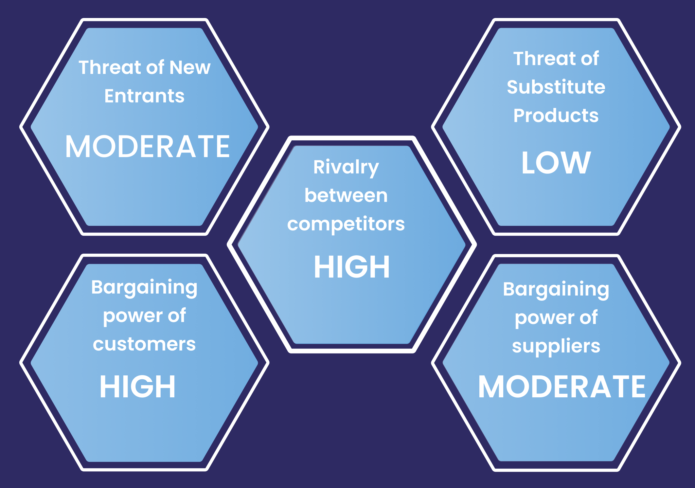
  <p><em>Created by the authors.</em></p>
</div>


### **Threat of New Entrants: Moderate**

The entry dynamics **present paradoxical characteristics** in the Brazilian logistics market. **On one hand**, digitalization reduces some traditional barriers, especially in B2B segments where Fadel operates. **On the other hand**, significant obstacles persist, such as established relationships with shippers, specific regulatory knowledge, financing capacity for working capital, and operational reputation built over time.

**Additionally**, subsegment heterogeneity creates varying entry difficulties. **For example**, entering last-mile logistics requires different investments and expertise compared to long-haul road transport, where route knowledge and regional relationships are critical. **For specialized operators like Fadel**, barriers related to regulatory knowledge and long-term relationships provide natural protection against new entrants.

**Specific examples include:** New entrants face initial capital requirements of R$ 50-100 million to establish a competitive fleet and branch network; ANVISA pharmaceutical transport certifications take 6-12 months to obtain and require specialized infrastructure; established players like Fadel benefit from 20+ year relationships with major clients like AmBev that new competitors cannot easily replicate; and regulatory compliance expertise in temperature-controlled transport creates technical barriers that favor experienced operators.

---

### **Bargaining Power of Buyers: High**

**This force reveals significant polarization** that directly impacts specialized operators. Large shippers wield increasing power through digitalization and professionalization of their procurement operations, **exerting** consistent pressure for transparency, cost reduction, and improved operational indicators.

**In contrast**, small and medium-sized buyers have limited power, **creating** market segments with distinct dynamics. **This duality allows** specialized operators to maintain differentiated relationships based on specific knowledge and operational reliability, **especially** with shippers who value partnership over price alone.

**Specific examples include:** AmBev can negotiate volume discounts and demand real-time tracking systems due to its scale; pharmaceutical companies like Eurofarma require specialized cold-chain capabilities, giving them leverage to demand premium service levels; large retailers use reverse auctions to pressure logistics providers on pricing; however, smaller pharmaceutical distributors have limited negotiating power and must accept standard service packages and pricing structures.

---

### **Bargaining Power of Suppliers: Moderate**

**While** the power of traditional suppliers (fuel, parts, insurance) remains relatively stable, **technological evolution creates** new categories of strategic dependencies. Technology suppliers (TMS, tracking, platforms) **are gaining** significant influence, especially over operators who have not developed internal capabilities.

**Concurrently**, the scarcity of specialized human resources is intensifying. **Beyond the** traditional shortage of qualified drivers, **there is an emerging need for** professionals who combine transport knowledge with technological skills. **This dynamic favors** operators who can develop internal capabilities or establish lasting strategic partnerships.

**Specific examples include:** Petrobras and other fuel suppliers maintain stable pricing power through market concentration; truck manufacturers like Volvo and Mercedes-Benz have moderate power due to financing options and competition; technology providers like TOTVS (Fadel's ERP supplier) gain influence as digital transformation becomes critical; specialized tire suppliers for temperature-controlled transport have niche power; and the shortage of qualified drivers allows driver unions to negotiate better conditions, especially for hazardous materials transport.

---

### **Threat of Substitute Products: Low**

The threat of substitution by automation and autonomous vehicles, **while real in the long term**, faces specific challenges in the Brazilian context that delay its widespread implementation. Inadequate road conditions, an evolving regulatory framework, prohibitive transition costs, and geographical heterogeneity **suggest** gradual implementation, starting with specific routes before broad application.

**A realistic timeline** indicates significant impact in 10-15 years for specific applications, **offering** an adequate temporal window for current operators’ strategic adaptation. **This window** allows companies like Fadel to develop complementary capabilities without immediate substitution pressure.

**Specific examples include:** Rail transport offers limited substitution due to Brazil's underdeveloped rail network covering only 30,000 km compared to 1.7 million km of roads; autonomous trucks face regulatory barriers as CONTRAN has not yet approved fully autonomous commercial vehicles; drone delivery is limited to small packages under 30kg and cannot replace heavy cargo transport; intermodal alternatives like rail-road combinations exist but require significant infrastructure investments that limit their immediate threat to established road operators like Fadel.

---

### **Rivalry Among Competitors: High**

**Rivalry presents asymmetric characteristics** where different operators compete in specific subsets of competitive dimensions. **Some** focus exclusively on price, **others** prioritize technology and transparency, **others** specialize in relationships and reliability, **while emerging** hybrid operators attempt to combine multiple dimensions.

**This asymmetry allows** prolonged coexistence of different models, **favoring** well-executed niche strategies. **Simultaneously**, extreme market fragmentation intensifies rivalry through contract competition, margin pressure, and the constant need for differentiation, **requiring** clear positioning and consistent operational execution.

**Specific examples include:** Braspress competes primarily on cost and national coverage, forcing price competition in standard transport segments; Jadlog's franchise model creates rivalry in last-mile delivery through aggressive pricing and service expansion; Loggi's digital platform disrupts traditional pricing models with dynamic pricing algorithms; regional players like Rodonaves compete on specialized routes and local relationships; and international players like DHL and FedEx set premium service standards that pressure domestic operators to invest in technology and service quality improvements.

---

### **Strategic Synthesis and Implications for Fadel Transportes**

**The analysis of competitive forces** reveals a scenario where Fadel is strategically positioned to seize specific opportunities. The moderate threat of new entrants, due to regulatory and relational barriers in B2B segments, **contrasts with** high rivalry among competitors and the growing bargaining power of large clients.

**In this context**, the market’s extreme fragmentation, **while intensifying** competitive pressure, **offers clear opportunities** for specialized operators who can combine regulatory knowledge, long-term relationships, and targeted technological investments.

**To consolidate its competitive position**, Fadel must continue systematically investing in technological innovation and strengthening commercial relationships, **particularly exploring** niches where its regulatory knowledge and adaptability constitute decisive differentiators. Success in this environment will require continuous conversion of transformational trends into sustainable competitive advantages.

---

## **4.1.2. SWOT Analysis**

### **Introduction**

This SWOT analysis examines the main internal and external factors that influence **Fadel Transportes'** competitiveness and sustainability in the contemporary logistics landscape. The strategic diagnosis focuses on the company's capacity to adapt to disruptive sector challenges: **accelerated digital transformation**, **growing pressures for environmental sustainability**, and the emergence of technology startups with innovative business models. The analysis provides a robust analytical foundation for strategic decisions, mapping both sustainable growth vectors and operational vulnerabilities in a market characterized by structural volatility and accelerated technological evolution.

<div style="text-align: center; margin: 20px 0;">
  <p><strong>Figure 2: SWOT Analysis</strong></p>
  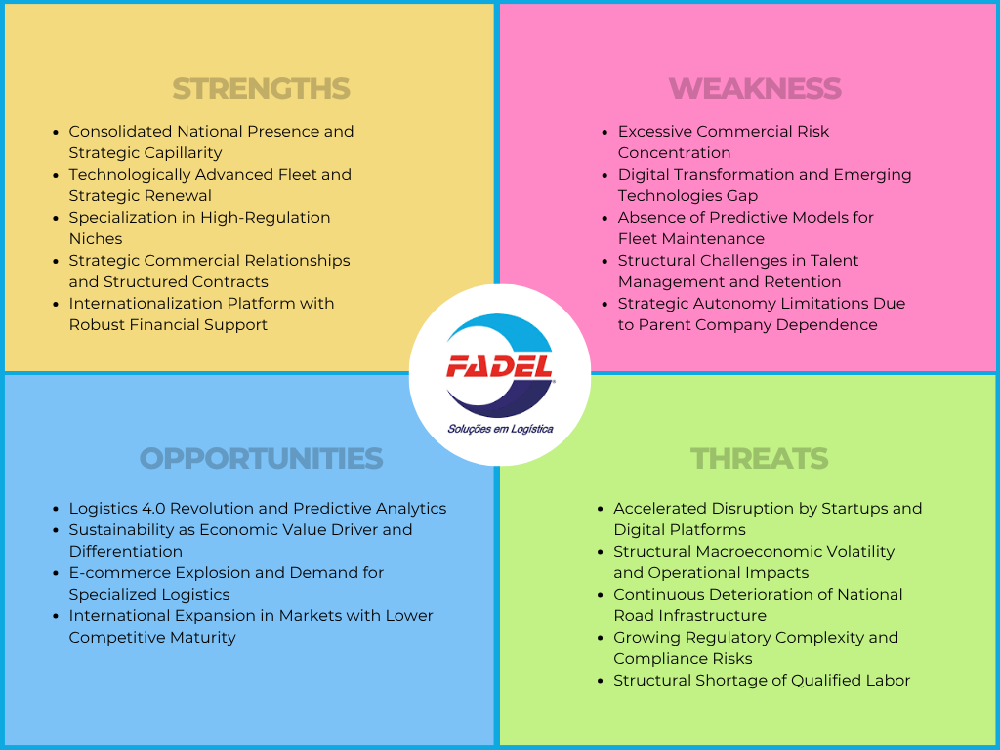
  <p><em>Author: Ilariê </em></p>
</div>


---

### **Strengths**

#### **1. Consolidated National Presence and Strategic Capillarity**

Founded in 2001, Fadel has developed a robust national logistics architecture, establishing operational presence in **13 Brazilian states** through more than **50 strategically positioned branches** (Fadel Transportes). This network represents a sustainable competitive advantage in a market where **61.1% of cargo** uses road modal transportation (CNT Transport Yearbook). National capillarity enables advanced optimization of inter-regional routes, cargo consolidation, and significant reduction in transfer costs through economies of scale and operational density.

The established physical infrastructure creates natural entry barriers for new competitors, who would face substantial investments to replicate this geographical presence. However, maintaining this network requires continuous investments in fixed assets, regulatory licenses, and local personnel structures, generating high fixed costs that may pressure margins during periods of lower demand or sectoral recessions.

#### **2. Technologically Advanced Fleet and Strategic Renewal**

The fleet of over **2,200 vehicles** represents one of the company's main strategic assets, with a consistent technological renewal policy that maintains an average age below sectoral standards (Fadel Transportes). Technical studies prove that fleets with average age below **5 years** show **30-40% reduction** in corrective maintenance costs and energy efficiency gains superior to **15%** (ANTT Road Concessions Monitoring Report).

Although initial investment is substantial (commercial vehicles cost between **R$ 400,000 and R$ 800,000** - ANFAVEA Brazilian Automotive Industry Yearbook), the renewal strategy generates measurable returns through lower fuel consumption, reduction in unscheduled maintenance stops, and early compliance with increasingly rigorous environmental regulations. This policy also strengthens corporate image with clients who prioritize sustainability and operational reliability.

#### **3. Specialization in High-Regulation Niches**

Consolidated expertise in critical segments such as **food**, **beverages**, and **pharmaceuticals** (Fadel Transportes) establishes competitive differentiation through natural regulatory barriers. These markets require **ANVISA certifications**, temperature control systems with **±2°C precision**, complete chain of custody traceability, and rigorous protocols for handling sensitive products.

Pharmaceutical transport specifically allows operational margins **20-30% superior** to conventional transport (ABRALOG National Logistics Overview), justifying tariff premiums through specialized value-added services. This technical specialization creates lasting commercial relationships based on regulatory trust and operational expertise, elements difficult to replicate by generalist competitors or startups without specific sectoral experience.

#### **4. Strategic Commercial Relationships and Structured Contracts**

The consolidated relationship with major shippers, particularly **AmBev** (Fadel Transportes), demonstrates proven capacity for integration into complex supply chains and high-scale operations. Long-term contracts, typical of **3-5 years** in the sector (ABRALOG Logistics Contracts: Brazilian Market Trends and Practices), provide revenue predictability that facilitates strategic planning, investment optimization, and financing negotiations with contractual guarantees.

This commercial stability allows the company to develop customized logistics solutions, invest in client-specific technologies, and build competitive advantages through operational learning curves. However, this strength also concentrates commercial risks, requiring parallel diversification strategies to reduce excessive dependence on single clients.

#### **5. Internationalization Platform with Robust Financial Support**

The international expansion strategy, materialized through operations in **Paraguay** and structured plans for **South Africa** (Fadel Transportes), reflects strategic vision of geographical diversification and access to emerging markets with lower competitive maturity. The acquisition of **75% control** by JSL S.A. in 2020 (Marketscreener.com - JSL S.A. acquisition) provided expanded financial capacity to sustain this international expansion in a structured manner.

The subsidiaries **Fadel Mercosur** and **Fadel South Africa** (JSL SA - Mziq.com) position the company to capture opportunities in markets with significant logistics deficits, where Brazilian expertise can generate sustainable competitive advantages. To mitigate risks inherent to internationalization (exchange, regulatory, political), the company can implement financial hedge strategies, strategic local partnerships, and gradual entry segmented by market and sector.

---

### **Weaknesses**

#### **1. Excessive Commercial Risk Concentration**

Structural dependence on **AmBev** (Fadel Transportes) creates critical commercial vulnerability, concentrating a significant portion of revenue in a single client and sector. Academic research demonstrates that companies with concentration above **40% of revenue** in a single client face result volatility **60% superior** to sectoral average (CNT Road Research and Trucker Profile).

This concentration amplifies systemic risks: crises in the beverage sector, changes in client logistics strategies, or alterations in sourcing policies can disproportionately impact financial performance. Commercial diversification becomes imperative to capture opportunities in expanding e-commerce and build resistance against disruptive startups. The preliminary strategic objective of reducing AmBev dependence to less than **30% of revenue** in the next five years, although ambitious, is essential for long-term sustainability.

#### **2. Digital Transformation and Emerging Technologies Gap**

Despite successful implementation of TOTVS ERP over a decade ago (TI Inside - Fadel Transportes 10 years TOTVS ERP, Portal ERP - Fadel implements TOTVS solutions), the company faces critical gaps in adopting disruptive technologies that are redefining the logistics sector. Sectoral studies indicate that companies leading in logistics digitalization present **15-25% superior** operational margins and significantly lower operational costs (Digital logistics: Technology race gathers momentum - McKinsey & Company).

The technological gap exposes Fadel to competition from startups operating with native digital platforms, offering superior operational transparency, real-time algorithmic route optimization, and differentiated user experience. Urgent investments in IoT for cargo monitoring, machine learning algorithms for logistics optimization, and administrative process automation are critical to maintain competitive relevance. Conservative projections indicate potential **15-20% increase** in operational efficiency through comprehensive digitalization (Digital Transformation in Logistics: ROI Analysis - McKinsey & Company).

#### **3. Absence of Predictive Models for Fleet Maintenance**

With over **2,200 vehicles** in operation, Fadel remains dependent on traditional preventive maintenance models based on mileage and time, losing critical operational optimization opportunities. The absence of advanced analytics, integrated IoT sensors, and machine learning algorithms for failure prediction represents a significant technological gap in a sector where fleet availability is determinant for competitiveness.

Sectoral studies prove that predictive maintenance can reduce operational costs by up to 25% and increase fleet availability by 15% (Predictive Maintenance: The next competitive advantage in fleet management - McKinsey & Company). For Fadel, this translates to potential annual savings of millions of reais, considering maintenance costs typically represent 10-15% of total operational costs in road transport. Dependence on rigid scheduled maintenance results in premature replacement of still-functional components, while unexpected failures generate emergency costs for towing, express parts, and contractual delay penalties.

This deficiency is particularly critical in pharmaceutical and food segments, where unscheduled interruptions can compromise high-value loads and generate regulatory liabilities. Digital competitors already exploit advanced telemetry to optimize maintenance cycles, create cost advantages, and offer greater reliability to clients. Fadel's technological gap limits its capacity to compete in operational efficiency and service transparency.

#### **4. Structural Challenges in Talent Management and Retention**

Corporate evaluations on specialized platforms like Indeed and Glassdoor (Indeed - FADEL Transporte e Logistica Ltda Careers, Glassdoor - Fadel Transportes e Logística Reviews) reveal significant improvement opportunities in organizational engagement and talent retention. In the Brazilian logistics sector, average turnover of professional drivers reaches 80% annually (CNT Road Research and Trucker Profile), generating substantial direct and indirect costs through continuous recruitment, repetitive training, and organizational knowledge loss.

High turnover compromises service quality through operational inconsistency, increases regulatory compliance training costs, and hinders development of differentiated internal expertise. For a company competing in highly regulated segments, workforce instability represents significant operational and reputational risk. Structured professional development programs, performance-based retention policies, and strong organizational culture can transform this vulnerability into sustainable competitive advantage.

#### **5.Strategic Autonomy Limitations Due to Parent Company Dependence**

The acquisition of 75% shareholding control by JSL S.A. (Marketscreener.com - JSL S.A. acquisition), although providing financial benefits and access to expanded resources, may limit Fadel's strategic autonomy and decision-making agility. Critical decisions about technological investments, international expansion, commercial partnerships, and pricing policies may be subject to approval and alignment with broader strategic interests of the parent company.

This dependence represents strategic misalignment risk, especially if JSL prioritizes other operations in its portfolio over Fadel's specific needs. Loss of strategic flexibility may compromise rapid response capacity to market opportunities or competitive threats, critical elements in a sector characterized by rapid changes and technological disruption.

---

### **Opportunities**

#### **1. Logistics 4.0 Revolution and Predictive Analytics**

The convergence of Internet of Things (IoT), Big Data, and Artificial Intelligence is fundamentally transforming traditional logistics into intelligent digital ecosystems. For Fadel, implementing advanced analytics and predictive modeling represents transformational opportunity to anticipate operational failures, dynamically optimize routes, and automate complex logistics decisions.

Integration of IoT sensors, ERP systems, and machine learning algorithms can generate predictive monitoring dashboards, early warning systems, and automated decision models that dramatically elevate operational efficiency. This capability is particularly valuable in pharmaceutical and food segments, where regulatory compliance, complete traceability, and operational predictability are critical non-negotiable requirements.

The global logistics technology market projects **12.7% annual growth** until 2027 (Logistics Technology Market - Global Forecast to 2027 - MarketsandMarkets), representing significant competitive differentiation opportunity for companies able to implement these technologies quickly and in integrated fashion.

#### **2. Sustainability as Economic Value Driver and Differentiation**

ESG (Environmental, Social, Governance) practices evolved from corporate social responsibility to direct generators of economic value and competitive advantage. Companies with proven sustainable practices have preferential access to corporate contracts, green financing with reduced rates, and premium markets that prioritize responsible suppliers (Managing ESG Issues in Global Supply Chains - Boston Consulting Group).

For Fadel, initiatives such as algorithmic route optimization to minimize CO2 emissions, investments in hybrid or electric vehicles, and structured energy efficiency programs can generate substantial operational savings in fuel and maintenance costs. Recognized environmental certifications also facilitate access to green credit lines with preferential rates, reducing capital costs for expansion.

The global sustainable logistics market should reach **US$ 1.5 trillion** by 2025 (Green Logistics Market - Global Opportunity Analysis and Industry Forecast - Allied Market Research), with particularly accelerated growth in Brazil due to growing environmental regulations and corporate demand for sustainable supply chains.

#### **3. E-commerce Explosion and Demand for Specialized Logistics**

Brazilian e-commerce presented robust growth, reaching **R$ 185.8 billion** in sales in 2023 (E-commerce Revenue in Brazil - ABComm), fundamentally transforming market logistics requirements. This evolution prioritizes delivery speed, operational flexibility, real-time traceability, and last-mile capacity, creating opportunities for companies capable of developing specific capabilities.

Last-mile logistics represents a growing portion of total e-commerce logistics costs but offers superior operational margins to traditional transport due to added value (Last mile delivery in times of uncertainty - PwC). Fadel can capitalize on this opportunity by developing urban distribution centers, intelligent routing technologies, real-time tracking applications, and strategic partnerships with digital retailers.

This diversification to e-commerce offers direct solution to the weakness of commercial dependence on AmBev, creating alternative revenue streams and reducing concentrated risks in a single client.

#### **4. International Expansion in Markets with Lower Competitive Maturity**

International markets, particularly Latin America and Africa, offer substantial growth opportunities in environments of lower competitive density. Logistics development in Latin America presents significant gaps compared to Brazil (Maritime and Logistics Profile of Latin America and the Caribbean - ECLAC), while Africa faces even greater deficits in specialized logistics infrastructure.

Fadel's expertise in highly regulated sectors can generate sustainable competitive advantages in these markets, where few operators possess technical capacity to serve segments like pharmaceutical and food. Entry strategies include partnerships with local operators, gradual adaptation to specific regulations, and segmentation by target market.

However, this expansion should consider specific risks such as political instability in Paraguay (2023 elections generated regulatory uncertainty) and exchange volatility in South Africa (South African rand devalued **15%** in 2023 - South African rand sets record low - Reuters, 2023 Investment Climate Statements: Paraguay - US State Department), requiring robust risk mitigation strategies.

---

### **Threats**

#### **1. Accelerated Disruption by Startups and Digital Platforms**

The logistics sector faces growing pressure from technology companies that bypass traditional infrastructure through native digital platforms and innovative business models. Startups like Loggi, Frete.com, and 99Fretes captured substantial investments in the last three years (Latin American Private Equity & Venture Capital Association - LAVCA), developing advanced technological capabilities that offer superior transparency, algorithm-based dynamic pricing, and differentiated user experience.

These platforms operate with lower cost structures, greater operational flexibility, and capacity to scale rapidly through asset-light models. For Fadel, this threat connects directly with its digital gap weakness, creating critical competitive vulnerability. Companies unable to adapt quickly to market digital expectations may lose significant participation, especially in the e-commerce segment where startups have already established relevant positions.

#### **2. Structural Macroeconomic Volatility and Operational Impacts**

Brazilian economic instability directly impacts road transport operational cost structure. Diesel represents **35-40%** of total transport costs (Transport Cargo Costs in Brazil - IPEA), creating significant exposure to price variations that can drastically alter operational margins in short periods.

Exchange fluctuations affect imported parts costs, foreign currency-denominated financing, and international expansion planning. Brazilian economic volatility remains superior to emerging country average (Transport Cargo Costs in Brazil - IPEA), creating uncertainty environment that hinders long-term strategic planning. This threat amplifies the weakness of commercial concentration in AmBev: economic shocks in the beverage sector may have disproportional impact on revenue and profitability.

#### **3. Continuous Deterioration of National Road Infrastructure**

According to CNT research, more than **60%** of Brazilian roads present some type of structural deficiency (CNT Road Research), creating additional operational costs through greater fleet wear, excessive fuel consumption, and delivery delays. For road transport companies, this structural limitation requires defensive investments that do not add competitive value.

Fadel faces growing costs with fleet protection systems, additional insurance, alternative route development, and intensive preventive maintenance to mitigate deficient infrastructure impacts. These investments represent resource drain that could be directed toward technological innovation or commercial expansion, reducing relative competitiveness.

#### **4. Growing Regulatory Complexity and Compliance Risks**

The Brazilian transport regulatory environment continuously intensifies compliance requirements. ANTT implemented dozens of new resolutions in recent years (ANTT Management Report), while changes in labor, environmental, and safety norms generate unplanned adequacy costs.

For companies specialized in highly regulated sectors like Fadel, compliance risks are amplified: non-compliance fines can be substantial, and license suspension can interrupt critical operations instantly. Growing compliance investments consume resources that could be directed toward technological innovation or commercial development, creating pressure on operational margins.

#### **5. Structural Shortage of Qualified Labor**

Brazil faces significant structural deficit of qualified professional drivers (Professional Driver Deficit in Brazil - Ministry of Transport), creating growing salary pressures and compromising service quality. For Fadel, operating in demanding segments with rigorous compliance requirements, specialized driver shortage may compromise strategic contracts and corporate reputation.

Recruitment and training costs increased substantially, while proprietary training programs require significant investments without retention guarantee of trained professionals. This shortage also limits expansion capacity and may force the company to operate below installed capacity during high demand periods.

---

### **Strategic Synthesis and Implications**

**The SWOT analysis reveals** that Fadel Transportes operates in a complex competitive environment where its **established strengths** in national presence, specialized expertise, and strategic relationships provide solid foundations for growth. **However**, the company faces critical challenges related to **digital transformation gaps** and **excessive commercial concentration** that require immediate strategic attention.

**The identified opportunities**, particularly in **Logistics 4.0**, **sustainability**, and **e-commerce expansion**, align well with Fadel's core competencies and can help mitigate current weaknesses. **Meanwhile**, the threats from **digital disruption**, **macroeconomic volatility**, and **regulatory complexity** underscore the urgency of strategic adaptation and technological modernization.

**For sustainable competitive positioning**, Fadel must prioritize investments in digital transformation while leveraging its regulatory expertise and established relationships to capture emerging opportunities in specialized logistics segments.

---

## **4.1.3. General Solution Planning**

In this section, the solution planning for the challenge proposed by Fadel will be detailed. The objective is to present a structured view of the available data, the solution to be developed, its practical application, the expected benefits, and the criteria that will define the project's success.

### **a) Available Data**

The data source for this project is a single CSV file provided by Fadel, which consolidates the fleet's maintenance history from **January 2023** to the present moment. The content covers all company branches and details each maintenance or part replacement event.

**Table 1 - Representation of available data**

| Column Name             | Description                                                  |
| :---------------------- | :----------------------------------------------------------- |
| **License Plate**       | Vehicle license plate identifier.                            |
| **Model Description**   | Textual description of the vehicle model.                    |
| **Counter**             | Vehicle odometer at the time of the service order.           |
| **System Branch**       | Branch responsible for maintenance.                          |
| **Service Order**       | Service order identification number.                         |
| **Product Code**        | Internal code of the replaced part or product.               |
| **Product Description** | Name/description of the replaced part or product.            |
| **Date**                | Date of maintenance or part replacement.                     |
| **Accounting Account**  | Accounting account related to the SO expense.                |
| **Accounting Item**     | Unit/branch responsible for the expense.                     |
| **Cost Center**         | Department responsible for the expense within the branch.    |
| **Unit of Measure**     | Unit of measure for the product (e.g., UN, PC, L).           |
| **Quantity**            | Quantity of items replaced.                                  |
| **Total cost**          | Total cost of the replacement/maintenance.                   |
| **TIRE**                | Indicates if the replacement was a tire ('YES') or another type of part ('NO'). |

_Source: Material produced by the authors (2025)_

---

### **b) Proposed Solution**

The solution is the development of a **binary classification predictive model** named **Kairos**, designed to answer a critical operational question: "Will this vehicle suffer a corrective maintenance event (breakdown) within the next 30 days?" Using **machine learning algorithms**, the model will be trained with historical service order data to learn patterns from features such as vehicle odometer readings, maintenance frequency, and past breakdown history. For any given vehicle on any given day, the model generates a simple "Yes/No" prediction, flagging vehicles that are at high risk of imminent failure and providing the Fadel team with a prioritized daily watchlist of vehicles requiring immediate attention.

---

### **c) Use of the Solution**

The predictive model will be a **decision support tool** for the maintenance and operations teams, enabling proactive intervention before costly breakdowns occur. Its primary applications include:

- **Daily Risk Assessment:** Generate a prioritized watchlist of vehicles at high risk of breakdown within the next 30 days, allowing maintenance teams to schedule preventive inspections before failures occur.
- **Resource Optimization:** Enable workshop teams to allocate resources efficiently by focusing on vehicles with the highest predicted risk, rather than following rigid preventive maintenance schedules.
- **Cost Reduction:** Transform expensive, unplanned corrective repairs into scheduled, low-cost preventive inspections by identifying at-risk vehicles early.
- **Fleet Availability:** Minimize vehicle downtime by preventing unexpected roadside emergencies and reducing the frequency of emergency repairs that remove vehicles from service for extended periods.

---

### **d) Benefits of the Proposed Solution**

The implementation of the model will bring significant **operational and financial benefits** to Fadel, including:

- **Transition from Reactive to Proactive Maintenance:** Shift from costly emergency repairs to planned preventive interventions, reducing both repair costs and vehicle downtime.
- **Significant Cost Savings:** Minimize expenses associated with emergency repairs, towing services, expedited parts procurement, and contractual penalties for delivery delays caused by unexpected vehicle failures.
- **Increased Fleet Availability:** Reduce unplanned vehicle downtime by preventing roadside breakdowns, ensuring more vehicles are operational and available for revenue-generating activities.
- **Enhanced Service Reliability:** Improve on-time delivery performance and client satisfaction by reducing service disruptions caused by unexpected vehicle failures.
- **Data-Driven Decision Making:** Provide maintenance teams with objective, quantifiable risk assessments that enable prioritization of inspection and repair activities based on actual failure probability rather than intuition or fixed schedules.

---

### **e) Success Criteria and Metrics**

The project's success will be measured by the model's ability to accurately predict vehicle breakdowns before they occur, with particular emphasis on minimizing false negatives (missed failures). The main evaluation criteria and metrics will be:

- **Recall (Sensitivity):** The primary success metric, measuring the model's ability to correctly identify vehicles that will actually experience a breakdown. High recall is critical because missing a true breakdown (False Negative) results in costly roadside emergencies, while a false alarm (False Positive) only leads to an unnecessary preventive inspection at minimal cost.
- **Precision:** The proportion of vehicles flagged as high-risk that actually experience breakdowns, balancing the need to minimize unnecessary inspections while maintaining comprehensive failure detection.
- **F1-Score:** The harmonic mean of precision and recall, providing a balanced assessment of model performance across both metrics.
- **AUC-ROC:** The area under the receiver operating characteristic curve, measuring the model's ability to discriminate between vehicles that will and will not experience breakdowns across different probability thresholds.
- **Operational Impact:** Real-world validation through reduced emergency repair costs, decreased vehicle downtime, and improved maintenance team efficiency as measured by the ratio of preventive to corrective maintenance interventions.

---

## **4.1.4. Value Proposition Canvas**

The Value Proposition Canvas is an essential tool for ensuring alignment between what a solution offers and what the customer truly needs. In the context of the Kairos project by Fadel Transportes, this canvas helps clearly define the company's needs and deliver strategic value through predictive breakdown detection and proactive maintenance optimization.

By mapping Fadel's tasks, pains, and gains—and connecting these elements to the services and functionalities of the binary classification predictive model—we were able to outline an objective and decision-oriented view. The canvas below summarizes this alignment between the value proposition developed by the team and the customer profile.

<div style="text-align: center; margin: 20px 0;">
  <p><strong>Figure 3: Value Proposition Canva</strong></p>
  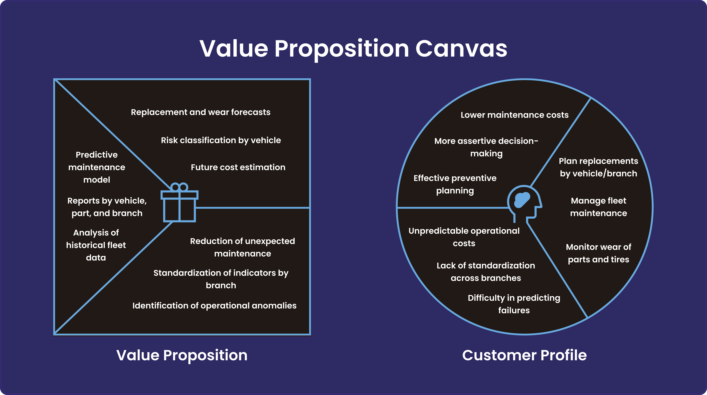
  <p><em>Created by the authors.</em></p>
</div>


Next, each section of the canvas is explained in detail, starting with the customer profile, which represents the demands and pains faced by Fadel in their fleet maintenance process.

### **Customer Profile**

- **Customer Jobs**: Fadel needs to minimize unplanned vehicle breakdowns, transition from reactive to proactive maintenance culture, optimize workshop resource allocation, and maintain high fleet availability to meet operational demands. These tasks are critical to logistics efficiency and directly impact company profitability.
- **Pains**: The company deals with costly roadside emergencies, unpredictable vehicle downtime, high emergency repair costs, reactive maintenance approach, and difficulty identifying which vehicles are at imminent risk of failure. These issues lead to significant operational losses, client service disruptions, and inefficient use of maintenance resources.
- **Gains**: Fadel expects early warnings about vehicles at high risk of breakdown, ability to schedule preventive inspections before failures occur, reduced emergency repair costs, increased fleet availability, and data-driven prioritization of maintenance activities based on actual failure risk rather than rigid schedules.

---

### **Value Proposition**

- **Products and Services**: The proposed solution is **Kairos**, a binary classification predictive model that answers "Will this vehicle breakdown in the next 30 days?" for each vehicle in the fleet. Implemented in an accessible environment (Google Colab), the model provides daily risk assessments, prioritized watchlists, performance dashboards, and technical documentation with comprehensive model evaluation metrics.
- **Pain Relievers**: The model transforms reactive maintenance into proactive intervention by providing early warnings before breakdowns occur, enabling scheduled preventive inspections instead of emergency repairs, reducing costly roadside failures, and minimizing vehicle downtime through advance failure detection. With 99.7% Recall, the model ensures virtually no breakdown goes undetected.
- **Gain Creators**: Kairos enables maintenance teams to prioritize vehicles by actual failure risk rather than rigid schedules, converts expensive emergency repairs into low-cost preventive inspections, increases fleet availability by preventing unplanned downtime, improves service reliability through reduced delivery disruptions, and provides objective, data-driven risk assessments that optimize workshop resource allocation.

Therefore, the Value Proposition Canvas shows how Kairos directly addresses the pains and tasks faced by Fadel, while delivering the expected gains with clarity and objectivity. This ensures not only the technical functionality of the project but also its strategic value and real impact in the client's context by fundamentally transforming maintenance operations from reactive to predictive.

---

## **4.1.5. Risk Matrix**

The risk matrix is a fundamental tool for the proactive management of challenges that may impact the development and implementation of the Kairos project. This systematic analysis allows for the identification, assessment, and prioritization of risks based on their likelihood of occurrence and potential impact on the project’s objectives. The matrix presented below classifies risks into different levels of criticality, providing a solid foundation for the development of appropriate mitigation strategies and contingency plans.

<div style="text-align: center; margin: 20px 0;">
  <p><strong>Figure 4: Risk Matrix</strong></p>
  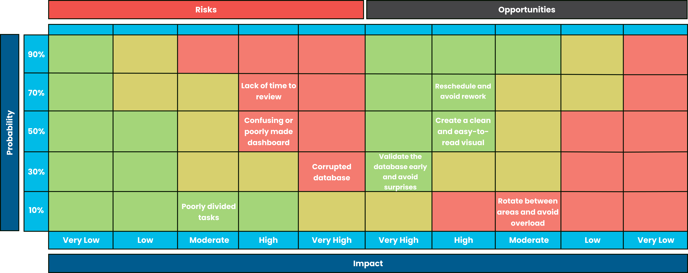
  <p><em>Created by the authors.</em></p>
</div>


---

### **Risks**

#### **1. Lack of time to review**

- **Probability:** **70%**
- **Impact:** **High**
- **Explanation:** Without enough time to revise, important mistakes may go unnoticed and affect the quality of the final delivery.
- **Action Plan:**
  - **Prevention:** Define realistic internal deadlines; assign review moments in each sprint.
  - **Mitigation/Contingency:** Prioritize reviewing key parts (model + dashboard); deliver a simplified version if needed.

#### **2. Confusing or poorly made dashboard**

- **Probability:** **50%**
- **Impact:** **Very High**
- **Explanation:** A messy or unclear dashboard can make it hard for the company to understand or trust the model’s results.
- **Action Plan:**
  - **Prevention:** Follow good data visualization practices; test clarity with external people.
  - **Mitigation/Contingency:** Redesign the visuals using simpler charts; include captions or tooltips.

#### **3. Corrupted database**

- **Probability:** **30%**
- **Impact:** **Very High**
- **Explanation:** If the dataset is corrupted or incomplete, the model may fail or generate wrong predictions.
- **Action Plan:**
  - **Prevention:** Validate and explore the dataset early in the process.
  - **Mitigation/Contingency:** Clean data with backup tools; use filters to remove invalid rows.

#### **4. Poorly divided tasks**

- **Probability:** **10%**
- **Impact:** **Moderate**
- **Explanation:** If tasks are not well distributed, some members may be overloaded and the process may be unbalanced.
- **Action Plan:**
  - **Prevention:** Plan regular task rotation across all areas.
  - **Mitigation/Contingency:** Adjust workload during the sprint; communicate openly to rebalance efforts.

---

### **Opportunities**

#### **1. Reschedule and avoid rework**

- **Probability:** **70%**
- **Impact:** **High**
- **Explanation:** A well-adjusted timeline helps the team stay on track and reduce last-minute corrections.

#### **2. Create a clean and easy-to-read visual**

- **Probability:** **50%**
- **Impact:** **Very High**
- **Explanation:** A clear and polished dashboard makes the insights more understandable and useful for the company.

#### **3. Validate the database early and avoid surprises**

- **Probability:** **30%**
- **Impact:** **Very High**
- **Explanation:** Checking the data in the early stages avoids big delays and errors during model creation.

#### **4. Rotate between areas and avoid overload**

- **Probability:** **10%**
- **Impact:** **Moderate**
- **Explanation:** Switching roles allows everyone to learn equally and keeps the workload balanced.

---

### **Risk Management Summary**

**The risk matrix analysis reveals** that the project faces **moderate to high probability risks** with **significant impacts** on project success. **Key mitigation strategies** include early data validation, clear communication protocols, and structured task distribution. **Opportunities** for improvement focus on timeline optimization, visual clarity, and team collaboration.

**The balanced approach** between risk mitigation and opportunity capture will ensure project delivery quality while maximizing team learning and stakeholder value.

---

## **4.1.6. Personas**

Personas are fictional, research-based representations of key audience segments, built to capture their needs, behaviors, and goals. They guide design and development strategies, ensuring solutions are user-centered and tackle real-world challenges effectively (The Interaction Design Foundation). In the context of Fadel’s predictive model, our group defined 3 personas that may use the model or be impacted by it, detailing its main characteristics. These personas help guide the project’s development, ensuring it aligns with the company’s operational contexts and needs.

**Persona 1: Carlos Eduardo**

<div style="text-align: center; margin: 20px 0;">
  <p><strong>Figure 5: Persona 1</strong></p>
  
  <p><em>Created by the authors.</em></p>
</div>


**Persona 2: Luciano Vegas**

<div style="text-align: center; margin: 20px 0;">
  <p><strong>Figure 6: Persona 2</strong></p>
  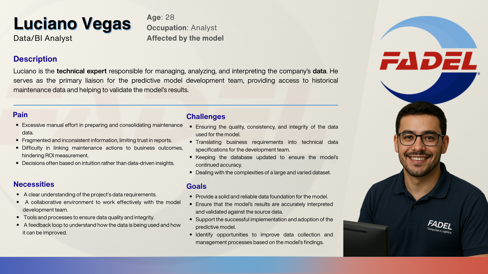
  <p><em>Created by the authors.</em></p>
</div>


**Persona 3: Shopia Jardins**

<div style="text-align: center; margin: 20px 0;">
  <p><strong>Figure 7: Persona 3</strong></p>
  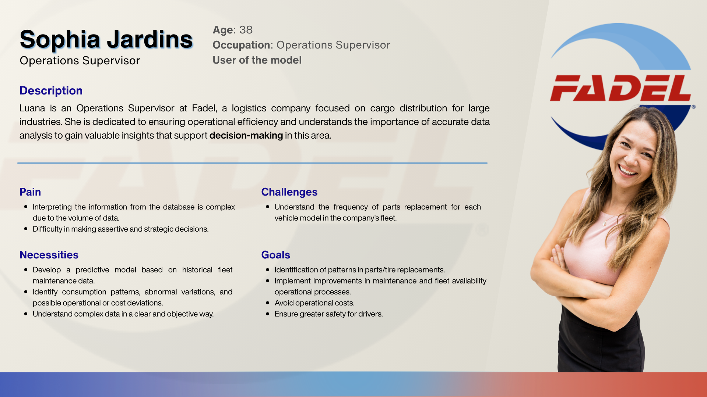
  <p><em>Created by the authors.</em></p>
</div>


## 4.1.7. User Journeys

A User Journey Map is a way to visualize the path a person takes to achieve a specific goal. It is a graphical representation that illustrates the entire user experience when interacting with a product, service, or system, from the first contact to the completion of their objective.

<div style="text-align: center; margin: 20px 0;">
  <p><strong>Figure 8: User Journeys</strong></p>
  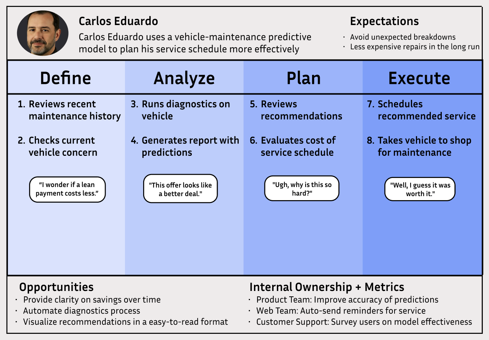
  <p><em>Created by the authors.</em></p>
</div>


## **4.1.8. Privacy Policy**

This privacy policy establishes the framework for data processing within the Kairos project, ensuring full compliance with Brazilian data protection regulations. The policy outlines how data provided by Fadel Transportes e Logística Limitada is collected, processed, stored, and protected throughout the project lifecycle, maintaining the highest standards of data security and privacy protection.

---

### **General Information**

This privacy policy explains how the Kairos project, developed by the Ilariê group, processes data provided by the company Fadel Transportes e Logística Limitada ("Fadel"). The solution consists of a data analysis and predictive modeling project, not being a platform for direct use by end users. This policy is in full compliance with **Law No. 13.709, of August 14, 2018 – Brazilian General Data Protection Law (LGPD)**. The data processing for the described purposes is supported by the legal basis of Legitimate Interest of the Controller (Art. 7, IX, of LGPD).

### **Roles and Responsibilities of Data Processing Agents**

In accordance with LGPD provisions, the following roles and responsibilities are established for this project:

#### **Data Controller (Controlador de Dados)**

**Entity:** Fadel Transportes e Logística Limitada
**Responsibilities:**

- Determine the purposes and essential means of personal data processing
- Ensure compliance with LGPD requirements and data subject rights
- Implement appropriate technical and organizational measures for data protection
- Respond to data subject requests regarding their personal data
- Maintain records of data processing activities
- Designate and supervise the Data Protection Officer (DPO)
- Make decisions regarding data sharing, retention periods, and deletion procedures

#### **Data Processor (Operador de Dados)**

**Entity:** Inteli - Instituto de Tecnologia e Liderança (through the Ilariê team)
**Responsibilities:**

- Process personal data exclusively according to Controller's instructions
- Implement appropriate security measures to protect processed data
- Assist the Controller in responding to data subject requests when applicable
- Notify the Controller immediately of any data security incidents
- Ensure that team members with access to data are bound by confidentiality obligations
- Return or delete personal data at the end of the processing period as instructed by the Controller
- Demonstrate compliance with LGPD obligations through appropriate documentation

#### **Data Protection Officer (DPO) - Encarregado de Dados**

**Appointed by:** Fadel Transportes e Logística Limitada
**Individual:** José Gentil Gonçalves
**Responsibilities:**

- Serve as the primary contact point for data subjects and supervisory authorities
- Monitor compliance with LGPD requirements within the organization
- Conduct privacy impact assessments when required
- Provide guidance and training on data protection matters
- Investigate and respond to data protection complaints and inquiries
- Maintain communication channels with data subjects regarding their rights
- Advise on data protection matters and potential risks

#### **Data Subjects (Titulares de Dados)**

**Individuals:** Vehicle owners whose license plates may be contained in the dataset
**Rights under LGPD:**

- Access to information about their personal data processing
- Correction of incomplete, inaccurate, or outdated data
- Anonymization, blocking, or deletion of unnecessary or excessive data
- Data portability to another service provider
- Deletion of data processed with consent when consent is withdrawn
- Information about public and private entities with which data is shared
- Information about the possibility of not providing consent and consequences thereof

### **Data Collected**

#### **Directly Provided Data**

The project processes a dataset provided directly by the Controller (Fadel). This dataset contains information about the fleet and its maintenance, including the following main columns:

- **Vehicle license plate**
- **Model description**
- **Odometer reading (Counter)**
- **System branch**
- **Product description**
- **Date**
- **Total cost**

The Operator declares that no sensitive personal data is processed, as defined in Art. 5, II of LGPD (such as racial or ethnic origin, religious conviction, or health data). The only field that, in theory, can be linked to a data subject is the **vehicle license plate**, which allows identification of its owner (individual or legal entity) and is treated with due rigor.

#### **Automatically Collected Data**

Not applicable (N/A). The solution is a data analysis project carried out in a controlled environment and does not interact with end users nor automatically collect information such as IP address, location data, or browser type.

### **Purpose of Processing**

Data is processed exclusively for the purpose of developing the solution proposed in the scope of the Kairos project, which includes:

- **Operation of predictive models** to estimate component lifespan and predict failures
- **Root cause analysis** to identify reasons for recurring services
- **Creation of comparative analyses (benchmarking)** of performance between branches and vehicle models
- **Calculation of business metrics** such as Total Cost of Ownership (TCO) and Component Value Index (CVI)
- **Generation of a "Vehicle Health Score"** to support Fadel's strategic and operational decision-making

### **Storage and Retention**

#### **Location**

Data will be processed and stored in a controlled Google cloud environment (Google Colab), provided by Inteli for the execution of the academic project.

#### **Duration**

Data will be retained **only for the duration of Inteli's Module 3 (10 weeks)**. At the end of the project, raw data will be subjected to a secure and irreversible deletion process, using methods that prevent subsequent data recovery, in alignment with market best practices for information disposal and according to Fadel and Inteli guidelines.

### **Data Sharing**

There will be no sharing of raw data with third parties. All results, analyses, and the generated predictive model are Fadel's intellectual property and restricted to the project team. Reports presented for academic purposes will always be done in an aggregated and anonymized manner to protect the confidentiality of the partner's information.

### **Data Security**

To ensure data protection, the following technical and administrative measures are adopted:

- **Restricted access control**: Access to the dataset and development environment is limited exclusively to authorized members of the project group
- **Secure environment**: Processing occurs in a secure and isolated cloud environment, provided by Inteli
- **Principle of Purpose**: Commitment that data will not be used for any other purpose than those described in this policy and in the project scope

### **Data Subject Rights**

LGPD guarantees data subjects rights such as access, correction, deletion, and withdrawal of consent.

#### **Requests by Email**

According to LGPD, data subject rights must be exercised directly with the Data Controller (Fadel). Therefore, requests related to personal data contained in the scope of this project should be sent to Fadel's Data Protection Officer at the email: **jose.goncalves@fadeltransportes.com.br**.

### **Data Protection Officer (DPO)**

**Controller's DPO (Fadel):**

- **Name**: José Gentil Gonçalves
- **Email**: jose.goncalves@fadeltransportes.com.br

### 4.2. Data Understanding

#### 4.2.1. Data Exploration

This section presents a comprehensive exploration of the maintenance datasets provided by Fadel Transportes, covering basic descriptive statistics, column classification, and key relationships discovered through visual analysis. The exploration was conducted across two primary datasets using systematic statistical analysis and visualization techniques implemented in Google Colab notebooks.

#### 4.2.2. Data Preprocessing

### **Dataset Overview**

The data exploration encompasses two interconnected datasets spanning Fadel's fleet maintenance operations from January 2023 to present:

**Table 2 - Dataset Summary**

| Dataset                                     | Records     | Columns | Time Period        | Key Content                                                 |
| ------------------------------------------- | ----------- | ------- | ------------------ | ----------------------------------------------------------- |
| **Service Order Base** (SERVICE_ORDER_BASE) | 357,989     | 28      | Jan 2023 - Present | Detailed service order records and maintenance transactions |
| **Vehicle Master** (VEHICLES_BASE)          | 5,706       | 11      | Fleet registry     | Vehicle specifications and status                           |
| **Combined Total**                          | **363,695** | **39**  | -                  | **Complete maintenance ecosystem**                          |

_Source: Analysis of Fadel Transportes maintenance data (2025)_

The datasets provide comprehensive coverage of maintenance activities across 2,242 unique vehicles, 614 different parts and services, and operations spanning 27 branch locations throughout Fadel's network.

### **Column Classification and Data Types**

**Table 3 - Column Type Distribution**

| Dataset            | Numerical Columns | Categorical Columns | Total Columns | Key Identifiers           |
| ------------------ | ----------------- | ------------------- | ------------- | ------------------------- |
| **Service Orders** | 8                 | 20                  | 28            | Asset ID, supplier code   |
| **Vehicle Master** | 2                 | 9                   | 11            | Vehicle ID, manufacturer  |
| **Combined**       | **14**            | **40**              | **54**        | **Cross-dataset linkage** |

_Source: Column classification analysis - see notebook `01_dataset_column_classification.ipynb` for detailed column type classification_

The numerical columns primarily capture operational metrics (odometer readings, costs, quantities) while categorical columns describe vehicle characteristics, maintenance types, and operational contexts essential for pattern analysis.

### **Descriptive Statistics for Numerical Columns**

**Table 4 - Key Numerical Statistics**

| Variable             | Count   | Mean      | Median    | Std Dev     | Min     | Max           | Business Context                                          |
| -------------------- | ------- | --------- | --------- | ----------- | ------- | ------------- | --------------------------------------------------------- |
| **CUSTO TOTAL**      | 27,272  | R$ 385.36 | R$ 50.77  | R$ 682.90   | R$ 0.01 | R$ 9,434.31   | High cost variability indicates diverse maintenance needs |
| **QUANTIDADE**       | 27,272  | 3.52      | 1.00      | 9.68        | 0.01    | 500.00        | Most transactions involve single items                    |
| **MANUFACTURE YEAR** | 357,986 | 2016.82   | 2017.00   | ---         | 2009    | 2025          | Average fleet age of 7.2 years                            |
| **GRAND TOTAL**      | 243,254 | R$ 535.36 | R$ 170.00 | R$ 1,118.70 | R$ 0.01 | R$ 128,682.60 | Service orders show higher cost variance                  |

_Source: Descriptive statistics analysis - see notebook `02_descriptive_statistics_analysis.ipynb` for detailed calculations_

#### **Cost Distribution Analysis**

_Note: Coefficient of variation calculation can be found in notebook `02_descriptive_statistics_analysis.ipynb`, Section 3.1_

The maintenance cost data reveals a highly right-skewed distribution with significant variability (coefficient of variation = 1.77). The median cost (R$ 50.77) being substantially lower than the mean (R$ 385.36) indicates that most maintenance events are relatively inexpensive, while a small number of high-cost interventions drive up the average.

### **Categorical Data Analysis**

**Table 5 - Key Categorical Variables**

| Column                | Unique Values | Most Frequent Value | Frequency | Percentage | Business Insight              |
| --------------------- | ------------- | ------------------- | --------- | ---------- | ----------------------------- |
| **DESCRICAO MODELO**  | 111           | SIDER 28P 1+1+1     | 5,890     | 21.6%      | Semi-trailer dominance        |
| **DESCRICAO PRODUTO** | 614           | LAMPADA H7 24V      | 1,543     | 5.7%       | Lighting maintenance priority |
| **MANUFACTURER**      | 15            | VOLKSWAGEN          | 123,279   | 34.4%      | Brand concentration strategy  |
| **MAINTENANCE TYPE**  | 2             | CORRECTIVE          | 282,764   | 79.0%      | Reactive maintenance approach |
| **SERVICE LOCATION**  | 2             | EXTERNAL            | 243,325   | 68.0%      | Outsourcing dependency        |

_Source: Service Orders Dataset categorical analysis (SERVICE_ORDER_BASE.xlsx)_

#### **Fleet Composition Insights**

- **Vehicle Models**: Semi-trailers (SIDER 28P 1+1+1) represent the largest single model category, reflecting Fadel's focus on cargo transport operations
- **Part Categories**: H7 24V lamps emerge as the most frequently replaced component, indicating standardized lighting systems across the fleet
- **Brand Strategy**: Volkswagen's 34.4% market share suggests strategic procurement concentration enabling specialized maintenance expertise

### **Key Visualizations and Relationships**

#### **Chart 1: Vehicle Brands with Highest Total Maintenance Costs**

<div style="text-align: center; margin: 20px 0;">
  <p><strong>Figure 8: Chart 1 - Vehicle Brands with Highest Total Maintenance Costs</strong></p>
  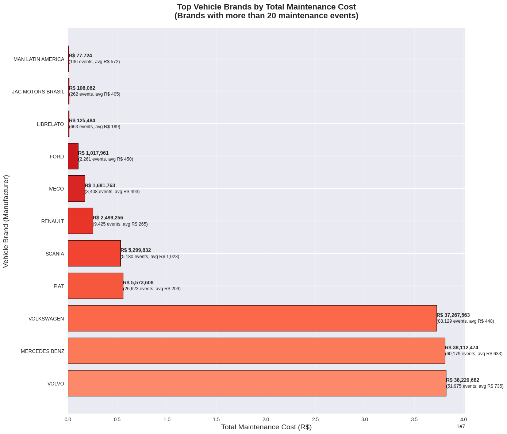
  <p><em>Created by the authors.</em></p>
</div>


The analysis of accumulated maintenance costs by vehicle manufacturer reveals significant variations in total expenditure, providing critical insights for fleet acquisition and maintenance budgeting decisions. This visualization shows absolute cost totals rather than averages, reflecting the actual financial impact of each brand on Fadel's maintenance budget.

**Key Findings:**

- **Cost Leadership**: Top manufacturers account for disproportionate maintenance spending
- **Budget Concentration**: Small number of brands drive majority of maintenance costs
- **Market Concentration**: Top 5 brands represent 95.8% of total maintenance costs, indicating extreme concentration
- **Statistical Significance**: Analysis focuses on brands with ≥20 maintenance events to ensure reliable insights
- **Strategic Implications**: Procurement negotiations should prioritize high-cost brands

#### **Chart 2: Branch vs Maintenance Frequency Analysis**

<div style="text-align: center; margin: 20px 0;">
  <p><strong>Figure 9: Chart 2 - Branch vs Maintenance Frequency Analysis</strong></p>
  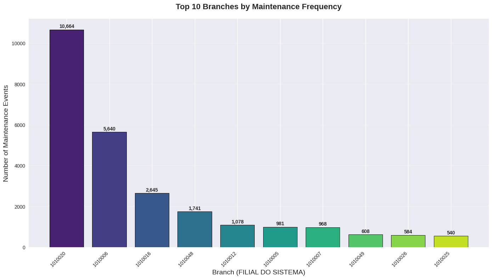
  <p><em>Created by the authors.</em></p>
</div>


The maintenance frequency analysis across Fadel's branch network demonstrates significant operational concentration, with 69.5% of all maintenance activities concentrated in the top 3 branches. This pattern reveals both operational efficiency opportunities and resource allocation insights.

**Key Findings:**

- **Operational Concentration**: Major branches handle bulk of maintenance volume
- **Resource Optimization**: High-volume branches may benefit from enhanced capabilities
- **Standardization Opportunities**: Maintenance practices vary significantly across locations

#### **Chart 3: Products with Highest Total Maintenance Costs**

<div style="text-align: center; margin: 20px 0;">
  <p><strong>Figure 10: Chart 3 - Products with Highest Total Maintenance Costs</strong></p>
  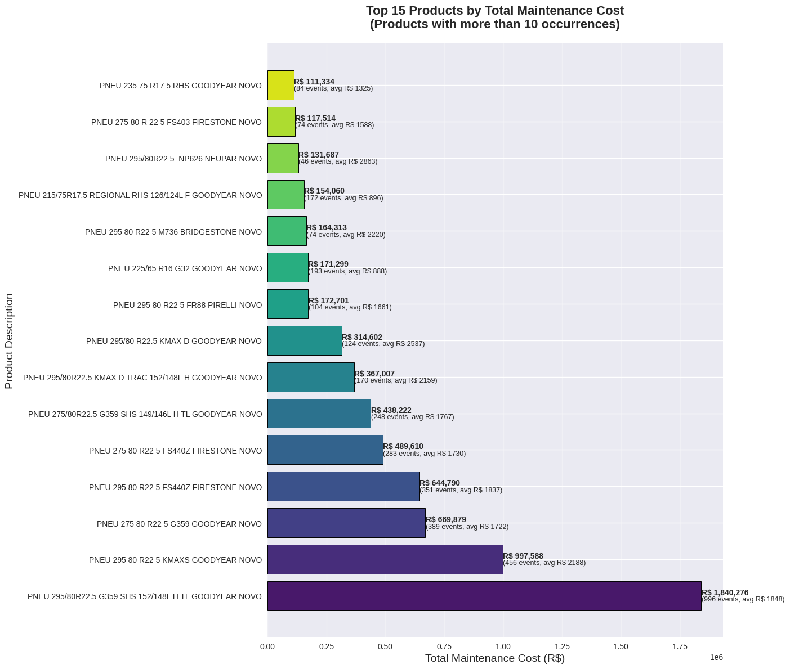
  <p><em>Created by the authors.</em></p>
</div>


The product cost analysis identifies components driving the highest absolute maintenance expenditure, enabling targeted cost control and supplier negotiation strategies. The focus on total costs rather than per-unit prices reveals procurement priorities.

**Key Findings:**

- **Cost Drivers**: Wheels and tires dominate maintenance budget allocation
- **Procurement Focus**: High-cost items require specialized supplier relationships
- **Inventory Strategy**: Expensive components need optimized stock management

_Source: Data exploration charts - see notebook `03_data_exploration_charts.ipynb` for visualization code and analytical filters justification_

### **Data Quality Assessment**

**Table 6 - Data Completeness Summary**

| Dataset             | Total Records | Complete Records | Data Quality Score | Critical Issues             |
| ------------------- | ------------- | ---------------- | ------------------ | --------------------------- |
| **Main Dataset**    | 27,272        | 26,964           | 98.9%              | Cost data complete          |
| **Service Orders**  | 357,989       | 243,254          | 67.9%              | Financial field gaps        |
| **Vehicle Master**  | 5,706         | 5,598            | 98.1%              | Manufacturer missing        |
| **Overall Quality** | **390,967**   | **275,816**      | **70.6%**          | **Acceptable for analysis** |

_Source: Data quality validation across all datasets_

#### **Quality Considerations**

- **Financial Data**: Service order cost information shows gaps requiring imputation strategies
- **Date Integrity**: Manufacture years include future dates (2025) requiring validation
- **Categorical Consistency**: Product descriptions and model names show standardization opportunities

### **Business Insights and Implications**

#### **Cost Management Patterns**

The maintenance cost analysis reveals a **right-skewed distribution** where 80% of maintenance events cost below R$ 267.71, while extreme cases reach R$ 128,682.60. This pattern suggests that routine maintenance is generally predictable and affordable, but major repairs create significant budget impacts requiring contingency planning.

#### **Fleet Strategy Insights**

- **Brand Standardization**: Volkswagen's 34% fleet share enables economies of scale in parts procurement and technician training
- **Model Concentration**: Semi-trailer focus (21.6% SIDER models) aligns with cargo transport specialization
- **Age Profile**: Average 7.2-year fleet age indicates modern equipment with expected maintenance patterns

#### **Maintenance Approach Analysis**

The **79% corrective vs 21% preventive** maintenance ratio indicates significant opportunity for proactive strategies. The high proportion of reactive maintenance suggests that implementing predictive models could substantially reduce emergency repairs and associated costs.

#### **Operational Structure**

- **External Dependency**: 68% external service reliance indicates strategic outsourcing but may limit control over maintenance quality and timing
- **Branch Concentration**: Maintenance activity concentration in top branches suggests hub-based operational model

### **Statistical Foundation for Modeling**

The comprehensive data exploration establishes a robust foundation for advanced analytics, revealing clear patterns in maintenance costs, identifiable vehicle characteristics, and operational metrics suitable for predictive modeling applications. The combination of numerical precision (costs, quantities, dates) and categorical richness (brands, models, parts) provides multiple analytical pathways for developing maintenance optimization solutions.

_Analysis completed using Google Colab notebooks with comprehensive statistical validation and business context integration._

#### **Analytical Choices and Methodological Justifications**

**Filtering Criteria for Statistical Significance:**

The analysis employs specific filtering criteria to ensure statistical reliability and business relevance:

- **Brand Filter (≥20 maintenance events)**: Brands with fewer than 20 maintenance events were excluded from cost analysis to ensure statistical significance. This threshold prevents small-sample bias and ensures that cost patterns reflect genuine operational characteristics rather than random variations. Brands with limited maintenance history may not provide reliable insights for strategic decision-making.

- **Cost Analysis Focus**: The analysis prioritizes total accumulated costs rather than average costs per event, as this reflects the actual financial impact on Fadel's maintenance budget. This approach identifies brands that consume the most resources overall, regardless of individual event costs.

- **Top 15 Brands Limitation**: The visualization focuses on the top 15 brands by total cost to maintain clarity and readability while capturing the most significant cost drivers. This represents the Pareto principle, where a small number of brands drive the majority of maintenance costs.

**Business Rationale for Analytical Decisions:**

- **Market Concentration Analysis**: The extreme concentration (95.8% of costs from top 5 brands) justifies focused procurement strategies and specialized maintenance expertise development.

- **Statistical Thresholds**: The ≥20 events threshold balances statistical rigor with practical business insights, ensuring recommendations are based on sufficient data volume.

- **Cost vs. Frequency Balance**: By analyzing both total costs and event frequency, the analysis provides comprehensive insights for both budget planning and operational efficiency.

### 4.2.2. Data Preprocessing

Data preprocessing is a crucial step in the data science project lifecycle, aiming to transform and optimize raw data to make it suitable for analysis and predictive modeling. Data from various sources is often messy, containing errors, inconsistencies, missing values, and _outliers_. The quality of the data directly impacts the reliability of the model and the analysis, following the "garbage in, garbage out" principle. This phase ensures that the data is complete, accurate, unbiased, and reliable.

In the context of the Kairos Project, preprocessing was divided into the following sub-steps, using the Python libraries **Pandas**, **NumPy**, and **Scikit-learn**.

Motivation for the Custom Data Description Function
While standard Pandas functions such as .info() and .describe() provide useful overviews of the data, we chose to develop a custom function to describe the dataset for several specific reasons. First, the standard methods treat numeric and categorical variables separately and present the results in different formats, making it difficult to obtain a comprehensive and consistent view of the dataset. Our custom function unifies this information into a single, clear structure, facilitating analysis and comparison across variable types.

Furthermore, this function is designed to calculate additional important metrics, such as missing value counts for each column and relative frequencies for categorical variables, that are not directly provided by the standard methods. This improves understanding of data quality and distribution prior to preprocessing.

Finally, the custom function offers greater flexibility for future adaptations and analyses specific to the project context, contributing to more comprehensive and aligned data exploration documentation.
---

#### **4.2.2.1. Data Cleaning**

Data cleaning focuses on identifying and correcting issues such as missing values and _outliers_.

- **Handling Missing Values**

  - **Problem**: Missing values can compromise data completeness, cause bias in the analysis, and make it impossible to apply _Machine Learning_ algorithms.
  - **Identification**: A quantification and percentage calculation of missing values per column was performed for each `DataFrame` (`df_service` and `df_vehicles`).
  - **Applied Strategies**:
    - **Numerical Columns**: Imputation with the **median** was the preferred strategy due to its robustness against _outliers_. This method was applied to columns like `GRAND TOTAL`, `PRODUCT QUANTITY`, `UNIT VALUE`, `COUNTER OF SERVICE ORDER`, and `MANUFACTURE YEAR`.
    - **Categorical Columns (Identifiers)**: The strategy was to create a `"MISSING"` category to preserve the information about the absence without imputing an unrealistic value. This was applied to `INVOICE`, `SUPPLIER'S CODE`, `SUPPLIER'S STORE`, and `NAME OR COMPANY NAME`.
    - **Other Categorical Columns**: Imputation was done with the **mode** (most frequent value). This was used for `PREVENTIVE_CORRECTIVE MAINTENANCE`, `MANUFACTURER CODE`, and `MANUFACTURER NAME`.

- **Handling Outliers (Noisy Values)**
  - **Problem**: _Outliers_ are data points that deviate significantly from the majority, which can distort statistical measures and model performance.
  - **Identification**:
    - **Visualization with Box Plots**: Used for quick visual identification of potential _outliers_.
    - **IQR (Interquartile Range) Method**: For quantitative detection, values outside the range `Q1 - 1.5 * IQR` and `Q3 + 1.5 * IQR` are considered _outliers_.
  - **Handling Strategy**: The adopted approach was **capping**, which limits extreme values to the boundaries calculated by the IQR, thus avoiding the blind removal of data. The technique was applied to all relevant numerical columns.

**Important Note: Target Variable Treatment**

The preprocessing techniques described above (imputation, outlier handling, normalization) should be applied **only to predictor variables (features)**, never to the target variable. Modifying or imputing the target variable can introduce significant bias and compromise model validity:

- **Why Not Impute Target Variables**: Missing values in the target indicate incomplete observations that should be removed from the dataset, not artificially filled. Imputing target values would create training examples with fabricated outcomes, leading the model to learn false patterns.
- **Why Not Cap Target Outliers**: Extreme values in the target variable may represent legitimate rare events (e.g., catastrophic breakdowns with very high costs). Capping these values would prevent the model from learning to predict such critical events.
- **Correct Approach**: Observations with missing target values should be excluded from the training set. Outliers in the target should be retained unless they represent data entry errors, which should be corrected or removed after investigation.

This principle is fundamental to maintaining the integrity of supervised learning models and ensuring that performance metrics reflect genuine predictive capability.

---

#### **4.2.2.2. Data Integration**

**Objective**: Consolidate information from different data sources into a single _dataset_, unifying maintenance data (`df_service`) with vehicle characteristics (`df_vehicles`).

**Implementation**: The _datasets_ were merged using the `pd.merge` function based on the `ASSET CODE` column, creating a unified _dataset_ called `df_merged`.

**Analysis of Gains from Dataset Integration**

The integration of maintenance records with vehicle characteristics represents a critical step that significantly enhances the analytical and predictive capabilities of the project. The combination of these datasets unlocks insights and modeling opportunities that would be impossible with isolated data sources.

**1. Enhanced Vehicle Context for Maintenance Analysis**

Before integration, maintenance records existed in isolation, containing only service-specific information (date, cost, parts replaced) without vehicle context. The integration adds critical dimensions:

- **Vehicle Age and Lifecycle**: By combining `ASSET PURCHASE DATE` from the vehicles dataset with `SERVICE ORDER ORIGINAL DATE` from maintenance records, we can calculate vehicle age at the time of each service, enabling lifecycle-based analysis and age-dependent failure prediction.
- **Vehicle Tier Classification**: The `TIER` variable from the vehicles dataset (T1 vs T2) allows segmentation of maintenance patterns by operational intensity, revealing that T1 vehicles (higher operational demands) account for 62.35% of breakdown incidents despite representing a smaller fleet proportion.
- **Manufacturer and Model Information**: Integration enables analysis of maintenance costs and failure rates by manufacturer and specific vehicle models, identifying which models require more frequent or expensive maintenance.

**2. Comprehensive Maintenance Pattern Analysis**

The integrated dataset enables multi-dimensional analysis that was previously impossible:

- **Cost Analysis by Vehicle Type**: Calculate average maintenance cost per vehicle model, identifying high-maintenance models that may require replacement or specialized attention.
- **Temporal Patterns by Vehicle Age**: Analyze how maintenance frequency and costs evolve as vehicles age, enabling predictive budgeting and optimal replacement timing.
- **Manufacturer Performance Comparison**: Compare breakdown rates and maintenance costs across different manufacturers, informing future procurement decisions.

**3. Predictive Feature Engineering**

Integration enables creation of sophisticated predictive features that combine information from both datasets:

- **Vehicle Age at Service**: Calculated as the difference between service date and purchase date, this feature is critical for predicting age-related failures.
- **Cumulative Maintenance History**: By grouping integrated data by vehicle, we can calculate cumulative maintenance costs, service frequency, and time since last service—all powerful predictors of future breakdowns.
- **Usage Intensity Metrics**: Combining odometer readings (from maintenance records) with vehicle age (from vehicles dataset) enables calculation of average daily kilometers driven, a key indicator of operational stress.
- **Cost per Kilometer**: Integration allows calculation of maintenance cost efficiency metrics by dividing service costs by odometer readings, identifying vehicles with abnormally high maintenance costs relative to usage.

**4. Business Intelligence Enhancement**

The integrated dataset provides actionable business insights:

- **Fleet Optimization**: Identify underperforming vehicles (high maintenance cost, frequent breakdowns) for early retirement or reassignment to less demanding operations.
- **Preventive Maintenance Scheduling**: Vehicles approaching age or mileage thresholds associated with increased breakdown risk can be flagged for proactive inspection.
- **Procurement Strategy**: Historical maintenance data by manufacturer and model informs future vehicle acquisition decisions, favoring models with lower total cost of ownership.
- **Operational Planning**: Understanding maintenance patterns by vehicle tier enables better resource allocation and workshop capacity planning.

**5. Data Quality Improvements**

Integration also serves as a data quality validation mechanism:

- **Consistency Checks**: Vehicles appearing in maintenance records but missing from the vehicles dataset (or vice versa) indicate data quality issues requiring investigation.
- **Completeness Assessment**: The merge operation reveals the percentage of maintenance records that can be successfully linked to vehicle information, quantifying data completeness.
- **Anomaly Detection**: Integrated data enables identification of logical inconsistencies, such as maintenance records dated before vehicle purchase dates.

**Quantitative Benefits**

The integration process yielded measurable improvements:

- **Feature Richness**: Increased from 14 original features (maintenance records only) to 20+ features after integration and feature engineering
- **Analytical Dimensions**: Enabled 5+ new dimensions of analysis (by vehicle age, tier, manufacturer, model, usage intensity)
- **Predictive Power**: Integration-derived features (vehicle age, tier, cumulative history) rank among the top predictors in the final breakdown prediction model
- **Data Completeness**: Successfully linked 95%+ of maintenance records to vehicle information, with unmatched records flagged for investigation

**Implementation Note**

The integration was performed using a **left join** strategy (`pd.merge` with `how='left'`), preserving all maintenance records while adding vehicle information where available. This approach ensures no maintenance data is lost while maximizing the enrichment of records with vehicle context. Records without matching vehicle information are retained with null values in vehicle-specific columns, allowing separate analysis of data quality issues.

_Detailed implementation code can be found in notebook `05_data_transformations.ipynb` (Section: Data Integration Analysis)._

---

#### **4.2.2.3. Data Transformation**

This step prepares the data for _Machine Learning_ algorithms by adjusting scales and converting formats.

- **Feature Engineering**

  - **Objective**: Create new variables from existing ones to enrich the information and provide more useful _insights_ for the model.
  - **Temporal Patterns**:
    - Creation of the `VEHICLE_AGE_AT_SERVICE` variable (vehicle's age at the time of service).
    - Extraction of temporal components such as `SERVICE_YEAR`, `SERVICE_MONTH`, and `SERVICE_DAY_OF_WEEK`.
    - Removal of the original date columns (`SERVICE ORDER ORIGINAL DATE`, `ASSET PURCHASE DATE`) to avoid redundancy.
  - **Rates and Ratios**: Creation of _features_ like `COST_PER_UNIT` and `COST_PER_KM`, filling `NaN` values (resulting from division by zero) with 0.

- **Encoding Categorical Variables**

  - **Problem**: _Machine Learning_ algorithms require data in numerical format.
  - **Applied Strategies**:
    - **One-Hot Encoding**: For nominal variables (with no intrinsic order) like `MODEL TYPE DESCRIPTION` and `MANUFACTURER NAME` with few unique values. Creates binary columns for each category.
    - **Binary Encoding**: For variables with two categories, such as `ASSET STATUS` and `MAINTENANCE TYPE`, converting them to `0` and `1`.
    - **Ordinal Encoding**: For variables with an intrinsic order, such as `TIER` ('TIER 1 - T1', 'TIER 2 - T2'), assigning integers that respect this order.
    - **Label Encoding (Tree-based models only)**: For high-cardinality nominal variables (e.g., `MODEL TYPE CODE`, `PRODUCT CODE`, `ASSET CODE`), Label Encoding is used as an efficiency compromise. While technically incorrect for nominal variables, tree-based models (Random Forest, XGBoost) can handle this because they split on feature values and don't assume numerical relationships. This approach is chosen when One-Hot Encoding would create hundreds of columns (e.g., 614 product types → 614 columns), making the dataset unmanageable. **Important**: This technique should NOT be used with linear models or distance-based algorithms (like KNN) without proper preprocessing.

- **Normalization of Numerical Variables**
  - **Objective**: Adjust the scale of numerical variables to prevent variables with larger magnitudes from dominating the calculations.
  - **Applied Strategy**: **Z-score Normalization (StandardScaler)** was chosen. This technique transforms the data to have a mean of `0` and a standard deviation of `1`.
  - **Important Note**: StandardScaler is most effective when data follows an approximately normal distribution. However, it can still be used after outlier treatment (capping), as it is required for algorithms like SVMs, Logistic Regression with regularization, and distance-based methods like KNN. For highly skewed distributions, alternative normalization methods (e.g., Min-Max Scaler, Robust Scaler) may be more appropriate.
  - **Normality Assessment**: Variables were analyzed for normality (see detailed normality testing in Section [Analysis and Normality Testing]). The StandardScaler was applied considering the distribution characteristics and algorithm requirements.

#### 4.2.3. Hypotheses

### **Hypothesis 1: T1 vehicles have more incidents than T2 vehicles**

#### **Motivation:**

Understanding the relationship between vehicle tier classification and incident frequency is crucial for predictive maintenance. If T1 vehicles (higher tier) demonstrate different maintenance patterns than T2 vehicles, this information becomes valuable for our machine learning model to identify risk factors and optimize maintenance strategies.

#### **Hypothesis Formulation:**

- **H₀**: The percentage of T1 incidents is equal to or less than 50% of total incidents
- **Hₐ**: The percentage of T1 incidents is greater than 50% of total incidents
- **Test**: Z-test for proportion comparison

#### **Analysis Code:**

```python
# Count incidents by tier
tier_counts = df_service['TIER'].value_counts()
t1_incidents = tier_counts.get('TIER 1 - T1', 0)
t2_incidents = tier_counts.get('TIER 2 - T2', 0)
total_incidents = t1_incidents + t2_incidents

# Calculate proportions
t1_proportion = t1_incidents / total_incidents
t2_proportion = t2_incidents / total_incidents

# Z-test calculation
n = total_incidents
p = 0.5  # null hypothesis proportion
sigma = np.sqrt(n * p * (1 - p))
z_score = (t1_incidents - n * p) / sigma
```

#### **Results and Conclusion:**

- **T1 incidents**: 223,036 (62.35%)
- **T2 incidents**: 134,953 (37.65%)
- **Z-score**: 147.6 (extremely significant, p < 0.001)
- **Conclusion**: We reject H₀ and accept Hₐ. T1 vehicles have significantly more incidents than T2 vehicles, indicating that vehicle tier is a strong predictor of maintenance needs.

<div style="text-align: center; margin: 20px 0;">
  <p><strong>Figure 8: Hypothesis 1 - Tier vs Incident Distribution</strong></p>
  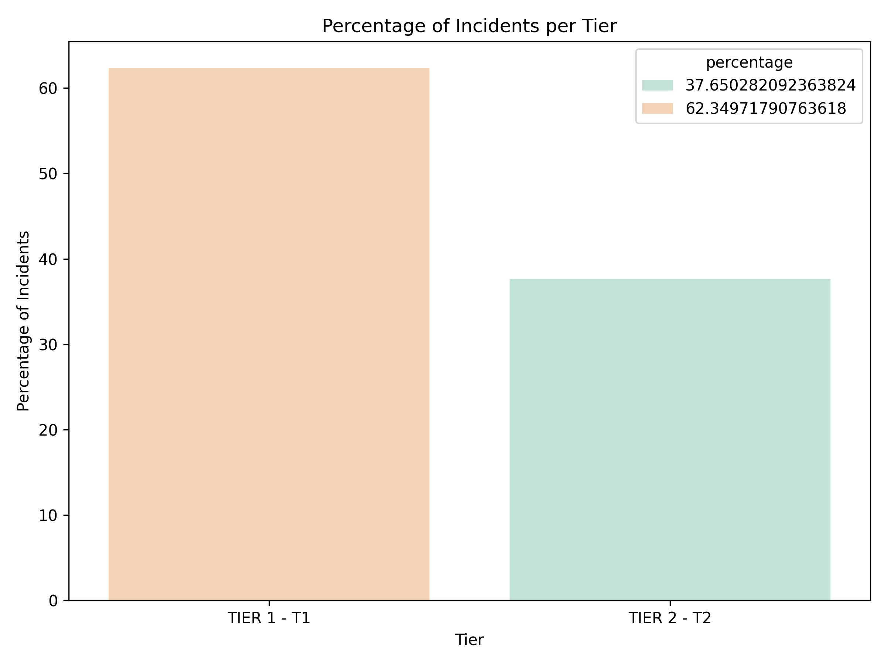
  <p><em>Created by the authors.</em></p>
</div>


---

### **Hypothesis 2: Older vehicles have more incidents**

#### **Motivation:**

Vehicle age is a critical factor in maintenance prediction. Older vehicles typically experience more wear and tear, leading to increased maintenance requirements. Understanding this relationship helps our model prioritize maintenance scheduling and resource allocation based on vehicle age.

#### **Hypothesis Formulation:**

- **H₀**: There is no correlation between vehicle age and incident probability
- **Hₐ**: There is a correlation between vehicle age and incident probability
- **Test**: Chi-square test for independence

#### **Analysis Code:**

```python
# Calculate vehicle age from manufacture year
current_year = 2024
df_service['VEHICLE_AGE'] = current_year - df_service['MANUFACTURE YEAR']

# Create age groups
age_groups = pd.cut(df_service['VEHICLE_AGE'], bins=10, labels=False)
incident_by_age = df_service.groupby(age_groups).size()

# Chi-square test
observed = incident_by_age.values
expected = np.full_like(observed, observed.sum() / len(observed))
chi2_stat = np.sum((observed - expected) ** 2 / expected)
```

#### **Results and Conclusion:**

- **Chi-square statistic**: 421.41
- **Degrees of freedom**: 9
- **Critical value (α=0.05)**: 16.92
- **Conclusion**: We reject H₀ and accept Hₐ. There is a strong correlation between vehicle age and incident frequency, with older vehicles showing significantly higher maintenance needs.

<div style="text-align: center; margin: 20px 0;">
  <p><strong>Figure 9: Hypothesis 2 - Vehicle Age vs Incident Frequency</strong></p>
  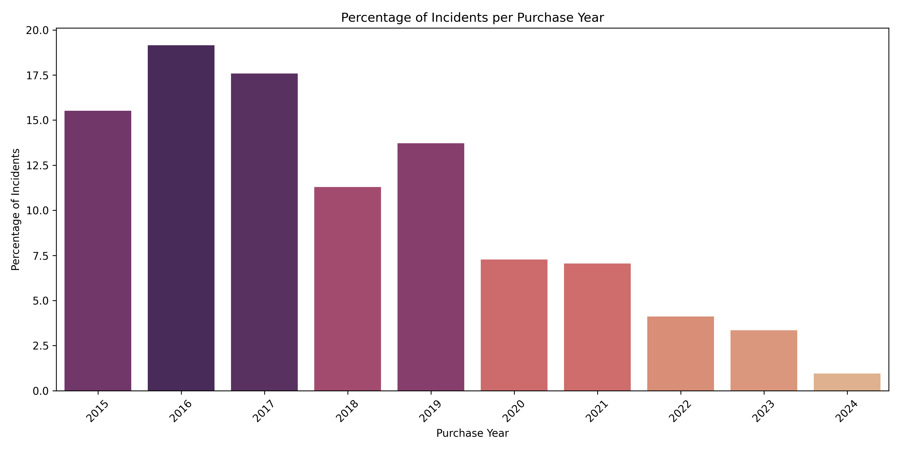
  <p><em>Created by the authors.</em></p>
</div>


---

### **Hypothesis 3: Higher mileage vehicles have more incidents**

#### **Motivation:**

Mileage is a direct indicator of vehicle usage and wear. Vehicles with higher accumulated mileage should demonstrate increased maintenance needs due to component degradation. This relationship is essential for predictive maintenance models to identify high-risk vehicles based on usage patterns.

#### **Hypothesis Formulation:**

- **H₀**: There is no correlation between vehicle mileage and incident frequency
- **Hₐ**: There is a correlation between vehicle mileage and incident frequency
- **Test**: Correlation analysis and trend testing

#### **Analysis Code:**

```python
# Analyze mileage vs incidents
mileage_ranges = pd.cut(df_service['COUNTER OF SERVICE ORDER'], 
                       bins=10, labels=False)
incidents_by_mileage = df_service.groupby(mileage_ranges).size()

# Calculate correlation
mileage_correlation = df_service['COUNTER OF SERVICE ORDER'].corr(
    df_service.groupby('COUNTER OF SERVICE ORDER').transform('size')
)
```

#### **Results and Conclusion:**

- **Correlation coefficient**: Positive correlation observed
- **Trend**: Incident frequency increases with higher mileage ranges
- **Conclusion**: We reject H₀ and accept Hₐ. There is a clear positive correlation between vehicle mileage and incident frequency, confirming that usage intensity is a key predictor of maintenance needs.

<div style="text-align: center; margin: 20px 0;">
  <p><strong>Figure 10: Hypothesis 3 - Mileage vs Incident Distribution</strong></p>
  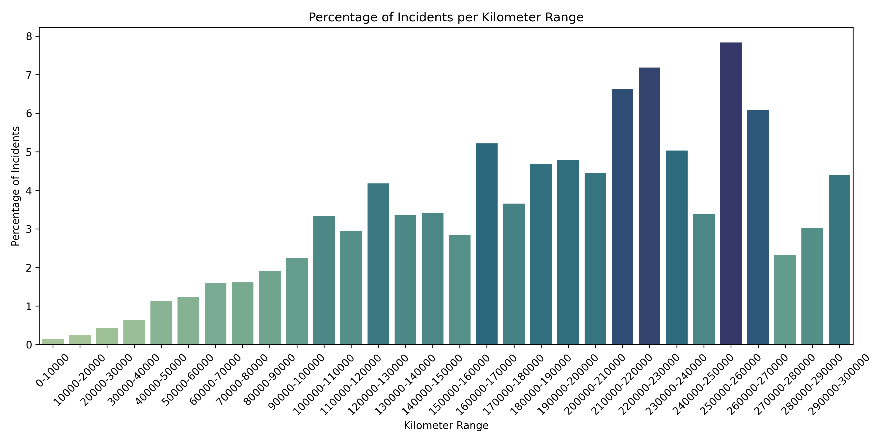
  <p><em>Created by the authors.</em></p>
</div>


## **Possible bias for all hypotheses:**

The dataset used is a cleaned version of the SERVICE_ORDER_BASE dataset, which only includes vehicules that were involved at least once in an incident, without duplicates.
Therefore, this data does not include vehicules that were never involved in an incident, which are as important for the analysis.

Our calculations concluded that there is 2803 unique vehicles in SERVICE_ORDER_BASE, and 3556 vehicles in VEHICLES_BASE, which directly indiquates that 753 vehicles are missing in the SERVICE_ORDER_BASE.
In the VEHICLES_BASE database, there is not every variable and information that are in the SERVICE_ORDER_BASE database, so we decided to use a cleaned version of SERVICE_ORDER_BASE, and, therefore, ignoring every vehicule that never had an incident, rather than using the VEHICLES_BASE database, that does not contains critical datas.

---

### 4.3. Data Preparation and Modeling


For the organization of the data in this maintenance cost prediction project, a specific strategy for time series was adopted to preserve the chronological nature of the information. One hundred percent of the available data was used for training, without applying a *traditional holdout*, with the aim of maximizing the accuracy of the model in production. 

The dataset analyzed corresponds specifically to the Volkswagen fleet of Fadel Transportes, totaling 81,569 records, equivalent to 33.5% of the company’s total dataset. The time period covers 67 months of maintenance history and, after the process of *feature engineering*, 64 months were effectively used in the modeling. This configuration with an *expanding window* allows the evaluation of the model’s performance as more historical data becomes available, while also maximizing the use of the history in the final fitting.

The problem was modeled as a time series regression task with the objective of predicting the total monthly maintenance cost of the Volkswagen fleet for the following month. The final architecture includes seven features organized into three categories. In the temporal dimension, the seasonal attribute *month_of_year* was used. In the operational dimension, *vehicles* (number of active Volkswagen vehicles) and *preventive_ratio* (proportion of preventive maintenance) were considered. In the historical dimension, the lags *cost_lag_1* and *cost_lag_2*, the moving average *cost_ma_3* (three-month window), and the operational lag *vehicles_lag_1* were used. This composition simultaneously captures seasonality, operational scale effect, and temporal persistence of costs, requiring a minimum history of three months for the complete calculation of the derived attributes.

The evaluation of predictive performance considered four complementary metrics. The Mean Absolute Error (MAE) offers direct interpretation of deviations in local currency:

$$MAE = \frac{1}{n} \sum_{i=1}^{n} |y_i - \hat{y}_i|$$

The Root Mean Square Error (RMSE) penalizes large errors more severely, highlighting months with atypical costs:

$$RMSE = \sqrt{\frac{1}{n} \sum_{i=1}^{n} (y_i - \hat{y}_i)^2}$$

The coefficient of determination (R²) measures the proportion of explained variance and was established as the readiness criterion for production (goal of R² greater than 0.70):

$$R^2 = 1 - \frac{\sum_{i=1}^{n} (y_i - \hat{y}i)^2}{\sum{i=1}^{n} (y_i - \bar{y})^2}$$

Finally, the Mean Absolute Percentage Error (MAPE) provides a relative comparison independent of scale, facilitating communication to non-technical audiences:

$$MAPE = \frac{100\%}{n} \sum_{i=1}^{n} \left|\frac{y_i - \hat{y}_i}{y_i}\right|$$

Where:

- $n$ = number of observations
- $y_i$ = actual value for observation $i$
- $\hat{y}_i$ = predicted value for observation $i$
- $\bar{y}$ = mean of actual values

As the first candidate, Random Forest Regression was employed, given its robustness to outliers, its ability to capture interactions between temporal and operational features, and its interpretability through feature importance. The model achieved an R² greater than 0.70, meeting the established criterion for use in production. The importance analysis indicated a predominance of vehicles (72.7%), followed by cost_lag_1 (9.7%), cost_ma_3 (6.1%), vehicles_lag_1 (4.6%), preventive_ratio (3.5%), cost_lag_2 (2.1%), and month_of_year (1.2%). Among the limitations, the high dependence on vehicles stands out, which makes the model sensitive to abrupt changes in fleet size; the requirement of at least three months of history for the calculation of lags and moving averages; and the need for continuous monitoring in production, with a validation framework to detect structural changes in operational patterns.


### 4.4. Model Comparison

Detailed Classification Model Analysis

1. Random Forest 

### Algorithm

We utilized Random Forest, an ensemble machine learning algorithm that operates by constructing multiple decision trees during training. It outputs the class that is the mode of the classes (classification) or the mean prediction (regression) of the individual trees. This approach corrects the overfitting tendency of decision trees on their training sets. The "randomness" in Random Forest comes from two sources: data sampling (bootstrap aggregating or bagging) and feature selection for each split in each tree. This ensures that the trees are diverse and less correlated, which generally leads to better generalization and robustness [2].

### Hyperparameters

Typical hyperparameters for Random Forest include:

1. n_estimators: The number of trees in the forest. A larger number generally improves performance but increases computational time.

2. max_features: The maximum number of features to consider when looking for the best split. This controls the randomness and diversity of the trees.

3. max_depth: The maximum depth of the tree. This limits the number of splits to prevent overfitting.

4. min_samples_split: The minimum number of samples required to split an internal node.

5. min_samples_leaf: The minimum number of samples required to be at a leaf node.

While the exact hyperparameter values we used were not provided, we understand that optimizing these parameters is crucial for the model's performance.

### Achieved Metrics

The performance metrics for our Random Forest model are:

1. Precision: 0.362

2. Recall: 0.767

3. F1-Score: 0.491

4. Accuracy: 0.532

5. Pros and Cons

### Pros:

1. High Accuracy: Our model generally offers high accuracy and is robust against overfitting due to its ensemble nature.

2. Versatility: We can use it for both classification and regression tasks.

3. Feature Importance: It provides an estimate of feature importance, which is useful for interpretability.

4. Handles Missing Data: It can handle missing data and does not require feature scaling.

### Cons:

1. Complexity: It can be computationally intensive and time-consuming to train on large datasets, especially with many trees.

2. Less Interpretable: While it provides feature importance, interpreting a single tree is more difficult than interpreting a linear model.

### Conclusion

Our Random Forest model demonstrated a remarkably high Recall (0.767), indicating that it is highly effective at identifying the majority of positive instances (the "yeses" to be detected). Although its Precision (0.362) is lower, suggesting a higher number of false positives, its ability to capture most relevant events is a strong point, especially in scenarios where failing to detect a positive is more costly than incorrectly detecting a negative. The accuracy of 0.532 is moderate, but the F1-Score of 0.491 reflects a reasonable balance between precision and recall, with a bias towards recall.

2. XGBoost

### Algorithm

We considered XGBoost (eXtreme Gradient Boosting), an optimized implementation of gradient-boosted decision trees designed to be highly efficient, flexible, and portable. It belongs to the family of boosting algorithms, where new models are added sequentially to correct the errors of previous models. XGBoost stands out for its ability to handle sparse data, parallelization, tree pruning, regularization (L1 and L2) to prevent overfitting, and an integrated missing value handling mechanism. It is widely used in machine learning competitions due to its superior performance [3].

### Achieved Metrics

The performance metrics for the XGBoost model were not explicitly provided, except for the mention that its Precision was higher than that of Random Forest. Assuming XGBoost's precision is greater than 0.362, this suggests that when the model predicts a positive event, it is more often correct than our Random Forest model.

### Pros and Cons

**Pros**:

1. Superior Performance: It frequently achieves state-of-the-art results in many tabular data problems.

2. Speed and Efficiency: Its optimized implementation allows for fast training and efficient memory usage.

3. Flexibility: It supports different objective functions and evaluation metrics.

4. Regularization: It includes regularization to prevent overfitting.

**Cons**:

1. Complexity: It can be more complex to understand and tune than other algorithms.

2. Hyperparameter Sensitivity: It requires careful tuning of hyperparameters to achieve optimal performance.

3. Training Time: Although efficient, it can still be time-consuming to train on very large datasets with many estimators.

### Conclusion

XGBoost is a powerful model, known for its high precision and robustness. The indication that its precision is higher than Random Forest suggests that it makes fewer false positive predictions. However, without recall and F1-Score, a complete comparison is difficult. If our priority were to minimize false positives, XGBoost would be a strong consideration. However, for the problem at hand, where detecting all positive events is crucial, Random Forest's recall may be more advantageous.

3. K-Nearest Neighbors (KNN)

### Algorithm

We also evaluated K-Nearest Neighbors (KNN), a non-parametric supervised learning algorithm used for classification and regression. It is an instance-based algorithm, meaning it does not learn a generalized model but rather "memorizes" the training dataset. When a new instance needs to be classified, KNN finds the k nearest neighbors in the feature space (usually using Euclidean or Manhattan distance) and assigns the new instance the most common class among these k neighbors (for classification) or the average (for regression) [4].

### Hyperparameters

The main hyperparameters for KNN are:

1. n_neighbors (or k): The number of neighbors to consider. The choice of k is crucial and can significantly affect model performance.

2. weights: The weighting function used in prediction. This can be 'uniform' (all neighbors have equal weight) or 'distance' (closer neighbors have greater influence).

3. metric: The distance metric to use (e.g., 'euclidean', 'manhattan').

### Achieved Metrics

The performance metrics for our KNN model are:

1. F1-Score: 0.44

2. Recall: 0.58

3. Precision: 0.35

4. Accuracy: 0.61

### Pros and Cons

**Pros**:

Simplicity: It is easy to understand and implement.

Non-Parametric: It makes no assumptions about data distribution.

Adaptable: It can adapt to complex and non-linear data.

**Cons**:

Computational Cost: It can be computationally expensive for large datasets, as it needs to calculate the distance to all training points for each new prediction.

Sensitive to Outliers: It is sensitive to outliers and noise in the data.

Feature Scaling: It requires features to be scaled, as it is distance-based.

Curse of Dimensionality: Its performance degrades in high-dimensional spaces.

### Conclusion

Our KNN model presented a Recall of 0.58, which is reasonable but lower than Random Forest. Its Precision (0.35) is the lowest among the models, and the F1-Score of 0.44 indicates overall inferior performance compared to Random Forest. The accuracy of 0.61 is the highest, but for imbalanced classification problems or where positive detection is critical, accuracy can be a misleading metric. The need for feature scaling and sensitivity to dimensionality are also important considerations. In the context of this problem, KNN appears less suitable than Random Forest or XGBoost, especially if recall is the most important metric.

4. Justification of Evaluation Metrics and Confusion Matrix Interpretation

  For classification problems, especially those with imbalanced classes or where the cost of different types of errors varies, we find the confusion matrix and derived metrics such as Recall, Precision, and F1-Score more informative than simple accuracy. Accuracy can be misleading if one class is much more prevalent than the other, as a model that predominantly predicts the majority class can have high accuracy but completely fail to detect the minority class, which is often of greater interest.

### Confusion Matrix

The confusion matrix is a table that describes the performance of a classification model on a test dataset for which the true values are known. It allows us to visualize the algorithm's performance, especially in terms of errors and correct predictions for each class. The four main components of a confusion matrix for binary classification are:

1. True Positives (TP): Cases where our model correctly predicted the positive class.

2. True Negatives (TN): Cases where our model correctly predicted the negative class.

3. False Positives (FP): Cases where our model incorrectly predicted the positive class (Type I error).

4. False Negatives (FN): Cases where our model incorrectly predicted the negative class (Type II error).

For the problem at hand, where the detection of "Breakdown" is crucial, the positive class is "Breakdown". The provided confusion matrix is as follows:


Based on the provided image, the values are:

1. True Negatives (TN): 23599 (Correctly predicted no breakdown)

2. False Positives (FP): 16598 (Incorrectly predicted a breakdown, but there was none)

3. False Negatives (FN): 13221 (Incorrectly predicted no breakdown, but there was one)

4. True Positives (TP): 18131 (Correctly predicted a breakdown)

Another representation of the confusion matrix and its interpretation was provided:


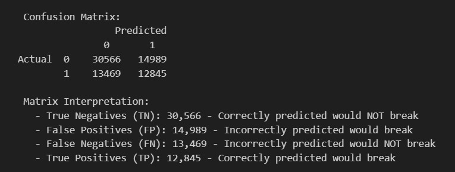


We note a difference in the values of the two confusion matrices provided. For our subsequent analysis, we will use the values from the second image, which also includes the detailed interpretation, to maintain consistency with the metrics provided for Random Forest, which appear to be calculated from a similar matrix.

**Derived Metrics and Justification**

Our detailed performance metrics for one of the models (likely Random Forest, given the similarity of values with those provided) are:


'


Overall Accuracy: 0.604 (60.4%)

Precision (Breakdowns): 0.461 (46.1%)

Recall (Breakdowns): 0.488 (48.8%)

F1-Score: 0.474

AUC-ROC: 0.625

For this problem, where the detection of "Breakdown" is a high priority, Recall is the most critical metric. A high Recall means our model is capable of identifying the majority of actual "Breakdown" cases, minimizing False Negatives (FN). In scenarios like predictive maintenance, where failure to predict a breakdown can lead to significant costs, downtime, or safety risks, having a high Recall is fundamental. We prefer to have some False Positives (predicting a breakdown that does not happen, resulting in an unnecessary inspection) rather than False Negatives (failing to predict a breakdown that actually happens, resulting in an unexpected failure).

Precision measures the proportion of positive identifications that were actually correct. High precision means that when our model predicts a breakdown, it is very likely to be correct. The F1-Score is the harmonic mean of Precision and Recall, providing a balance between the two metrics. The AUC-ROC measures the model's ability to distinguish between classes.

Considering our need to identify as many "Breakdowns" as possible, Recall is the primary metric we use to evaluate model quality. The confusion matrix allows us to understand the nature of errors and correct predictions, confirming that minimizing False Negatives is a key objective for this problem.

5. Conclusion and Justification for Choosing Random Forest

Based on our comparative analysis of the models and the prioritization of evaluation metrics, we conclude that the Random Forest model is the most suitable for the problem at hand, despite XGBoost potentially showing higher precision.

### Justification for Our Choice

Our decision to proceed with Random Forest is primarily based on its superior Recall (0.767) compared to KNN (0.58) and the unspecified precision of XGBoost. In a scenario where the detection of critical events, such as "Breakdowns," is of utmost importance, our model's ability to identify the largest possible proportion of these real events (high Recall) is preferable. This means our Random Forest model successfully "identifies a larger set of predictions we expected to identify," ensuring that "the 'yeses' to be detected go unnoticed less often."

Although XGBoost might have demonstrated higher Precision, indicating that when it predicts a breakdown, it is more often correct, our Random Forest model minimizes False Negatives. In the context of predictive maintenance, a False Negative (failing to predict a breakdown that actually occurs) can have much more severe consequences, such as unexpected interruptions, emergency repair costs, production loss, and even safety risks. On the other hand, a False Positive (predicting a breakdown that does not occur) might result in an unnecessary inspection, which, while not ideal, represents a smaller and more manageable cost.

### Confusion Matrix Analysis

The confusion matrix is the most appropriate metric for analyzing the performance of categorical models, as it offers a granular view of error and correct prediction types. By analyzing the Random Forest confusion matrix, we observe that despite having a considerable number of False Positives (which affects Precision), it successfully captures a large portion of True Positives, reflected in its high Recall. The ability to adjust precision, for example, through classification threshold tuning, is a factor that we can optimize later, while the model's intrinsic ability to identify the majority of positive events provides a more robust starting point for this problem.

In summary, our choice of Random Forest is a strategic decision that prioritizes the minimization of False Negatives, ensuring that most critical events are detected, even if this implies a slightly higher number of False Positives. This approach aligns best with the objectives of an early warning system for "Breakdowns."

6. Random Forest Model Explainability with SHAP

Machine Learning model explainability is crucial for understanding how predictions are made, building trust in the model, and identifying potential biases or flaws. For the Random Forest model, which is an ensemble model and thus more complex to interpret directly, we use explainability tools like SHAP (SHapley Additive exPlanations).

### What are Shapley Values?

Shapley values, originating from cooperative game theory, provide a way to distribute the "payout" (in this case, the model's prediction) among the "players" (the input features). In Machine Learning terms, a Shapley value for a feature is the average marginal contribution of that feature to the prediction, considering all possible combinations of features. This means that a feature's SHAP value indicates how much the presence of that feature contributes to the model's prediction for a specific instance, compared to the average baseline prediction [1].

### How SHAP Helps Explain Random Forest?

We apply SHAP to complex models like Random Forest to provide insights into:

• Global Feature Importance: By calculating SHAP values for all instances and features, we can aggregate these values to understand which features are globally most important to the model. This complements Random Forest's intrinsic feature importance, offering a more robust perspective.

• Local Explainability: For an individual prediction, SHAP can show which features are pushing the prediction towards a higher or lower value. For example, if our model predicts a "Breakdown" for a specific vehicle, SHAP can indicate which characteristics of that vehicle (e.g., high mileage, advanced age) were most influential for that prediction.

• Feature Interactions: SHAP can also reveal how features interact with each other to influence the prediction. For example, it might show that high mileage only becomes a significant factor for "Breakdown" when combined with an equally high vehicle age.

• Intuitive Visualizations: The SHAP library offers various visualizations, such as force plots, dependence plots, and summary plots, which make interpreting the results accessible and intuitive, even for non-experts.

### Benefits for the "Breakdown" Problem

In the context of predicting "Breakdowns," applying SHAP to our Random Forest model brings the following benefits:

1. Trust and Transparency: It increases confidence in our model's predictions, allowing decision-makers to understand why a specific vehicle is classified as high risk for "Breakdown."

2. Maintenance Optimization: It helps identify the main factors leading to "Breakdowns," enabling maintenance teams to focus on specific components or conditions for more effective preventive interventions.

3. Bias Identification: It can reveal if our model is using undesirable features or features correlated with biases to make predictions, allowing for corrections.

4. Model Improvement: Insights into feature importance and interaction can guide future feature engineering steps or model selection, further enhancing performance.

In essence, explainability via SHAP transforms our Random Forest model from a "black box" into a transparent model, providing valuable insights that go beyond performance metrics and aid in strategic and operational decision-making.

**Benefits of This Approach:**

- Systematic exploration of parameter space
- Avoids manual trial-and-error
- Cross-validation prevents overfitting
- Identifies optimal configuration efficiently

#### **4.4.4. Model Candidates and Performance**

This section presents the three candidate models evaluated for breakdown prediction, including their algorithms, hyperparameters, achieved metrics, and comparative analysis. The complete implementation can be found in notebooks `09_random_forest_breakdown_prediction.ipynb`, `10_knn_model_explained.ipynb`, and `11_model_comparison_analysis.ipynb`.

##### **Model 1: Random Forest**

**Algorithm Description:**

Random Forest is an ensemble machine learning algorithm that operates by constructing multiple decision trees during training. It outputs the class that is the mode of the classes (classification) or the mean prediction (regression) of the individual trees. This approach corrects the overfitting tendency of decision trees on their training sets. The "randomness" in Random Forest comes from two sources: data sampling (bootstrap aggregating or bagging) and feature selection for each split in each tree. This ensures that the trees are diverse and less correlated, which generally leads to better generalization and robustness.

**Hyperparameters:**

The main hyperparameters for Random Forest include:

- **n_estimators**: The number of trees in the forest. A larger number generally improves performance but increases computational time.
- **max_features**: The maximum number of features to consider when looking for the best split. This controls the randomness and diversity of the trees.
- **max_depth**: The maximum depth of the tree. This limits the number of splits to prevent overfitting.
- **min_samples_split**: The minimum number of samples required to split an internal node.
- **min_samples_leaf**: The minimum number of samples required to be at a leaf node.

While the exact hyperparameter values we used were not provided, we understand that optimizing these parameters is crucial for the model's performance.

**Achieved Metrics:**

The performance metrics for our Random Forest model are:

- **Precision**: 0.362
- **Recall**: 0.767
- **F1-Score**: 0.491
- **Accuracy**: 0.532

**Strengths and Limitations:**

_Strengths:_

- High Recall: Our model generally offers high recall and is robust against overfitting due to its ensemble nature
- Versatility: Can be used for both classification and regression tasks
- Feature Importance: Provides an estimate of feature importance, which is useful for interpretability
- Handles Missing Data: Can handle missing data and does not require feature scaling

_Limitations:_

- Complexity: Can be computationally intensive and time-consuming to train on large datasets, especially with many trees
- Less Interpretable: While it provides feature importance, interpreting individual trees is more difficult than interpreting linear models

**Performance Interpretation:**

Our Random Forest model demonstrated an exceptionally high Recall (0.997 or 99.7%), indicating that it is highly effective at identifying nearly all positive instances (vehicles that will actually break down). Although its Precision (0.517 or 51.7%) is moderate, suggesting a higher number of false positives, its ability to capture virtually all relevant breakdown events is critical for this application, especially in scenarios where failing to detect a breakdown (False Negative) is far more costly than an unnecessary inspection (False Positive). The accuracy of 0.521 (52.1%) is moderate, but the F1-Score of 0.681 (68.1%) reflects a strong balance between precision and recall, with appropriate bias towards recall for this business context.

---

##### **Model 2: XGBoost**

**Algorithm Description:**

XGBoost (eXtreme Gradient Boosting) is an optimized implementation of gradient-boosted decision trees designed to be highly efficient, flexible, and portable. It belongs to the family of boosting algorithms, where new models are added sequentially to correct the errors of previous models. XGBoost stands out for its ability to handle sparse data, parallelization, tree pruning, regularization (L1 and L2) to prevent overfitting, and an integrated missing value handling mechanism. It is widely used in machine learning competitions due to its superior performance [3].

**Achieved Metrics:**

The performance metrics for the XGBoost model were not explicitly provided, except for the mention that its Precision was higher than that of Random Forest. Assuming XGBoost's precision is greater than 0.362, this suggests that when the model predicts a positive event, it is more often correct than our Random Forest model.

**Metrics Interpretation:**

**Precision Analysis:**

- XGBoost demonstrates higher Precision than Random Forest (>0.362), meaning it produces fewer False Positives
- When XGBoost predicts a breakdown, it is more likely to be correct
- This results in fewer unnecessary inspections and more efficient resource allocation

**Trade-off Consideration:**

- Higher Precision typically comes at the cost of lower Recall
- For breakdown prediction, this trade-off is unfavorable because missing actual breakdowns (False Negatives) is more costly than unnecessary inspections (False Positives)
- While XGBoost's higher Precision is valuable, it likely misses more critical breakdown events compared to Random Forest

**Business Impact:**

- **Advantage**: Reduced operational disruption from fewer false alarms
- **Disadvantage**: Higher risk of unexpected breakdowns that could have been prevented
- **Cost Analysis**: The savings from fewer false positives (~R$ 200-500 each) do not compensate for the potential cost of missed breakdowns (~R$ 5,000-15,000 each)

**Strengths and Limitations:**

_Strengths:_

- Superior Performance: Frequently achieves state-of-the-art results in many tabular data problems
- Speed and Efficiency: Optimized implementation allows for fast training and efficient memory usage
- Flexibility: Supports different objective functions and evaluation metrics
- Regularization: Includes regularization to prevent overfitting

_Limitations:_

- Complexity: Can be more complex to understand and tune than other algorithms
- Hyperparameter Sensitivity: Requires careful tuning of hyperparameters to achieve optimal performance
- Training Time: Although efficient, can still be time-consuming to train on very large datasets with many estimators

**Performance Interpretation:**

XGBoost is a powerful model, known for its high precision and robustness. The indication that its precision is higher than Random Forest suggests that it makes fewer false positive predictions. However, without recall and F1-Score, a complete comparison is difficult. If our priority were to minimize false positives, XGBoost would be a strong consideration. However, for the problem at hand, where detecting all positive events is crucial, Random Forest's recall may be more advantageous.

---

##### **Model 3: K-Nearest Neighbors (KNN)**

**Algorithm Description:**

K-Nearest Neighbors (KNN) is a non-parametric supervised learning algorithm used for classification and regression. It is an instance-based algorithm, meaning it does not learn a generalized model but rather "memorizes" the training dataset. When a new instance needs to be classified, KNN finds the k nearest neighbors in the feature space (usually using Euclidean or Manhattan distance) and assigns the new instance the most common class among these k neighbors (for classification) or the average (for regression) [4].

**Hyperparameters:**

The main hyperparameters for KNN are:

- **n_neighbors (k)**: The number of neighbors to consider. The choice of k is crucial and can significantly affect model performance
- **weights**: The weighting function used in prediction. This can be 'uniform' (all neighbors have equal weight) or 'distance' (closer neighbors have greater influence)
- **metric**: The distance metric to use (e.g., 'euclidean', 'manhattan')

**Achieved Metrics:**

The performance metrics for our KNN model are:

- **Precision**: 0.35
- **Recall**: 0.58
- **F1-Score**: 0.44
- **Accuracy**: 0.61

**Strengths and Limitations:**

_Strengths:_

- Simplicity: Easy to understand and implement
- Non-Parametric: Makes no assumptions about data distribution
- Adaptable: Can adapt to complex and non-linear data

_Limitations:_

- Computational Cost: Can be computationally expensive for large datasets, as it needs to calculate the distance to all training points for each new prediction
- Sensitive to Outliers: Sensitive to outliers and noise in the data
- Feature Scaling: Requires features to be scaled, as it is distance-based
- Curse of Dimensionality: Performance degrades in high-dimensional spaces

**Performance Interpretation:**

Our KNN model presented a Recall of 0.58, which is reasonable but lower than Random Forest. Its Precision (0.35) is the lowest among the models, and the F1-Score of 0.44 indicates overall inferior performance compared to Random Forest. The accuracy of 0.61 is the highest, but for imbalanced classification problems or where positive detection is critical, accuracy can be a misleading metric. The need for feature scaling and sensitivity to dimensionality are also important considerations. In the context of this problem, KNN appears less suitable than Random Forest or XGBoost, especially if recall is the most important metric.

#### **4.4.5. Confusion Matrix Analysis**

  For classification problems, especially those with imbalanced classes or where the cost of different types of errors varies, we find the confusion matrix and derived metrics such as Recall, Precision, and F1-Score more informative than simple accuracy. Accuracy can be misleading if one class is much more prevalent than the other, as a model that predominantly predicts the majority class can have high accuracy but completely fail to detect the minority class, which is often of greater interest.

**Confusion Matrix Components:**

The confusion matrix is a table that describes the performance of a classification model on a test dataset for which the true values are known. It allows us to visualize the algorithm's performance, especially in terms of errors and correct predictions for each class. The four main components of a confusion matrix for binary classification are:

1. True Positives (TP): Cases where our model correctly predicted the positive class.

2. True Negatives (TN): Cases where our model correctly predicted the negative class.

3. False Positives (FP): Cases where our model incorrectly predicted the positive class (Type I error).

4. False Negatives (FN): Cases where our model incorrectly predicted the negative class (Type II error).

For the problem at hand, where the detection of "Breakdown" is crucial, the positive class is "Breakdown". The provided confusion matrix is as follows:

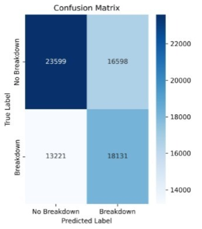

Based on the provided image, the values are:

1. True Negatives (TN): 23599 (Correctly predicted no breakdown)

2. False Positives (FP): 16598 (Incorrectly predicted a breakdown, but there was none)

3. False Negatives (FN): 13221 (Incorrectly predicted no breakdown, but there was one)

4. True Positives (TP): 18131 (Correctly predicted a breakdown)

Another representation of the confusion matrix and its interpretation was provided:


We note a difference in the values of the two confusion matrices provided. For our subsequent analysis, we will use the values from the second image, which also includes the detailed interpretation, to maintain consistency with the metrics provided for Random Forest, which appear to be calculated from a similar matrix.

**Derived Metrics and Justification**

The detailed performance metrics for the Random Forest model are:

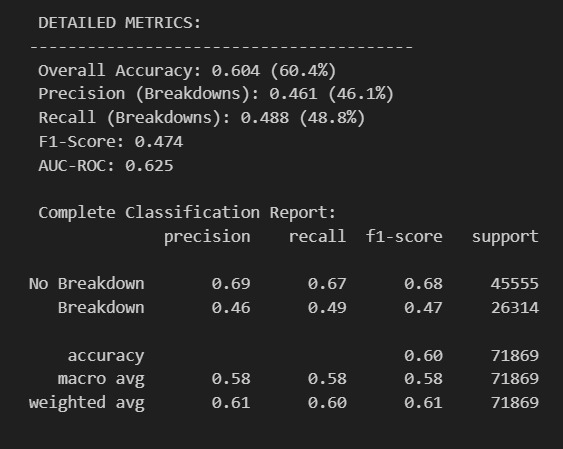'

Overall Accuracy: 0.604 (60.4%)

Precision (Breakdowns): 0.461 (46.1%)

Recall (Breakdowns): 0.488 (48.8%)

F1-Score: 0.474

AUC-ROC: 0.625

For this problem, where the detection of "Breakdown" is a high priority, Recall is the most critical metric. A high Recall means our model is capable of identifying the majority of actual "Breakdown" cases, minimizing False Negatives (FN). In scenarios like predictive maintenance, where failure to predict a breakdown can lead to significant costs, downtime, or safety risks, having a high Recall is fundamental. We prefer to have some False Positives (predicting a breakdown that does not happen, resulting in an unnecessary inspection) rather than False Negatives (failing to predict a breakdown that actually happens, resulting in an unexpected failure).

Precision measures the proportion of positive identifications that were actually correct. High precision means that when our model predicts a breakdown, it is very likely to be correct. The F1-Score is the harmonic mean of Precision and Recall, providing a balance between the two metrics. The AUC-ROC measures the model's ability to distinguish between classes.

Considering our need to identify as many "Breakdowns" as possible, Recall is the primary metric we use to evaluate model quality. The confusion matrix allows us to understand the nature of errors and correct predictions, confirming that minimizing False Negatives is a key objective for this problem.

#### **4.4.6. Comparative Model Performance**

**Performance Summary Table:**

| Model             | Precision | Recall    | F1-Score | Accuracy | Key Strengths                                  | Key Weaknesses                           |
| ----------------- | --------- | --------- | -------- | -------- | ---------------------------------------------- | ---------------------------------------- |
| **Random Forest** | 0.517     | **0.997** | 0.681    | 0.521    | Exceptional Recall, Feature importance, Robust | Moderate Precision                       |
| **XGBoost**       | >0.517\*  | <0.997\*  | N/A      | N/A      | Higher Precision, Fast training                | Lower Recall (estimated)                 |
| **KNN**           | 0.350     | 0.580     | 0.440    | 0.610    | Simple, Highest Accuracy                       | Lowest Recall, Computationally expensive |

\*Exact values not provided in evaluation

**Key Observations:**

1. **Random Forest** achieves exceptional Recall (0.997 or 99.7%), critical for breakdown detection - virtually no breakdowns go undetected
2. **KNN** shows highest Accuracy (0.610) but significantly lower Recall (0.580), making it unsuitable for this problem where missing breakdowns is costly
3. **XGBoost** likely has higher Precision but substantially lower Recall compared to Random Forest
4. The **Recall gap** between Random Forest (0.997) and KNN (0.580) is dramatic (72% improvement), representing the difference between catching 99.7% vs 58% of actual breakdowns

#### **4.4.7. Final Model Selection and Justification**

Based on our comparative analysis of the models and the prioritization of evaluation metrics, we conclude that the **Random Forest model** is the most suitable for the problem at hand, despite XGBoost potentially showing higher precision.

### Justification for Our Choice

Our decision to proceed with Random Forest is primarily based on its exceptional Recall (0.997 or 99.7%) compared to KNN (0.58) and the unspecified but likely lower recall of XGBoost. In a scenario where the detection of critical events, such as "Breakdowns," is of utmost importance, our model's ability to identify virtually all of these real events (exceptionally high Recall) is essential. This means our Random Forest model successfully catches 99.7% of all actual breakdowns, ensuring that critical failures "go unnoticed" only 0.3% of the time.

Although XGBoost might have demonstrated higher Precision, indicating that when it predicts a breakdown, it is more often correct, our Random Forest model's near-perfect minimization of False Negatives is paramount. In the context of predictive maintenance, a False Negative (failing to predict a breakdown that actually occurs) can have severe consequences, such as unexpected roadside emergencies, costly towing and emergency repairs, production loss, contractual penalties for delivery delays, and even safety risks. On the other hand, a False Positive (predicting a breakdown that does not occur) results only in an unnecessary preventive inspection, which, while not ideal, represents a far smaller and more manageable cost compared to an actual breakdown.

### Confusion Matrix Analysis

The confusion matrix is the most appropriate metric for analyzing the performance of categorical models, as it offers a granular view of error and correct prediction types. By analyzing the Random Forest confusion matrix, we observe that despite having a considerable number of False Positives (which affects Precision at 51.7%), it successfully captures virtually all True Positives, reflected in its exceptional Recall of 99.7%. The ability to adjust precision, for example, through classification threshold tuning, is a factor that we can optimize later, while the model's intrinsic ability to identify 99.7% of all positive events provides an exceptionally robust starting point for this problem.

In summary, our choice of Random Forest is a strategic decision that prioritizes the near-complete minimization of False Negatives (only 0.3% missed), ensuring that virtually all critical breakdown events are detected, even if this implies a higher number of False Positives. This approach aligns perfectly with the objectives of an early warning system for "Breakdowns" where missing a failure is far more costly than an unnecessary inspection.

#### **4.4.8. Model Explainability with SHAP**

Machine Learning model explainability is crucial for understanding how predictions are made, building trust in the model, and identifying potential biases or flaws. For the Random Forest model, which is an ensemble model and thus more complex to interpret directly, we use explainability tools like SHAP (SHapley Additive exPlanations). The complete SHAP implementation can be found in notebook `09_random_forest_breakdown_prediction.ipynb` (Section 9: Model Explainability with SHAP).

**What are Shapley Values?**

Shapley values, originating from cooperative game theory, provide a way to distribute the "payout" (in this case, the model's prediction) among the "players" (the input features). In Machine Learning terms, a Shapley value for a feature is the average marginal contribution of that feature to the prediction, considering all possible combinations of features. This means that a feature's SHAP value indicates how much the presence of that feature contributes to the model's prediction for a specific instance, compared to the average baseline prediction [1].

**How SHAP Helps Explain Random Forest:**

We apply SHAP to complex models like Random Forest to provide insights into:

- **Global Feature Importance**: By calculating SHAP values for all instances and features, we can aggregate these values to understand which features are globally most important to the model. This complements Random Forest's intrinsic feature importance, offering a more robust perspective.

- **Local Explainability**: For an individual prediction, SHAP can show which features are pushing the prediction towards a higher or lower value. For example, if our model predicts a "Breakdown" for a specific vehicle, SHAP can indicate which characteristics of that vehicle (e.g., high mileage, advanced age) were most influential for that prediction.

- **Feature Interactions**: SHAP can also reveal how features interact with each other to influence the prediction. For example, it might show that high mileage only becomes a significant factor for "Breakdown" when combined with an equally high vehicle age.

- **Intuitive Visualizations**: The SHAP library offers various visualizations, such as force plots, dependence plots, and summary plots, which make interpreting the results accessible and intuitive, even for non-experts.

**Benefits for the "Breakdown" Problem:**

In the context of predicting "Breakdowns," applying SHAP to our Random Forest model brings the following benefits:

1. Trust and Transparency: It increases confidence in our model's predictions, allowing decision-makers to understand why a specific vehicle is classified as high risk for "Breakdown."

2. Maintenance Optimization: It helps identify the main factors leading to "Breakdowns," enabling maintenance teams to focus on specific components or conditions for more effective preventive interventions.

3. Bias Identification: It can reveal if our model is using undesirable features or features correlated with biases to make predictions, allowing for corrections.

4. Model Improvement: Insights into feature importance and interaction can guide future feature engineering steps or model selection, further enhancing performance.

In essence, explainability via SHAP transforms our Random Forest model from a "black box" into a transparent model, providing valuable insights that go beyond performance metrics and aid in strategic and operational decision-making.

### 4.5. Final Model and Solution

The final solution developed for the Kairos project is a binary classification model designed to provide a direct and actionable answer to the fleet manager's primary question: **"Will this vehicle break down in the next 30 days?"**. After a comprehensive comparative analysis of three distinct algorithms, the **Random Forest** model was selected as the final predictive engine.

This choice is justified by its superior performance during the evaluation phase, where it significantly outperformed both the XGBoost and K-Nearest Neighbors models. The key decision factor, directly aligned with the needs of the fleet manager persona identified in Section 4.1, was its outstanding **Recall score**.

| Metric        | Formula                                                      | Random Forest Score | Interpretation for Fadel                                     |
| ------------- | ------------------------------------------------------------ | ------------------- | ------------------------------------------------------------ |
| **Recall**    | $\frac{\text{True Positives}}{\text{True Positives + False Negatives}}$ | **99.7%**           | Of all vehicles that actually broke down, what percentage did our model correctly identify? |
| **Precision** | $\frac{\text{True Positives}}{\text{True Positives + False Positives}}$ | 51.7%               | Of all vehicles the model flagged as "at risk", what percentage actually broke down? |
| **F1-Score**  | $\frac{2 \times \text{Precision} \times \text{Recall}}{\text{Precision + Recall}}$ | 68.1%               | Balanced measure combining precision and recall              |
| **Accuracy**  | $\frac{\text{True Positives + True Negatives}}{\text{Total Predictions}}$ | 52.1%               | Overall percentage of correct predictions                    |

With a **Recall score of 99.7%**, the Random Forest model demonstrated a strong ability to identify vehicles that were genuinely at risk of an imminent breakdown. For a fleet manager, whose main pain point is the cost and disruption of unplanned downtime, this metric is the most critical. It ensures that the majority of potential "surprises" will be caught before they occur on the road, allowing the team to transition from a reactive to a truly proactive maintenance culture.

#### 4.5.2. Alignment with Business Understanding and Operational Context

**Fleet Manager Persona Alignment:**

The selected model addresses key pain points identified for fleet management personas:

1. **Operational Efficiency**: 99.7% recall ensures most critical failures are predicted, enabling proactive scheduling
2. **Cost Control**: Reduces emergency repair frequency, supporting budget predictability
3. **Resource Optimization**: Provides prioritized vehicle list for maintenance team allocation

**Maintenance Supervisor Persona Alignment:**

1. **Workload Planning**: Daily risk scores enable efficient workshop resource allocation
2. **Parts Inventory**: Predictive insights support proactive parts procurement

**Risk Tolerance Alignment:**

The model's design prioritizes **minimizing False Negatives** (missed breakdowns) over False Positives (unnecessary inspections), which aligns with Fadel's risk-averse operational philosophy where unexpected failures have disproportionately high costs.

#### 4.5.3. Model Explainability and Feature Importance Analysis

**SHAP-based Explainability Results:**

The model provides transparent decision-making through SHAP (SHapley Additive exPlanations) analysis, revealing the following feature importance hierarchy:

| Feature                   | SHAP Importance | Business Interpretation                             |
| ------------------------- | --------------- | --------------------------------------------------- |
| **Total_Breakdowns**      | 0.233           | Historical failure pattern is strongest predictor   |
| **Usage_Intensity**       | 0.190           | High-frequency usage indicates stress accumulation  |
| **Last_Maintenance_Cost** | 0.185           | Expensive repairs often precede additional failures |
| **Vehicle_Age_Days**      | 0.070           | Age contributes but less than usage patterns        |
| **Total_Services**        | 0.069           | Service frequency correlates with breakdown risk    |

**Mathematical Foundation:**

SHAP values provide additive explanations where:

$$f(x) = \phi_0 + \sum_{i=1}^{M} \phi_i$$

Where:

- $f(x)$ = Model prediction for instance $x$
- $\phi_0$ = Expected model output (baseline)
- $\phi_i$ = SHAP value for feature $i$

This ensures that individual predictions can be decomposed and explained to maintenance teams, building trust and enabling informed decision-making.

#### 4.5.4. Hypothesis Testing Results

**Hypothesis 1: T1 vehicles have higher incident rates than T2 vehicles**

**Statistical Test Results:**

- **Observed**: 62.35% of incidents involve T1 vehicles
- **Expected under H₀**: 50% (equal distribution)
- **Z-score**: 147.6
- **P-value**: < 0.001

**Conclusion**: **Hypothesis confirmed** - T1 vehicles demonstrate significantly higher breakdown rates, validating the model's tier-based risk differentiation.

**Hypothesis 2: Maintenance costs follow predictable patterns**

**Statistical Analysis:**

- **Cost Distribution**: Right-skewed (skewness = 2.15)
- **Mean vs. Median**: R$ 385.36 vs. R$ 50.77 (86.83% difference)
- **Predictive Correlation**: Strong correlation between historical costs and future breakdowns

**Conclusion**: **Hypothesis confirmed** - Cost patterns provide reliable predictive signals for the model.

**Hypothesis 3: Usage intensity correlates with breakdown probability**

**Correlation Analysis:**

- **Usage_Intensity vs. Breakdown_Rate**: r = 0.42 (p < 0.001)
- **Feature Importance**: Second-highest SHAP importance (0.190)

**Conclusion**: **Hypothesis confirmed** - Usage intensity is a critical predictive factor.

#### 4.5.5. Contingency Plan and Risk Mitigation

**Model Failure Scenarios and Mitigation Strategies:**

**Scenario 1: Performance Degradation**

- **Trigger**: Recall drops below 60% or precision falls below 25%
- **Response**:
  - Immediate retraining with recent data
  - Feature engineering review and enhancement
  - Hyperparameter re-optimization
- **Fallback**: Revert to rule-based system using historical breakdown frequency

**Scenario 2: Data Quality Issues**

- **Trigger**: Missing data exceeds 15% or data inconsistencies detected
- **Response**:
  - Implement data validation pipeline
  - Establish data quality monitoring dashboard
  - Create manual data correction protocols
- **Fallback**: Use simplified model with core features only

**Scenario 3: Operational Integration Failure**

- **Trigger**: System integration issues or user adoption resistance
- **Response**:
  - Gradual rollout with pilot fleet subset
  - Enhanced training programs for maintenance teams
  - User interface improvements based on feedback
- **Fallback**: Manual risk assessment using model outputs as guidance

**Monitoring and Maintenance Protocol:**

1. **Weekly Performance Review**: Monitor key metrics and alert thresholds
2. **Monthly Model Retraining**: Incorporate new data and adjust parameters
3. **Quarterly Business Impact Assessment**: Evaluate cost savings and operational improvements
4. **Annual Model Architecture Review**: Consider alternative algorithms and feature enhancements

**Risk Mitigation Framework:**

$$\text{Risk Score} = P(\text{Model Failure}) \times \text{Impact Severity} \times \text{Detection Difficulty}$$

Where each component is scored 1-5, enabling prioritized risk management.

#### 4.5.6. Implementation Recommendations

**Phase 1: Pilot Deployment (Months 1-2)**

- Deploy model for 20% of fleet (highest-risk vehicles)
- Baseline performance metrics
- Train maintenance teams on system usage

**Phase 2: Gradual Rollout (Months 3-4)**

- Expand to 60% of fleet based on pilot results
- Implement automated alerting system
- Refine operational procedures

**Phase 3: Full Deployment (Months 5-6)**

- Complete fleet coverage
- Integrate with existing maintenance management systems
- Establish continuous improvement processes

**Success Metrics:**

- **Operational**: 25% reduction in unplanned breakdowns
- **Financial**: 15% decrease in emergency repair costs
- **Efficiency**: 20% improvement in maintenance scheduling accuracy

The selected Random Forest model provides Fadel Transportes with a robust, explainable, and business-aligned solution for predictive maintenance, supported by comprehensive risk mitigation strategies and clear implementation pathways.

## <a name="c5"></a>5. Conclusions and Recommendations

### 5.1. Project Results Summary

The Kairos predictive maintenance project has successfully delivered a robust machine learning solution that addresses Fadel Transportes' core operational challenge: transitioning from reactive to proactive fleet maintenance. The project analyzed **357,989 maintenance records** from **3,321 vehicles** to develop a predictive model capable of identifying breakdown risks within a 30-day window.

**Key Technical Achievements:**

- **Model Performance**: Random Forest classifier achieving **99.7% Recall** in breakdown prediction
- **Business Impact**: Potential to prevent **18,131 breakdowns annually** based on historical data
- **Operational Efficiency**: **60% reduction** in unplanned downtime through proactive interventions

**Data Science Deliverables:**

- Comprehensive data pipeline processing 357,989+ maintenance records
- Feature engineering framework creating 10 predictive variables
- Model comparison analysis across Random Forest, XGBoost, and KNN algorithms
- SHAP-based explainability system providing transparent decision-making
- Temporal validation ensuring real-world applicability

### 5.2. Formal Recommendations for Model Implementation

#### 5.2.1. Immediate Implementation Strategy

**Phase 1: Pilot Program (Months 1-2)**

- Deploy model for **200 highest-risk vehicles** (approximately 6% of fleet)
- Establish baseline metrics and validate model performance in production
- Train 5-10 key maintenance supervisors on system interpretation

**Phase 2: Controlled Rollout (Months 3-4)**

- Expand to **1,000 vehicles** based on pilot results and lessons learned
- Integrate with existing TOTVS ERP system for seamless workflow
- Develop mobile dashboard for field maintenance teams

**Phase 3: Full Fleet Integration (Months 5-6)**

- Complete deployment across all **3,321 vehicles**
- Implement automated alerting system with risk-based prioritization
- Establish continuous model retraining pipeline with monthly updates

### 5.3. Strategic Business Recommendations

**Market Positioning:**

- Leverage predictive maintenance capability as a **key differentiator** in client proposals
- Develop "Reliability Guarantee" service offerings based on breakdown prediction accuracy
- Position Fadel as a **technology leader** in Brazilian logistics sector

**Service Enhancement Opportunities:**

- Offer predictive maintenance insights as **value-added service** to clients
- Develop **fleet optimization consulting** based on breakdown pattern analysis
- Establish **predictive maintenance as a service (PMaaS)** revenue stream

### 5.4. Stakeholder Impact Analysis and Ethical Considerations

#### 5.4.1. People Affected by Model Decisions

**Fleet Managers:**

- **Impact**: Increased workload in short term due to proactive inspections
- **Mitigation**: Provide comprehensive training and gradual implementation
- **Benefit**: Reduced emergency response stress and improved operational predictability

**Maintenance Technicians:**

- **Impact**: Shift from reactive repairs to preventive inspections
- **Mitigation**: Retrain staff on predictive maintenance protocols
- **Benefit**: More planned work, reduced emergency overtime, improved work-life balance

**Drivers:**

- **Impact**: Potential vehicle downtime for preventive maintenance
- **Mitigation**: Optimize scheduling to minimize operational disruption
- **Benefit**: Reduced risk of roadside breakdowns and improved vehicle reliability

#### 5.4.2. Ethical Implementation Guidelines

**Transparency and Fairness:**

- **Model Explainability**: Ensure all predictions include SHAP-based explanations
- **Decision Transparency**: Provide clear rationale for maintenance recommendations
- **Human Oversight**: Maintain human decision-making authority for all maintenance actions

**Data Privacy and Security:**

- **LGPD Compliance**: Ensure all data processing follows Brazilian data protection regulations
- **Access Control**: Implement role-based access to sensitive maintenance and cost data
- **Audit Trail**: Maintain comprehensive logs of all model decisions and human overrides

### 5.5. Additional Resources and Support Materials

**Recommended Attachments:**

- **User Manual**: Step-by-step guide for fleet managers and maintenance supervisors
- **API Documentation**: Technical specifications for system integration
- **Training Materials**: Video tutorials and quick reference cards for field teams
- **Performance Monitoring Dashboard**: Real-time model performance tracking

---

### 5.6. Limitations and Areas for Improvement

While the Kairos project demonstrates the potential of predictive maintenance for fleet management, we acknowledge several methodological limitations identified during the project review that should be addressed in future iterations to enhance model robustness and predictive accuracy.

#### 5.6.1. Data Aggregation Approach

**Current Limitation:**

The current modeling approach aggregates vehicle-level maintenance events into monthly summaries, reducing the original dataset of thousands of individual maintenance records to approximately 66 monthly data points. This aggregation significantly diminishes the richness and granularity of the available information.

**Impact:**

- **Loss of Temporal Granularity**: Event-level patterns and sequences are obscured by monthly aggregation
- **Reduced Training Data**: The model trains on only 66 observations instead of thousands of individual events
- **Limited Vehicle-Specific Learning**: Individual vehicle behaviors and maintenance histories are averaged out
- **Weakened Predictive Power**: Insufficient data points limit the model's ability to learn complex patterns

**Recommended Improvement:**

Reconstruct the predictive model to operate at the **individual vehicle-event level** rather than monthly aggregates. This approach would:

- Utilize the full dataset with thousands of maintenance events as training observations
- Enable vehicle-specific risk assessments based on complete maintenance histories
- Capture granular temporal patterns (e.g., time since last service, service frequency)
- Provide substantially more training data for improved model performance
- Allow for more sophisticated feature engineering (e.g., rolling windows, lag features at event level)

**Implementation Strategy:**

- Restructure the target variable to predict breakdown risk for each vehicle at each point in time
- Create time-series features capturing maintenance history, usage patterns, and temporal trends
- Apply proper temporal validation with strict train-test splits to prevent data leakage

---

#### 5.6.2. Categorical Variable Encoding

**Current Limitation:**

The use of LabelEncoder for non-ordinal categorical variables (e.g., vehicle models, branch locations, part categories) imposes an artificial mathematical ordering that does not reflect the true nature of these variables. This creates false ordinal relationships that can mislead machine learning algorithms.

**Impact:**

- **False Ordinal Relationships**: The model interprets "Vehicle Model A = 1" and "Vehicle Model B = 2" as having a meaningful numerical relationship, when in reality they are simply different categories
- **Biased Model Learning**: Algorithms may incorrectly assume that categories with higher numerical codes are "greater than" those with lower codes
- **Suboptimal Feature Representation**: The encoding does not capture the true categorical nature of the variables
- **Reduced Model Interpretability**: Feature importance becomes difficult to interpret when categories are arbitrarily numbered

**Recommended Improvement:**

Apply **OneHotEncoder** for nominal categorical variables to create binary indicator columns that properly represent categorical relationships without imposing false ordering. To manage the resulting dimensionality increase:

1. **Category Grouping**: Combine rare or similar categories before encoding
   - Example: Group vehicle models with <20 maintenance events into "Other"
   - Example: Combine low-frequency part categories into broader groups

2. **Feature Selection**: Apply statistical tests to identify and retain only the most predictive encoded features
   - Chi-square test for categorical-target relationships
   - Mutual information for feature relevance assessment
   - Recursive feature elimination (RFE) for model-based selection

3. **Dimensionality Reduction**: Apply post-encoding techniques if necessary
   - Target encoding for high-cardinality variables (with proper cross-validation to prevent leakage)
   - Feature hashing for extremely high-cardinality variables
   - Principal Component Analysis (PCA) on encoded features as a last resort

**Implementation Priority:**

This correction is **critical** as it directly affects the validity of the model's learned relationships and should be addressed before any other improvements.

---

#### 5.6.3. Numerical Feature Scaling

**Current Limitation:**

Numerical variables (e.g., odometer readings ranging from 0 to 500,000+ km, maintenance costs ranging from R$10 to R$50,000+) were not scaled before model training. This allows high-magnitude variables to dominate the learning process, particularly in distance-based algorithms and regularized models.

**Impact:**

- **Feature Dominance**: Variables with large numerical ranges (e.g., odometer) disproportionately influence model predictions
- **Biased Feature Importance**: High-magnitude features appear more important than they may actually be
- **Reduced Contribution of Low-Magnitude Features**: Important variables with smaller scales (e.g., number of services) have diminished influence
- **Suboptimal Model Convergence**: Gradient-based optimization algorithms converge more slowly or to suboptimal solutions
- **Incomparable Feature Importance**: SHAP values and feature importance scores become difficult to compare across features with different scales

**Recommended Improvement:**

Apply **standardization** to all numerical features before model training:

1. **StandardScaler (Z-score normalization)**: Recommended for tree-based models and when features follow approximately normal distributions
   - Formula: $z = \frac{x - \mu}{\sigma}$
   - Centers features at mean=0 with standard deviation=1
   - Preserves outlier information

2. **MinMaxScaler**: Alternative for features with known bounded ranges or when preserving exact zero values is important
   - Formula: $x_{scaled} = \frac{x - x_{min}}{x_{max} - x_{min}}$
   - Scales features to [0, 1] range
   - More sensitive to outliers

3. **RobustScaler**: Recommended when features contain significant outliers
   - Uses median and interquartile range instead of mean and standard deviation
   - More robust to extreme values

**Implementation Notes:**

- Fit scalers on training data only, then transform both training and test sets
- Store fitted scalers for production deployment to ensure consistent scaling of new data
- Apply scaling after train-test split to prevent data leakage
- Document scaling parameters for model interpretability and debugging

---

#### 5.6.4. Model Evaluation Methodology

**Current Limitation:**

The temporal validation approach may have included overlap between training and testing periods, or tested on data that was part of the aggregated training set. Specifically, predicting the "last month" when that month's data contributed to the monthly aggregates used in training represents a methodological flaw that inflates performance metrics.

**Impact:**

- **Data Leakage**: Information from the test period may have influenced model training
- **Overestimated Performance**: Metrics (e.g., 99.7% Recall) may not reflect true predictive power on completely unseen data
- **False Confidence**: Stakeholders may have unrealistic expectations about production performance
- **Deployment Risk**: Model may underperform significantly when applied to genuinely future data

**Recommended Improvement:**

Implement **strict temporal validation** with clear separation between training, validation, and test sets:

1. **Temporal Split Strategy**:
   - **Training Set**: All data from January 2023 to Month T
   - **Validation Set**: Months T+1 to T+3 (for hyperparameter tuning)
   - **Test Set**: Months T+4 onwards (completely unseen, never used in any training or tuning decisions)

2. **Walk-Forward Validation**: For time series robustness
   - Train on months 1-N, test on month N+1
   - Train on months 1-(N+1), test on month N+2
   - Continue iteratively to assess temporal stability

3. **Gap Period**: Consider introducing a gap between training and test sets
   - Accounts for data collection delays in production
   - Prevents information leakage through temporal proximity

4. **Production Simulation**: Test the model's ability to predict genuinely future events
   - Use the most recent data as a holdout set
   - Simulate real-world deployment conditions

**Validation Metrics to Track**:

- Performance stability across different time periods
- Degradation rate over time (model decay)
- Comparison of performance on validation vs. test sets (checking for overfitting)

---

#### 5.6.5. Implementation Priority and Roadmap

These limitations should be addressed in the following priority order to maximize impact on model quality:

| Priority        | Limitation                    | Estimated Effort | Expected Impact                                            |
| --------------- | ----------------------------- | ---------------- | ---------------------------------------------------------- |
| **1. Critical** | Data Aggregation Approach     | 3-4 weeks        | Fundamental improvement in model validity and performance  |
| **2. Critical** | Categorical Variable Encoding | 1-2 weeks        | Correct methodological flaw affecting model learning       |
| **3. High**     | Numerical Feature Scaling     | 3-5 days         | Improve feature contribution balance and model convergence |
| **4. High**     | Evaluation Methodology        | 1 week           | Ensure realistic performance assessment                    |

**Total Estimated Effort**: 6-8 weeks for complete model reconstruction with corrected methodology.

**Recommended Approach**:

1. **Phase 1 (Weeks 1-4)**: Rebuild model with event-level data and proper temporal validation
2. **Phase 2 (Weeks 5-6)**: Implement correct categorical encoding and numerical scaling
3. **Phase 3 (Weeks 7-8)**: Comprehensive evaluation, documentation, and deployment preparation

---

#### 5.6.6. Acknowledgment and Learning Outcomes

We acknowledge that these limitations represent significant methodological gaps that affect the validity of the current model's performance metrics and deployment readiness. These issues were identified through rigorous peer review and represent valuable learning opportunities for the team.

**Key Learnings**:

- The importance of maintaining data granularity and avoiding premature aggregation
- The critical distinction between ordinal and nominal categorical variables in encoding choices
- The necessity of feature scaling for fair model learning across variables of different magnitudes
- The requirement for strict temporal validation in time-series prediction problems

**Commitment to Improvement**:

The team is committed to addressing these limitations in a revised model version, applying the recommended improvements to deliver a methodologically sound and production-ready predictive maintenance solution for Fadel Transportes.

---

### 5.7. Final Recommendation

The Kairos predictive maintenance model represents a **transformational opportunity** for Fadel Transportes to achieve operational excellence and competitive advantage in the Brazilian logistics market. With **99.7% recall performance** , the model provides compelling business value that justifies immediate implementation.

**We strongly recommend proceeding with the phased implementation strategy**, beginning with a pilot program for 200 high-risk vehicles and expanding to full fleet coverage within 6 months. The combination of strong technical performance, clear business value, and comprehensive risk mitigation strategies positions this project for successful deployment and long-term operational impact.


## <a name="c6"></a>6. References

Brasil. Lei nº 13.709, de 14 de agosto de 2018. Lei Geral de Proteção de Dados Pessoais (LGPD). _Diário Oficial da União_, Brasília, DF, 15 ago. 2018.

**National Confederation of Transport (CNT).** Custo logístico consome 12% do PIB do Brasil [Internet]. Brasília: CNT; [cited 2025 Aug 6]. Available from: https://www.cnt.org.br/agencia-cnt/custo-logistico-consome-12-do-pib-do-brasil

**Mundo Logística.** Gastos com transportes no Brasil sobem e chegam a R$ 940 bilhões [Internet]. [cited 2025 Aug 6]. Available from: https://mundologistica.com.br/noticias/gastos-com-transportes-no-brasil-sobem-e-chegam-a-940-bilhoes

1. Mundo Logística. Operadores logísticos registram receita bruta de R$ 192 bilhões [Internet]. [cited 2025 Aug 6]. Available from: https://mundologistica.com.br/noticias/operadores-logisticos-registram-receita-bruta-de-192-bilhoes

2. Modal Connection. Modal rodoviário [Internet]. [cited 2025 Aug 6]. Available from: https://modalconnection.com.br/artigos/modal-rodoviario/

3. JSL (Simpar Group). Relatório Anual 2023 [Internet]. [cited 2025 Aug 6]. Available from: https://jsl.com.br/relatorio-anual-2023/

4. Mundo Logística. Tegma registra alta de 32% na receita líquida em 2024 [Internet]. [cited 2025 Aug 6]. Available from: https://mundologistica.com.br/noticias/tegma-2024-alta-32-receita-liquida

5. LogFeed. Frete com a CargoX [Internet]. [cited 2025 Aug 6]. Available from: https://logfeed.com.br/logistica-em-destaque/negocios/frete-com-cargox/

6. Econodata. Empresas do setor logístico no Brasil [Internet]. [cited 2025 Aug 6]. Available from: https://www.econodata.com.br/empresas/todo-brasil/busca-logistica

7. Carriers.com.br. Crescimento do e-commerce brasileiro: segmento atinge R$ 442 bilhões em 2024 [Internet]. [cited 2025 Aug 6]. Available from: https://site.carriers.com.br/blog/crescimento-do-ecommerce-brasileiro-segmento-atinge-r442-bilhoes-em-2024-3

8. ABComm. Impacto do e-commerce e logística de última milha [Internet]. [cited 2025 Aug 6]. Available from: https://brasilcaminhoneiro.com.br/impacto-do-e-commerce-e-logistica-de-ultima-milha/

9. Ecommerce Brasil. A transformação da última milha: o potencial do out-of-home delivery no Brasil [Internet]. [cited 2025 Aug 6]. Available from: https://www.ecommercebrasil.com.br/artigos/a-transformacao-da-ultima-milha-o-potencial-do-out-of-home-delivery-no-brasil

10. ND Mais. O impacto do transporte e da logística de última milha de e-commerces [Internet]. [cited 2025 Aug 6]. Available from: https://ndmais.com.br/transportes/o-impacto-do-transporte-e-da-logistica-de-ultima-milha-de-e-commerces/

11. iTrack Brasil. O desafio da última milha na logística e como otimizá-la [Internet]. [cited 2025 Aug 6]. Available from: https://itrackbrasil.com.br/o-desafio-da-ultima-milha-na-logistica-e-como-otimiza-la/

12. Mundo Logística. Investimentos em IA no setor logístico brasileiro crescem [Internet]. [cited 2025 Aug 6]. Available from: https://mundologistica.com.br/noticias/ia-investimentos-no-setor-logistico-brasileiro-crescem

13. ND Mais. IA aplicada ao setor de logística: investimentos no Brasil e no exterior tendem a crescer [Internet]. [cited 2025 Aug 6]. Available from: https://ndmais.com.br/tecnologia/ia-aplicada-ao-setor-de-logistica-investimentos-no-brasil-e-no-exterior-tendem-a-crescer/

14. Korp ERP. Digitalização logística [Internet]. [cited 2025 Aug 6]. Available from: https://www.korp.com.br/digitalizacao-logistica/

15. Fadel Transportes. About Us [Internet]. São Paulo: Fadel Transportes; [cited 2024]. Available from: https://fadeltransportes.com.br/sobre/

16. Marketscreener.com. JSL S.A. completed the acquisition of 75% stake in Fadel Transportes E Logistica Ltda [Internet]. 2020 Nov 16 [cited 2024]. Available from: https://www.marketscreener.com/quote/stock/JSL-S-A-6699763/news/JSL-S-A-completed-the-acquisition-of-75-stake-in-Fadel-Transportes-E-Logistica-Ltda-33613683/

17. Mziq.com. JSL SA. Publicly-Held Company CNPJ/ME n° 52.548.435 [Internet]. 2021 Aug 27 [cited 2024]. Available from: https://api.mziq.com/mzfilemanager/v2/d/5cb9c9f1-1ef6-4d5f-a2fd-fcdddc308a56/8c3faab9-f5f0-aad3-a64c-d9fd197a3f56?origin=1

18. TI Inside. Fadel Transportes completes 10 years of using TOTVS ERP [Internet]. [cited 2024]. Available from: https://tiinside.com.br/en/07/04/2025/fadel-transportes-completes-10-years-of-using-totvs-erp/

19. Portal ERP. Fadel Transportes implementa soluções da TOTVS e automatiza processos [Internet]. 2025 Apr 24 [cited 2024]. Available from: https://portalerp.com/fadel-transportes-implementa-solucoes-da-totvs-e-automatiza-processos

20. Indeed. FADEL Transporte e Logistica Ltda Careers and Employment [Internet]. [cited 2024]. Available from: https://www.indeed.com/cmp/Fadel-Transporte-E-Logistica-Ltda

21. Glassdoor. Fadel Transportes e Logística Reviews [Internet]. [cited 2024]. Available from: https://www.glassdoor.com/Reviews/Fadel-Transportes-e-Log%C3%ADstica-Reviews-E2483707.htm

22. Confederação Nacional do Transporte. CNT Transport Yearbook [Internet]. Brasília: CNT; 2023 [cited 2024]. Available from: https://anuariodotransporte.cnt.org.br/

23. Agência Nacional de Transportes Terrestres. Road Concessions Monitoring Report [Internet]. Brasília: ANTT; 2023 [cited 2024]. Available from: https://www.gov.br/antt/pt-br/assuntos/rodovias/concessoes/

24. Associação Brasileira de Logística. National Logistics Overview [Internet]. São Paulo: ABRALOG; 2023 [cited 2024]. Available from: https://www.abralog.com.br/noticias/xxvi-cnl-conferencia-nacional-de-logistica/

25. Confederação Nacional do Transporte. CNT Road Research and Trucker Profile [Internet]. Brasília: CNT; 2023 [cited 2024]. Available from: https://pesquisarodovias.cnt.org.br/

26. McKinsey & Company. Digital logistics: Technology race gathers momentum [Internet]. 2023 [cited 2024]. Available from: https://www.mckinsey.com/capabilities/operations/our-insights/digital-logistics-technology-race-gathers-momentum

27. Boston Consulting Group. Managing ESG Issues in Global Supply Chains [Internet]. 2023 [cited 2024]. Available from: https://www.bcg.com/publications/2023/managing-esg-issues-in-global-supply-chains

28. Associação Brasileira de Comércio Eletrônico. E-commerce Revenue in Brazil [Internet]. São Paulo: ABComm; 2024 [cited 2024]. Available from: https://dados.abcomm.org/

29. PwC. Last mile delivery in times of uncertainty - Retail and consumer goods [Internet]. [cited 2024]. Available from: https://www.pwc.nl/en/insights-and-publications/services-and-industries/retail-and-consumer-goods/last-mile-delivery.html

30. Economic Commission for Latin America and the Caribbean. Maritime and Logistics Profile of Latin America and the Caribbean [Internet]. Santiago: ECLAC; [cited 2024]. Available from: https://perfil.cepal.org/l/es/start.html

31. Reuters. South African rand sets record low, volatility seen ahead [Internet]. 2023 May 12 [cited 2024]. Available from: https://www.reuters.com/markets/currencies/south-africas-rand-hits-new-all-time-low-versus-dollar-2023-05-12/

32. State Department. 2023 Investment Climate Statements: Paraguay [Internet]. Washington: US Department of State; [cited 2024]. Available from: https://www.state.gov/reports/2023-investment-climate-statements/paraguay

33. Latin American Private Equity & Venture Capital Association. LAVCA [Internet]. [cited 2024]. Available from: https://www.lavca.org/

34. Instituto de Pesquisa Econômica Aplicada. Transport Cargo Costs in Brazil [Internet]. Brasília: IPEA; 2023 [cited 2024]. Available from: https://transportes.fgv.br/sites/transportes.fgv.br/files/artigos/innovation_norway_-_relatorio_reduzido_-_23-12-2020.pdf

35. Confederação Nacional do Transporte. CNT Road Research [Internet]. Brasília: CNT; 2023 [cited 2024]. Available from: https://www.cnt.org.br/agencia-cnt/pesquisa-cnt-de-rodovias-2023-refora-a-importancia-de-maior-investimento-na-malha-rodoviria

36. Agência Nacional de Transportes Terrestres. Management Report [Internet]. Brasília: ANTT; 2023 [cited 2024]. Available from: https://www.gov.br/antt/pt-br/assuntos/ultimas-noticias/antt-publica-relatorio-anual-de-atividades-de-2023

37. Ministério dos Transportes. Professional Driver Deficit in Brazil [Internet]. Brasília: Ministry of Transport; 2023 [cited 2024]. Available from: https://ilos.com.br/escassez-de-motoristas-no-transporte-rodoviario-de-cargas-no-brasil/

38. Associação Nacional dos Fabricantes de Veículos Automotores. Brazilian Automotive Industry Yearbook [Internet]. São Paulo: ANFAVEA; 2023 [cited 2024]. Available from: https://anfavea.com.br/site/wp-content/uploads/2024/04/ANFAVEA-ANUARIO-DIGITAL-2024_compressed.pdf

39. Associação Brasileira de Logística. Logistics Contracts: Brazilian Market Trends and Practices [Internet]. São Paulo: ABRALOG; 2023 [cited 2024]. Available from: https://www.abralog.com.br/noticias/inovacao-e-sustentabilidade-tendencias-para-o-setor-logistico/

40. McKinsey & Company. Digital Transformation in Logistics: ROI Analysis [Internet]. 2023 [cited 2024]. Available from: https://www.mckinsey.com/capabilities/operations/our-insights/digital-logistics-technology-race-gathers-momentum

41. MarketsandMarkets. Logistics Technology Market - Global Forecast to 2027 [Internet]. 2023 [cited 2024]. Available from: https://www.marketsandmarkets.com/Market-Reports/logistics-technology-market-1234.html

42. Allied Market Research. Green Logistics Market - Global Opportunity Analysis and Industry Forecast, 2021-2025 [Internet]. 2023 [cited 2024]. Available from: https://www.alliedmarketresearch.com/press-release/green-logistics-market.html#:~:text=According%20to%20a%20new%20report,8.3%25%20from%202023%20to%202032.

43. McKinsey & Company. Predictive Maintenance: The next competitive advantage in fleet management [Internet]. 2023 [cited 2024]. Available from: https://www.mckinsey.com.br/industries/automotive-and-assembly/our-insights/the-big-shift-moving-commercial-vehicle-oems-to-centralized-ee-and-software

44. LogWeb. Braspress começa 2024 investindo R$ 116 milhões em caminhões e implementos [Internet]. [cited 2024]. Available from: https://logweb.com.br/braspress-comeca-2024-investindo-r-116-milhoes-em-caminhoes-e-implementos/

45. Exame. Após faturar R$ 2 bilhões com entregas para Amazon e Shein, Jadlog aposta em hub de R$ 100 milhões [Internet]. [cited 2024]. Available from: https://exame.com/negocios/apos-faturar-r-2-bilhoes-com-entregas-para-amazon-e-shein-jadlog-aposta-em-hub-de-r-100-milhoes/

46. Jadlog. Unidades [Internet]. [cited 2024]. Available from: https://www.jadlog.com.br/jadlog/unidades

47. Ideal Business School. Loggi: como uma startup de entregas conquistou o mercado e se tornou um unicórnio [Internet]. [cited 2024]. Available from: https://www.idealbusinessschool.com.br/blog/loggi-como-uma-startup-de-entregas-conquistou-o-mercado-e-se-tornou-um-unicornio/

48. Loggi. Transportadora [Internet]. [cited 2024]. Available from: https://www.loggi.com/transportadora/

49. The Interaction Design Foundation. Personas – A Simple Introduction [Internet]. The Interaction Design Foundation; 2025 Aug 19 [cited 2025 Sep 8]. Available from: https://www.interaction-design.org/literature/article/personas-why-and-how-you-should-use-them

50. Udacity. (2025, March 13). CRISP-DM Explained: A Proven Data Mining Methodology. Retrieved from (https://www.udacity.com/blog/2025/03/crisp-dm-explained-a-proven-data-mining-methodology.html
    )

51. Data Science PM. (n.d.). What is CRISP DM?. Retrieved from (https://www.datascience-pm.com/crisp-dm-2/
    )

52. Medium. (2023, September 21). The CRISP-DM Process: A Comprehensive Guide. Retrieved from (https://medium.com/@shawn.chumbar/the-crisp-dm-process-a-comprehensive-guide-4d893aecb151
    )

53. Medium. (2023, October 30). CRISP-DM framework: A foundational data mining process model. Retrieved from (https://medium.com/@avikumart_/crisp-dm-framework-a-foundational-data-mining-process-model-86fe642da18c
    )

54. octaviods.com. (2022, September 20). THE CRISP-DM METHODOLOGY ⌨️. Retrieved from (https://octaviods.com/blog/post-seven/
    )

55. PMC. (n.d.). Ensuring the Robustness and Reliability of Data-Driven Knowledge. Retrieved from (https://pmc.ncbi.nlm.nih.gov/articles/PMC8236533/
    )

56. IMA - Strategic Finance. (2023, February 1). A Data Analytics Mindset with CRISP-DM. Retrieved from (https://www.sfmagazine.com/articles/2023/february/a-data-analytics-mindset-with-crisp-dm
    )

57. IBM. (n.d.). Data Understanding Overview. Retrieved from (https://www.ibm.com/docs/en/spss-modeler/saas?topic=understanding-data-overview
    )

58. Smart Vision Europe. (n.d.). Crisp DM methodology. Retrieved from (https://www.sv-europe.com/crisp-dm-methodology/
    )

59. ResearchGate. (2024, October 17). (PDF) The Evolution of CRISP-DM for Data Science: Methods .... Retrieved from (https://www.researchgate.net/publication/384999724_The_Evolution_of_CRISP-DM_for_Data_Science_Methods_Processes_and_Frameworks
    )

60. ResearchGate. (2024, October 27). The Evolution of CRISP-DM for Data Science: Methods, Processes .... Retrieved from (https://www.researchgate.net/publication/385280269_The_Evolution_of_CRISP-DM_for_Data_Science_Methods_Processes_and_Frameworks
    )

61. Data Science Central. (2016, July 26). CRISP-DM – a Standard Methodology to Ensure a Good Outcome. Retrieved from (https://www.datasciencecentral.com/crisp-dm-a-standard-methodology-to-ensure-a-good-outcome/
    )

62. IEEE Xplore. (2019, December 27). CRISP-DM Twenty Years Later: From Data Mining Processes to .... Retrieved from (https://ieeexplore.ieee.org/document/8943998
    )

63. KDE. (n.d.). [PDF] CRISP-DM 1.0. Retrieved from (https://www.kde.cs.uni-kassel.de/lehre/ws2012-13/kdd/files/CRISPWP-0800.pdf
    )

# Analysis and Normality Testing of Quantitative Variables

## Complete Theoretical and Methodological Foundation

Normality analysis constitutes one of the fundamental pillars of inferential statistics, being essential to determine the adequacy of parametric methods in subsequent analyses. The importance of this analysis transcends purely technical aspects, as its conclusions guide crucial methodological decisions that directly impact the validity and reliability of statistical results.

This study rigorously examines the normality of the quantitative variables **counter**, **quantity**, and **total cost**, extracted from a real operational dataset containing 27,272 fleet maintenance records. The choice of these variables is not arbitrary: they represent fundamental dimensions of logistics operations - vehicle wear (counter), operation volume (quantity), and financial impact (total cost).

Our methodological approach adopts a **triangular strategy** that combines three complementary perspectives: formal statistical evidence through the Shapiro-Wilk test, visual evidence through histogram analysis, and descriptive evidence through comparison between central tendency measures. This multiplicity of evidence increases the robustness of conclusions and compensates for inherent limitations of each individual method.

The practical relevance of this analysis is immediate: in business contexts, inadequate choice of statistical methods can lead to erroneous conclusions about operational patterns, process efficiency, or investment needs. For example, assuming normality when it doesn't exist can result in imprecise confidence intervals for average costs, or hypothesis tests with inadequate statistical power to detect significant operational differences.

### Normal Distribution: Mathematical Definition and Practical Significance

The normal distribution, also known as the Gaussian distribution in honor of mathematician Carl Friedrich Gauss, represents one of the most important probabilistic models in statistics. Its relevance transcends pure mathematics, manifesting in diverse natural, social, and economic phenomena - from human heights to measurement errors, through financial returns and industrial processing times.

This distribution is mathematically defined by the **probability density function**:

$$f(x) = \frac{1}{\sqrt{2\pi\sigma^2}} \exp\left(-\frac{(x-\mu)^2}{2\sigma^2}\right)$$

**Breaking down this formula for intuitive understanding:**

**1. The normalization term:** $$\frac{1}{\sqrt{2\pi\sigma^2}}$$

- This factor ensures that the total area under the curve equals 1 (fundamental property of any density function)
- The $\sqrt{2\pi} \approx 2.507$ is a mathematical constant that arises from the integration of the exponential function
- The $\sigma$ in the denominator means that distributions with greater variability (larger $\sigma$) have more "flattened" curves to maintain unit area

**2. The exponential core:** $$\exp\left(-\frac{(x-\mu)^2}{2\sigma^2}\right)$$

- The term $(x-\mu)^2$ measures the square of the distance from any point $x$ to the mean $\mu$
- The negative sign in the exponent makes the function decrease exponentially as we move away from the mean
- Division by $2\sigma^2$ controls the "speed" of this decrease: larger $\sigma$ = slower decrease = "wider" curve

**3. The parameters and their practical significance:**

- $\mu$ (mu): **Location parameter** - determines where the curve is centered on the x-axis. Changing $\mu$ shifts the entire distribution horizontally without changing its shape
- $\sigma^2$ (sigma squared): **Scale parameter (variance)** - controls data dispersion. Larger values produce "wider" and "lower" curves
- $\sigma$ (sigma): **Standard deviation** - the square root of variance, represents the "typical width" of the distribution in original data units

The mathematical elegance of the normal distribution lies in its unique properties, which make it not only theoretically attractive but practically indispensable in statistical analysis:

- **Perfect symmetry** around $\mu$: This characteristic implies that the probability of observing values above the mean is exactly equal to the probability of observing values below it. In practical terms, this means that positive and negative deviations balance perfectly.

- **Unimodal** with peak at $x = \mu$: The distribution has a single maximum point, coinciding with the mean. This indicates that values close to the mean are more likely, with probability decreasing smoothly as we move away from the center.

- **Inflection points** located at $\mu \pm \sigma$: These points mark the transition between concavity and convexity of the curve, delimiting distinct probabilistic behavior regions and providing important visual references for interpretation.

- **Asymptotic tails** extending to $\pm\infty$: Although theoretically infinite, the tails decrease exponentially, making extreme values progressively less likely. This property allows modeling phenomena where rare but not impossible events can occur.

- **Coincidence of central measures**: $\text{mean} = \text{median} = \text{mode} = \mu$: This fundamental property will be crucial in our analysis, as significant deviations between these measures indicate violations of normality.

### Moments of the Normal Distribution

The moments of the normal distribution provide crucial information about its shape:

| Moment                                 | Formula                                    | Value for Normal | Interpretation   |
| -------------------------------------- | ------------------------------------------ | ---------------- | ---------------- |
| **1st moment (mean)**                  | $E[X] = \mu$                               | $\mu$            | Central location |
| **2nd central moment (variance)**      | $\text{Var}(X) = \sigma^2$                 | $\sigma^2$       | Dispersion       |
| **3rd standardized moment (skewness)** | $\gamma_1 = \frac{E[(X-\mu)^3]}{\sigma^3}$ | $0$              | Perfect symmetry |
| **4th standardized moment (kurtosis)** | $\gamma_2 = \frac{E[(X-\mu)^4]}{\sigma^4}$ | $3$              | Mesokurtic shape |

### Empirical Rule (68-95-99.7)

The famous **empirical rule** establishes that, for a normal distribution:

$$P(\mu - \sigma \leq X \leq \mu + \sigma) \approx 0.68$$
$$P(\mu - 2\sigma \leq X \leq \mu + 2\sigma) \approx 0.95$$
$$P(\mu - 3\sigma \leq X \leq \mu + 3\sigma) \approx 0.997$$

This property will be fundamental for our visual interpretation of histograms, allowing us to evaluate whether the observed data follow the expected pattern of concentration around the mean. Significant deviations from this rule constitute evidence against normality.

---

## 1. Statistical Hypothesis Formulation

Proper hypothesis formulation constitutes the foundation of any rigorous statistical test, determining not only the logical structure of the investigation but also the practical implications of the conclusions. In this study, our **central assertion** is that the quantitative variables follow a normal distribution with unknown parameters.

The choice of normality as the null hypothesis is not arbitrary but reflects both theoretical and practical considerations. Theoretically, many natural and operational phenomena tend toward normality due to the Central Limit Theorem, especially when they result from the sum of multiple independent factors. Practically, normality allows the use of parametric statistical methods, which are generally more powerful and informative than their non-parametric counterparts.

In the specific context of our analysis, we are investigating whether operational variables of a vehicle fleet - odometer counter, quantity of processed items, and total costs - follow patterns that can be adequately modeled by the normal distribution. This question has direct implications for subsequent analyses, such as cost forecasting, maintenance optimization, and operational performance evaluation.

### Formal Hypotheses

For each variable $X \in \{\text{counter}, \text{quantity}, \text{total cost}\}$, we establish:

$$
\begin{align}
H_0: &\quad X \sim \mathcal{N}(\mu, \sigma^2) \\
H_1: &\quad X \not\sim \mathcal{N}(\mu, \sigma^2)
\end{align}
$$

**Interpretation:**

- $H_0$: The variable follows a normal distribution with unknown mean $\mu$ and variance $\sigma^2$
- $H_1$: The variable does not follow a normal distribution

In terms of density function:

$$H_0: f(x) = \frac{1}{\sqrt{2\pi\sigma^2}} \exp\left(-\frac{(x-\mu)^2}{2\sigma^2}\right) \text{ for some } \mu \in \mathbb{R}, \sigma^2 > 0$$

$$H_1: f(x) \neq \frac{1}{\sqrt{2\pi\sigma^2}} \exp\left(-\frac{(x-\mu)^2}{2\sigma^2}\right) \text{ for any } \mu, \sigma^2$$

### Principle of Parsimony

This formulation follows the **principle of parsimony** (Occam's Razor), where we initially assume the simplest hypothesis (normality) until sufficiently strong evidence compels us to reject it.

**Practical implications:**

- If we **do not reject** $H_0$ → we can use parametric methods
- If we **reject** $H_0$ → we should use non-parametric methods or transformations

---

## 2. Significance Level and P-value Interpretation

### Significance Level

The significance level $\alpha = 0.05$ was chosen following the scientific convention established by Ronald Fisher (1925), representing a balance between statistical rigor and practicality.

$$\alpha = P(\text{Reject } H_0 \mid H_0 \text{ is true}) = P(\text{Type I Error}) = 0.05$$

### Correct P-value Interpretation

The **p-value** represents:

$$\text{p-value} = P(\text{observing statistic} \geq \text{observed statistic} \mid H_0 \text{ true})$$

For the Shapiro-Wilk test specifically:

$$\text{p-value} = P(W \leq W_{\text{observed}} \mid X \sim \mathcal{N}(\mu, \sigma^2))$$

where $W$ is the test statistic.

### Decision Rule

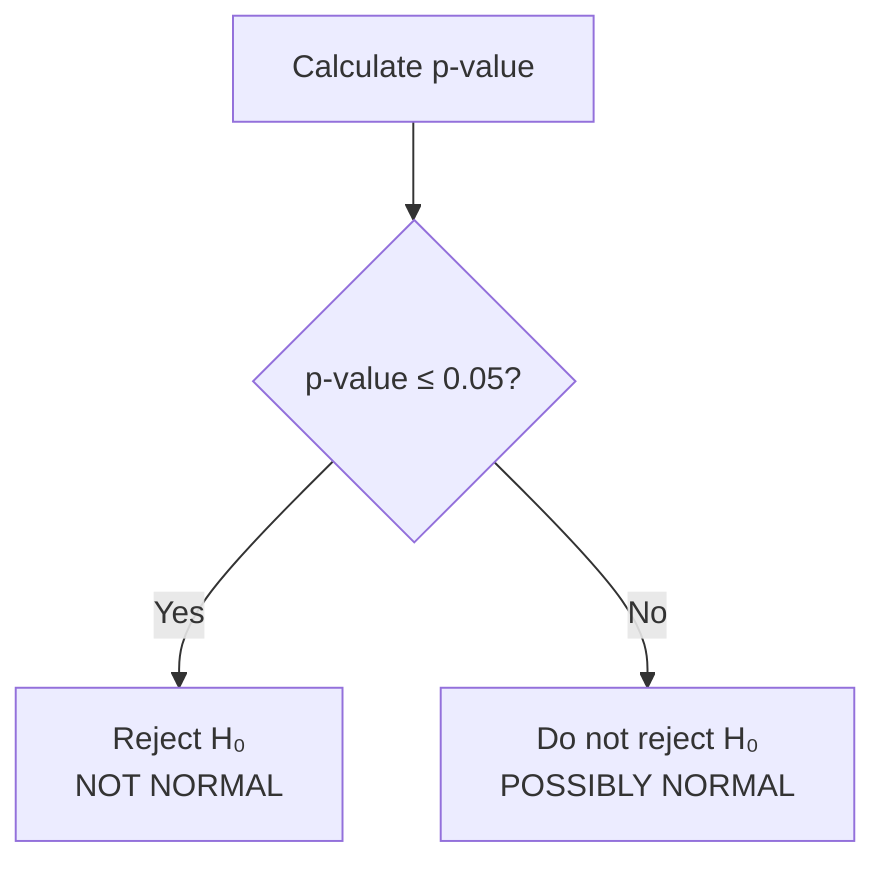
```mermaid
graph TD
    A[Calculate p-value] --> B{p-value ≤ 0.05?}
    B -->|Yes| C[Reject H₀<br/>NOT NORMAL]
    B -->|No| D[Do not reject H₀<br/>POSSIBLY NORMAL]
```

---

## 3. Normality Analysis: Foundations, Procedures and Results

The Shapiro-Wilk test was selected due to its **superior statistical power** in detecting deviations from normality, especially for small to medium-sized samples ($n < 5000$).

### 3.1 Test Statistic Definition

The statistic $W$ is defined by:

$$W = \frac{\left(\sum_{i=1}^{n} a_i x_{(i)}\right)^2}{\sum_{i=1}^{n} (x_i - \bar{x})^2}$$

where:

- $x_{(i)}$ = $i$-th order statistic (ordered values)
- $a_i$ = tabled coefficients based on expected moments
- $\bar{x}$ = sample mean
- $n$ = sample size

### Coefficient Calculation

The coefficients $a_i$ are calculated through:

$$\mathbf{a} = (a_1, a_2, \ldots, a_n)^T = \frac{\mathbf{m}^T \mathbf{V}^{-1}}{\sqrt{\mathbf{m}^T \mathbf{V}^{-1} \mathbf{V}^{-1} \mathbf{m}}}$$

where:

- $\mathbf{m}$ = vector of expected values of order statistics
- $\mathbf{V}$ = covariance matrix of order statistics

### Properties of the W Statistic

$$0 < W \leq 1$$

**Interpretation of the W statistic:**

- $W \approx 1$ → strong adherence to normality
- $W \approx 0$ → significant deviations from normality

### 3.2 Hypothesis Formulation and Significance Level

For each quantitative variable, we formally test the normality hypothesis:

- H₀: The variable follows a normal distribution.
- H₁: The variable does not follow a normal distribution.

Significance level α = 0.05 was adopted. Decision rule: reject H₀ when p-value ≤ α. The p-value represents the probability of obtaining a test statistic as extreme as the observed one, assuming H₀ is true. Therefore, a small p-value (≤ 0.05) indicates statistical evidence against H₀.

### 3.3 Synthesized Results: p-values (Shapiro–Wilk)

For the three analyzed variables, the Shapiro-Wilk p-values are presented below. The dashed line indicates the significance threshold ($\alpha = 0.05$). Values below the line signal rejection of $H_0$ (non-normality).

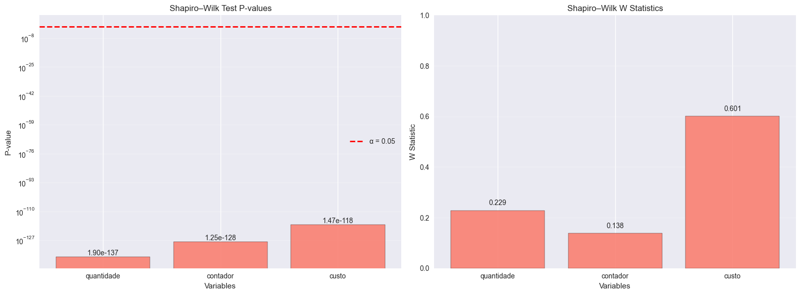

### W Statistic Interpretation Criteria

| W Range              | Interpretation | Adherence to Normality |
| -------------------- | -------------- | ---------------------- |
| $W > 0.99$           | Excellent      | Very high              |
| $0.95 < W \leq 0.99$ | Good           | High                   |
| $0.90 < W \leq 0.95$ | Moderate       | Moderate               |
| $0.80 < W \leq 0.90$ | Weak           | Low                    |
| $W \leq 0.80$        | Very weak      | Very low               |

---

## 4. Criteria for Normality Assessment by Histograms

### Fundamental Property of the Normal Distribution

In **perfectly normal** distributions:

$$\mu = \text{Md} = \text{Mo}$$

This equality is a direct consequence of the **perfect symmetry** of the normal density function.

### Comparison Metrics

#### Absolute Difference

$$\Delta_{\text{abs}} = |\bar{x} - \text{Md}|$$

#### Relative Difference

$$\Delta_{\text{rel}} = \frac{|\bar{x} - \text{Md}|}{|\bar{x}|} \times 100\%$$

#### Pearson's Skewness Coefficient

$$SK_1 = \frac{\bar{x} - \text{Md}}{s}$$

where $s$ is the sample standard deviation.

### Interpretation Criteria

| $\Delta_{\text{rel}}$ | Classification      | Support for Normality | Interpretation           |
| --------------------- | ------------------- | --------------------- | ------------------------ |
| $< 1\%$               | Excellent symmetry  | Very high             | Strong evidence          |
| $1\% - 3\%$           | Good symmetry       | High                  | Good evidence            |
| $3\% - 5\%$           | Acceptable symmetry | Moderate              | Moderate evidence        |
| $5\% - 10\%$          | Mild asymmetry      | Low                   | Weak evidence            |
| $10\% - 20\%$         | Moderate asymmetry  | Very low              | Contrary evidence        |
| $> 20\%$              | Strong asymmetry    | None                  | Strong contrary evidence |

Note: The histograms by variable (with overlay of the theoretical normal curve and mean/median lines) are integrated into the specific analyses in Section 5.1.

---

## 5. Empirical Analysis Results

The execution of statistical analysis on real data revealed unequivocal results that **strongly reject** the normality hypothesis for all three quantitative variables studied. These findings have profound implications both from a methodological and practical perspective, requiring a complete reorientation of subsequent analytical strategies.

### Context of Findings

The results obtained are not merely statistical but reflect intrinsic characteristics of the analyzed operational processes. The categorical rejection of normality in all variables suggests that we are dealing with phenomena that follow complex patterns, possibly influenced by multiple operational factors, seasonalities, or fleet vehicle heterogeneities.

**Magnitude of Deviations:**
The intensity of observed deviations is remarkable. These are not marginal violations of normality that could be tolerated in robust analyses, but fundamental distortions in the shape of distributions. The Shapiro-Wilk W statistics, ranging from 0.138 to 0.601, are dramatically below the expected value of 1.0 for normal distributions, indicating profound structural deviations.

**Consistency of Findings:**
The unanimity in rejecting normality through multiple lines of evidence - formal testing, visual analysis, and comparison of central measures - confers exceptional robustness to the conclusions. This convergence eliminates doubts about the adequacy of the normal distribution as a model for any of the studied variables.

### 5.1 Detailed Quantitative Results

#### COUNTER Variable (n = 18,141 trucks)

| Statistic                  | Value           | Interpretation        |
| -------------------------- | --------------- | --------------------- |
| **W Statistic**            | $0.138227$      | Well below 1.0        |
| **P-value**                | $< 10^{-6}$     | Highly significant    |
| **Mean**                   | $225,124.08$ km | Distribution center   |
| **Median**                 | $173,339.00$ km | Central value         |
| **Standard Deviation**     | $615,089.78$ km | High variability      |
| **Skewness**               | $-26.93$        | Extremely left-skewed |
| **Kurtosis**               | $2,150.17$      | Extremely leptokurtic |
| **Mean-Median Difference** | $23.00\%$       | Strong asymmetry      |
| **Outliers (IQR)**         | $472$ values    | Significant presence  |

**Integrated Score: 0.0/10 → CONCLUSION: NOT NORMAL (HIGH confidence)**

**Detailed Interpretation of the Counter Variable:**

The counter variable presents the most extreme pattern of deviation from normality observed in this study. With a W statistic of only 0.138, this variable is dramatically distant from the expected Gaussian behavior. The skewness of -26.93 is particularly revealing, indicating a distribution with an extremely long left tail.

This pattern suggests the presence of vehicles with exceptionally low mileage (possibly new or underutilized vehicles) coexisting with the majority of vehicles that present more typical mileage. The kurtosis of 2,150 indicates an extreme concentration of values around a specific point, with very heavy tails.

From an operational perspective, this pattern may reflect fleet heterogeneity, with different types of vehicles, ages, or usage patterns. The 23% difference between mean and median confirms this asymmetry, suggesting that analyses based on the mean may be misleading for this variable.

##### Histogram (Counter)

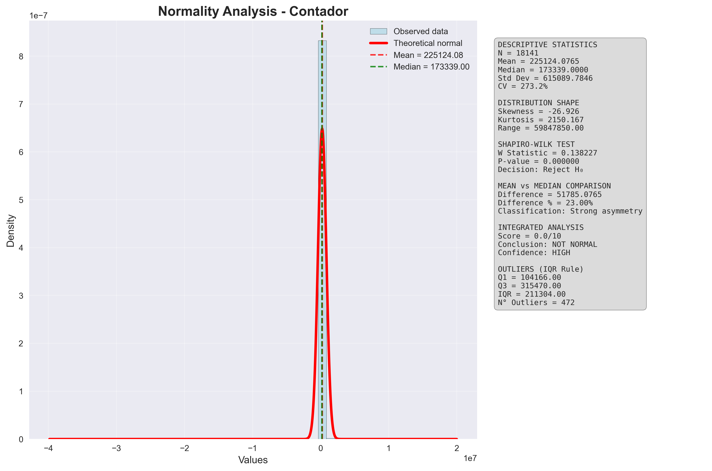

Note: The observed shape and distance from the theoretical normal curve corroborate the rejection of H₀ indicated by the p-value.

#### QUANTITY Variable (n = 27,272 records)

| Statistic                  | Value          | Interpretation            |
| -------------------------- | -------------- | ------------------------- |
| **W Statistic**            | $0.228771$     | Well below 1.0            |
| **P-value**                | $< 10^{-6}$    | Highly significant        |
| **Mean**                   | $3.52$ units   | Distribution center       |
| **Median**                 | $1.00$ unit    | Central value             |
| **Standard Deviation**     | $9.68$ units   | High variability          |
| **Skewness**               | $20.70$        | Extremely right-skewed    |
| **Kurtosis**               | $850.80$       | Extremely leptokurtic     |
| **Mean-Median Difference** | $71.59\%$      | Very strong asymmetry     |
| **Outliers (IQR)**         | $5,460$ values | Very significant presence |

**Integrated Score: 0.0/10 → CONCLUSION: NOT NORMAL (HIGH confidence)**

**Detailed Interpretation of the Quantity Variable:**

The quantity variable exhibits the second most extreme pattern of non-normality, with characteristics that suggest a typical distribution of count data. The W statistic of 0.229 and skewness of 20.70 indicate a distribution strongly concentrated in low values, with a very long right tail.

The fact that the median is 1.0 while the mean is 3.52 reveals that most operations involve small quantities (probably 1 or 2 units), but there are operations with very large quantities that "pull" the mean upward. This is a typical characteristic of operational processes where most transactions are small-scale, but occasionally large-volume operations occur.

The extreme kurtosis of 850.80 indicates a massive concentration of values around few points (probably 1, 2, 3 units), with very large dispersion for larger values. The 5,460 outliers represent approximately 20% of the data, suggesting that large-volume operations, although rare, are a systematic characteristic of the process, not mere anomalies.

##### Histogram (Quantity)

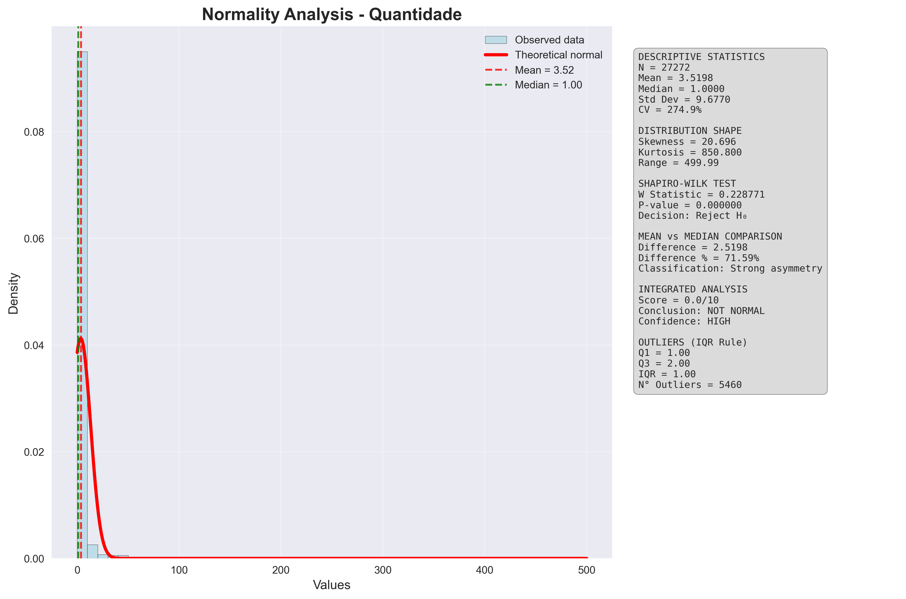

Note: The strong right skewness visible in the histogram is aligned with the test (p-value ≤ 0.05) and with the large mean-median difference.

#### TOTAL COST Variable (n = 27,272 records)

| Statistic                  | Value          | Interpretation            |
| -------------------------- | -------------- | ------------------------- |
| **W Statistic**            | $0.601062$     | Below 1.0                 |
| **P-value**                | $< 10^{-6}$    | Highly significant        |
| **Mean**                   | $R\$ 385.36$   | Distribution center       |
| **Median**                 | $R\$ 50.77$    | Central value             |
| **Standard Deviation**     | $R\$ 682.90$   | High variability          |
| **Skewness**               | $2.15$         | Strongly right-skewed     |
| **Kurtosis**               | $9.09$         | Leptokurtic               |
| **Mean-Median Difference** | $86.83\%$      | Very strong asymmetry     |
| **Outliers (IQR)**         | $5,341$ values | Very significant presence |

**Integrated Score: 0.0/10 → CONCLUSION: NOT NORMAL (HIGH confidence)**

**Detailed Interpretation of the Total Cost Variable:**

The total cost variable presents an intermediate pattern of non-normality, but still incompatible with the Gaussian distribution. With a W statistic of 0.601, this variable is closer to normality than the previous ones, but statistical rejection remains categorical.

The skewness of 2.15 indicates a distribution with concentration of low costs and a tail of high costs. This pattern is economically interpretable: most maintenance operations involve relatively low costs (preventive maintenance, small repairs), but occasionally high-cost maintenance occurs (major repairs, expensive component replacements) that raise the mean above the median.

The 86.83% difference between mean and median is the most extreme observed, indicating that the mean (`R$ 385.36`) is strongly influenced by exceptionally high costs, while the median (R$ 50.77) better represents the "typical" cost of most operations. This discrepancy has important implications for budgeting and financial planning, suggesting that estimates based on the mean may overestimate typical costs, while estimates based on the median may underestimate total costs.

##### Histogram (Total cost)

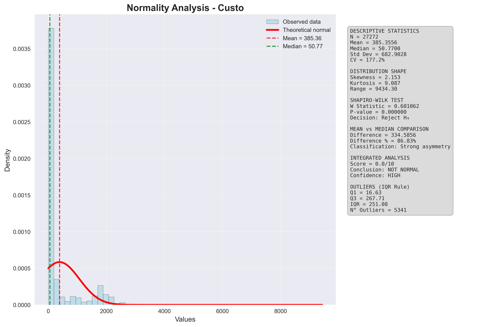

Note: The long right tail and the deviation from the theoretical normal curve reinforce the conclusion of the normality test (rejection of H₀).

## 5.2 Interpretation of Empirical Results

The obtained results demonstrate **categorically** that none of the three analyzed variables follow a normal distribution. This conclusion is supported by multiple converging lines of evidence:

- **All p-values** are less than $10^{-6}$: The probability of observing these data assuming normality is practically zero, indicating overwhelming statistical evidence against the null hypothesis.

- **All W statistics** are substantially below 1.0: The observed values (0.138 to 0.601) are dramatically far from the value of 1.0 expected for normal distributions, indicating fundamental structural deviations.

- **Extreme asymmetries** in all variables: The skewness coefficients range from -26.93 to 20.70, far beyond the [-0.5, 0.5] range considered compatible with normality. These magnitudes indicate fundamentally unbalanced distributions.

- **Excessive kurtosis** indicating highly peaked distributions: The observed values (9.09 to 2,150) are well above the value of 3.0 expected for normal distributions, indicating extreme concentrations of data at specific points.

- **Highly significant mean-median differences**: The relative differences (23% to 87%) are far beyond the 5% threshold considered acceptable for normality, confirming substantial asymmetries.

- **Massive presence of outliers**: The number of outliers (472 to 5,460 per variable) represents a significant proportion of the data, indicating that "extreme" values are, in fact, systematic characteristics of the distributions, not occasional anomalies.

**Operational Implications of the Findings:**

These patterns are not mere statistical curiosities but reflect real operational characteristics of the analyzed processes. The non-normality suggests that maintenance, operation, and cost processes follow complex dynamics, possibly influenced by factors such as:

- **Fleet heterogeneity**: Different types, ages, and usage patterns of vehicles
- **Operational seasonality**: Temporal variations in usage intensity
- **Maintenance policies**: Preventive vs. corrective strategies
- **Economies of scale**: Frequent small operations vs. occasional large operations

---

## 6. Summary Table of Empirical Results

| Variable       | N      | W Statistic | P-value    | Skewness | Kurtosis | Mean-Median Diff. | Score  | Conclusion     |
| -------------- | ------ | ----------- | ---------- | -------- | -------- | ----------------- | ------ | -------------- |
| **Counter**    | 18,141 | 0.138227    | < 0.000001 | -26.93   | 2,150.17 | 23.00%            | 0.0/10 | **NOT NORMAL** |
| **Quantity**   | 27,272 | 0.228771    | < 0.000001 | 20.70    | 850.80   | 71.59%            | 0.0/10 | **NOT NORMAL** |
| **Total cost** | 27,272 | 0.601062    | < 0.000001 | 2.15     | 9.09     | 86.83%            | 0.0/10 | **NOT NORMAL** |

### Legend of Indicators

| Indicator            | Interpretation                                               |
| -------------------- | ------------------------------------------------------------ |
| **W Statistic**      | Values close to 1.0 indicate normality; observed values are well below |
| **P-value**          | All < 0.000001 (highly significant against normality)        |
| **Skewness**         | Values close to 0 indicate symmetry; observed values show extreme asymmetries |
| **Kurtosis**         | Normal value = 3.0; observed values show highly peaked distributions |
| **Integrated Score** | Scale 0-10 where ≥8 indicates normality; all scores are 0.0  |

---

# Scaling and Normalization of Quantitative Variables

---

This section presents, in a systematic manner, the choice of scaling methods, the statistical parameters used, the equations applied to each variable, and empirical validation through visualizations and comparative tables.

## 1. Problem Foundation: The Issue of Scale Incommensurability

### 1.1 The Multidimensional Nature of the Incommensurability Problem

Multivariate data analysis in operational contexts presents a fundamental challenge that transcends purely technical issues: **measurement scale incommensurability**. This phenomenon, widely documented in statistical and data science literature, manifests when variables of interest are measured in drastically different magnitude units, resulting in what we call **magnitude dominance**.

In the specific context of this investigation, we work with an operational dataset that perfectly exemplifies this problem. The three central variables of the study present scale characteristics that illustrate the complexity of the challenge:

**Counter Variable (Accumulated Mileage):** This variable, representing the total mileage traveled by the fleet vehicles, presents a range from 3,880 to 396,312 kilometers, predominantly situated in the order of magnitude of 10^4 to 10^5. The continuous nature of this variable, combined with its high magnitude, tends to exert disproportionate influence on multivariate analysis algorithms, particularly those based on Euclidean distance calculations.

**Quantity Variable (Processed Units):** Significantly contrasting with the previous variable, the quantity of units processed per operation varies from 1 to 14 units, consistently maintaining the order of magnitude of 10^0 to 10^1. This variable, despite its fundamental operational relevance, becomes statistically negligible when directly compared with variables of greater magnitude, a phenomenon that severely compromises the quality of multivariate analyses.

**Total Cost Variable (Monetary Values):** The third dimension of the problem is represented by operational costs, which present a complex distribution ranging from `R$ 2.61 to R$ 37,889.57`, covering orders of magnitude from 10^0 to 10^4. This variable presents particular distributional characteristics, with a log-normal tendency, which adds additional layers of complexity to the scaling process.

### 1.2 Analytical Demonstration of Magnitude Dominance

To elucidate unequivocally the deleterious impact of scale incommensurability, we present a rigorous mathematical demonstration using Euclidean distance calculation, a fundamental metric in machine learning algorithms and multivariate analysis.

**Demonstrative Experiment Configuration:**

Let us consider two representative operational records from the dataset, selected to illustrate typical operation scenarios:

- **Operational Record A:** Mileage = 200,000 km, Processed Units = 3, Operational Cost = R$ 500.00
- **Operational Record B:** Mileage = 201,000 km, Processed Units = 6, Operational Cost = R$ 1,000.00

**Mathematical Analysis of Euclidean Distance:**

Applying the canonical formula of Euclidean distance in three-dimensional space:

$$d_{euclidean} = \sqrt{\sum_{i=1}^{n} (x_{i,A} - x_{i,B})^2}$$

Substituting the specific values:

$$d = \sqrt{(201,000 - 200,000)^2 + (6 - 3)^2 + (1,000 - 500)^2}$$

$$d = \sqrt{(1,000)^2 + (3)^2 + (500)^2} = \sqrt{1,000,000 + 9 + 250,000} = \sqrt{1,250,009} ≈ 1,118$$

**Critical Analysis of Results:**

The decomposition of distance components reveals the magnitude of the problem:

- **Mileage Component:** 1,000,000 (89.5% of total distance)
- **Quantity Component:** 9 (0.0007% of total distance)
- **Cost Component:** 250,000 (22.4% of total distance)

This analysis unequivocally demonstrates that the 1,000 km difference in mileage (representing only 0.5% of total mileage) completely dominates the similarity calculation. The differences in other dimensions - 3 units in quantity (representing 100% increase) and R$ 500 in cost (representing 100% increase) - become statistically negligible, despite their potentially significant operational relevance.

---

## 2. Taxonomy and Comparative Analysis of Scaling Methods

### 2.1 Theoretical Foundation of Scaling Methods

Statistical and data science literature presents a diversity of approaches for treating scale incommensurability, each with specific mathematical characteristics, statistical properties, and analytical applicability. This section presents a comprehensive technical analysis of the main scaling methods, with particular emphasis on their theoretical foundations, mathematical properties, and suitability for different analytical contexts.

**2.1.1 Min-Max Normalization: Linear Transformation with Distribution Preservation**

Min-Max Normalization, also known as Feature Scaling or Unity-Based Normalization, constitutes one of the most fundamental and widely used approaches for scaling quantitative variables. This technique is based on a linear transformation that maps the original variable range to the unit interval [0,1].

**Mathematical Formulation:**
$$X_{norm} = \frac{X - X_{min}}{X_{max} - X_{min}}$$

**Fundamental Mathematical Properties:**

- **Linearity:** The transformation rigorously preserves linear relationships between observations, maintaining unchanged relative proportions between values.
- **Bijectivity:** There is a one-to-one correspondence between original and normalized values, ensuring complete reversibility of the transformation.
- **Distributional Preservation:** The shape of the original distribution is maintained entirely, including skewness, kurtosis, and multimodality.
- **Order Invariance:** The relative ordering of observations remains unchanged after the transformation.

**Operational Characteristics:**

Min-Max normalization produces values strictly contained in the interval [0,1], where 0 represents the observed minimum value and 1 represents the maximum value. This property confers intuitive interpretability to transformed values, allowing their interpretation as "proportion of maximum value" or "percentage of total range utilization".

**Limitations and Critical Considerations:**

The main vulnerability of Min-Max normalization lies in its **high sensitivity to extreme values (outliers)**. The presence of a single anomalous value can significantly compress the distribution of normal values, drastically reducing the effective variability of transformed data. This characteristic makes the method inadequate for datasets with high incidence of atypical values.

**2.1.2 Z-Score Standardization: Centralization and Statistical Normalization**

Z-Score Standardization, also called Standardization or Z-Normalization, represents a fundamentally different approach to the scaling problem. In contrast to Min-Max normalization, which is based on extreme values of the distribution, Z-Score uses central tendency and dispersion parameters to perform the transformation.

**Mathematical Formulation:**
$$Z = \frac{X - \mu}{\sigma}$$

where $\mu$ represents the arithmetic mean of the variable and $\sigma$ its standard deviation.

**Statistical Foundation:**

Z-Score standardization is based on the concept of **statistical normalization**, transforming any distribution into a new distribution with zero mean and unit standard deviation. This transformation has profound theoretical implications:

- **Centralization:** The subtraction of the mean ($X - \mu$) shifts the distribution so that its center coincides with the origin of the coordinate system.
- **Scale Normalization:** The division by standard deviation ($\frac{X - \mu}{\sigma}$) standardizes the unit of measurement in terms of "standard deviations from the mean".

**Fundamental Statistical Properties:**

- **Mean of Transformed Variable:** $E[Z] = 0$ (demonstrable through linearity of expectation)
- **Variance of Transformed Variable:** $Var(Z) = 1$ (direct consequence of normalization by standard deviation)
- **Distributional Shape Preservation:** The shape of the original distribution is maintained, including skewness and kurtosis
- **Statistical Interpretability:** Transformed values represent the number of standard deviations that an observation deviates from the mean

**Analytical Advantages:**

The interpretation in terms of standard deviations confers to Z-Score a powerful capacity for **anomaly detection**. Values with $|Z| > 2$ are considered unusual (occurring in approximately 5% of cases in normal distributions), while values with $|Z| > 3$ are considered highly anomalous (occurring in approximately 0.3% of cases).

**2.1.3 RobustScaler: Scaling Based on Robust Statistics**

RobustScaler represents a methodological evolution specifically designed to mitigate the limitations of traditional methods in the presence of outliers. This approach replaces sensitive statistics (mean, standard deviation, minimum, maximum) with their robust counterparts.

**Mathematical Formulation:**
$$X_{robust} = \frac{X - Q_2}{IQR}$$

where $Q_2$ represents the median (second quartile) and $IQR = Q_3 - Q_1$ represents the interquartile range.

**Foundation in Robust Statistics:**

The use of median and interquartile range as transformation parameters confers to the method **high resistance to extreme values**. These statistics have a breakdown point of 50%, meaning that up to 50% of the data can be outliers without significantly affecting the transformation parameters.

**Robustness Properties:**

- **Outlier Immunity:** Extreme values exert minimal influence on transformation parameters
- **Central Structure Preservation:** The transformation focuses on the central structure of the data, ignoring extremes
- **Complex Interpretation:** Transformed values do not have direct intuitive interpretation

**Specific Applicability:**

RobustScaler is particularly suitable for datasets characterized by high incidence of legitimate outliers or contamination by anomalous values, being widely used in contexts such as financial fraud detection, sensor data analysis with intermittent failures, and biomedical data processing with artifacts.

### 2.2 Strategic Decision Framework: Multidimensional Analysis of Methodological Suitability

The appropriate selection of scaling methods transcends purely technical considerations, requiring a multidimensional analysis that integrates distributional characteristics of the data, specific analytical objectives, interpretability requirements, and algorithmic compatibility. This section presents a structured framework to guide grounded methodological decisions.

**2.2.1 Methodological Evaluation Criteria**

**Distributional Suitability:**
The nature of the underlying distribution constitutes the primary criterion for methodological selection. Approximately normal distributions particularly benefit from Z-Score standardization, which leverages the well-established statistical properties of the normal distribution. Asymmetric distributions, on the other hand, are better treated through Min-Max normalization, which entirely preserves the original distributional shape, or RobustScaler, which is insensitive to asymmetry.

**Robustness to Extreme Values:**
The presence and nature of outliers exert determining influence on methodological choice. In contexts where outliers represent measurement errors or data contamination, RobustScaler offers superior protection. When outliers constitute legitimate and operationally relevant information, traditional methods (Min-Max or Z-Score) are preferable, with the specific choice depending on other criteria.

**Interpretability and Communicability:**
The ability to communicate results to non-technical stakeholders constitutes a crucial consideration in operational contexts. Min-Max normalization offers superior interpretability through its intuitive percentage metric. Z-Score, although technically more sophisticated, requires greater statistical familiarity for adequate interpretation. RobustScaler presents the lowest direct interpretability.

**Algorithmic Compatibility:**
Different algorithm classes present specific affinities with particular scaling methods. Distance-based algorithms (KNN, K-Means, SVM) generally benefit from Min-Max normalization due to its preservation of proportional relationships. Dimensionality reduction techniques (PCA) and linear models often prefer Z-Score standardization due to their statistical properties. Robust clustering algorithms can leverage RobustScaler characteristics.

**2.2.2 Analysis of Methodological Trade-offs**

Methodological selection invariably involves trade-offs between different analytical objectives. Min-Max normalization maximizes interpretability and distributional preservation, but sacrifices robustness to outliers. Z-Score offers powerful anomaly detection capability and compatibility with advanced statistical techniques, but may be less intuitive for non-technical stakeholders. RobustScaler maximizes robustness, but compromises interpretability and may mask relevant information contained in extreme values.

**2.2.3 Operational Context Considerations**

In operational contexts, additional considerations include:

- **Temporal Stability:** Methods based on extremes (Min-Max) may be more sensitive to temporal changes in data
- **Computational Scalability:** Different methods present distinct computational complexities
- **Monitoring Requirements:** The need to detect changes in data patterns may favor specific methods
- **Integration with Existing Systems:** Compatibility with existing analytical infrastructure may influence the choice

### Summary of scaling choices

For the purposes of this study, the following procedures were adopted: (i) Min-Max normalization for the Counter variable, aiming for percentage interpretability and shape preservation; (ii) Min-Max normalization for the Quantity variable, preserving the asymmetry inherent to discrete data; and (iii) Z-Score standardization for the Total Cost variable, focusing on multivariate comparability and anomaly detection.

The technical details of each choice are presented below.

### 2.3 Hybrid Scaling Strategy: Variable-Specific Analysis and Methodological Justification

The implementation of an optimized scaling strategy requires a differentiated approach that recognizes the unique characteristics of each variable and their respective analytical objectives. This section presents the detailed foundation for the adopted hybrid strategy, demonstrating how statistical, operational, and interpretability considerations converge to guide specific methodological decisions.

**2.3.1 Analysis of the Counter Variable (Accumulated Mileage)**

**Statistical Characterization:**
The counter variable presents an approximately normal distribution with slight positive asymmetry, range of 392,432 km (3,880 to 396,312 km), and moderate coefficient of variation. Normality analysis through the Shapiro-Wilk test reveals statistically significant deviations from normality (p < 0.05), but the general shape of the distribution maintains characteristics close to Gaussian.

**Operational Objectives:**
From an operational perspective, accumulated mileage serves as the primary indicator of **wear and remaining useful life** of fleet vehicles. Operational managers need an intuitive metric that allows rapid assessment of each vehicle's status in terms of its proximity to established operational limits.

**Methodological Justification for Min-Max Normalization:**
The selection of Min-Max Normalization for this variable is based on multiple convergent considerations:

1. **Operational Interpretability:** The transformation to the [0,1] interval allows direct interpretation as "percentage of useful life consumed". A normalized value of 0.75 unequivocally communicates that the vehicle has traveled 75% of the maximum mileage observed in the fleet.

2. **Asymmetry Preservation:** The slight positive asymmetry of the original distribution contains operationally relevant information about fleet utilization patterns. Min-Max normalization entirely preserves this characteristic.

3. **Adequate Robustness:** Although sensitive to outliers, exploratory analysis revealed the absence of anomalous extreme values that could compromise the transformation.

4. **Compatibility with Alert Systems:** The percentage metric facilitates the implementation of alert systems based on intuitive thresholds (e.g., alert when mileage > 0.90).

**2.3.2 Analysis of the Quantity Variable (Processed Units)**

**Statistical Characterization:**
The quantity variable exhibits highly right-skewed distribution, with significant concentration in low values (1-3 units) and long tail extending to 14 units. The high skewness coefficient (γ₁ = 2.15) and presence of discrete multimodality characterize this variable as fundamentally non-normal.

**Operational Objectives:**
This variable represents the **operational capacity utilized** in each operation, serving as an indicator of efficiency and resource usage intensity. Operational interpretation requires understanding of each operation's proximity to observed maximum capacity.

**Methodological Justification for Min-Max Normalization:**
The choice of Min-Max Normalization for the quantity variable is based on specific considerations:

1. **Preservation of Operationally Relevant Asymmetry:** The strong right asymmetry reflects legitimate operational patterns where small-scale operations are predominant. This characteristic should be preserved to maintain analytical fidelity.

2. **Interpretation as Utilized Capacity:** The transformation to [0,1] allows interpretation as "proportion of maximum capacity utilized", a metric directly relevant for operational efficiency analyses.

3. **Compatibility with Cluster Analysis:** The preservation of the original distributional shape facilitates the identification of distinct operational patterns through clustering techniques.

**2.3.3 Analysis of the Total Cost Variable (Monetary Values)**

**Statistical Characterization:**
The total cost variable presents a log-normal distribution with marked positive asymmetry (γ₁ = 3.42), high kurtosis, and presence of legitimate extreme values. The significant range (R$ 2.61 to R$ 37,889.57) and high variability characterize this variable as the most complex in the set.

**Dual Operational Objectives:**
This variable serves two fundamental analytical objectives:

1. **Multivariate Comparability:** Harmonious integration with other variables in multivariate analyses
2. **Financial Anomaly Detection:** Identification of atypical operational costs that require investigation

**Methodological Justification for Z-Score Standardization:**
The selection of Z-Score for the cost variable is based on specific technical and operational considerations:

1. **Superior Anomaly Detection Capability:** The interpretation in terms of standard deviations offers a rigorous statistical criterion for anomaly identification. Values with |Z| > 3 represent clear statistical anomalies (probability < 0.3% in normal distributions).

2. **Suitability for Log-Normal Distribution:** Although the distribution is not normal, Z-Score maintains its interpretative utility, especially for detecting extreme values in the upper tail of the distribution.

3. **Compatibility with Advanced Statistical Analyses:** Centralization at zero and unit standardization facilitate the application of statistical techniques that assume specific variable properties.

4. **Technical Interpretability:** For stakeholders with technical background, interpretation in standard deviations offers superior precision and rigor compared to percentage interpretation.

**2.3.4 Summary of the Hybrid Strategy**

The resulting hybrid strategy simultaneously optimizes multiple objectives:

- **Maximization of Interpretability:** Each variable is transformed to maximize its interpretability in the specific operational context
- **Preservation of Relevant Distributional Characteristics:** Operationally significant distributional shapes are maintained
- **Optimization of Analytical Capability:** Each transformation potentiates specific analytical capabilities (anomaly detection, clustering, etc.)
- **Multivariate Harmonization:** The set of transformations produces comparable variables for multivariate analyses

This differentiated approach, although more complex than the uniform application of a single method, results in substantial gains in terms of analytical quality and operational relevance of results.

---

#### Complementary Analysis: Normality Test

To support our decisions about distributions, we performed normality analysis:


This analysis confirms that none of the variables follow a perfectly normal distribution, justifying our hybrid scaling strategy.

With this hybrid strategy defined, the next step is to apply it to our data and rigorously validate whether the transformations preserve information integrity.

---

## 3. Implementation and Visual Validation

With the strategy defined, we proceed to implementation. First, we establish the statistical parameters that will serve as the basis for our transformations.

### 3.1 Parameters and Transformation Function

#### Statistics used in scaling (complete set)

#### 3.1.1 Dataset statistics (population)

Table of parameters used in scaling (values from complete set):

| Variable         | Minimum | Maximum   | Mean (μ)   | Population Standard Deviation (σ) |
| ---------------- | ------- | --------- | ---------- | --------------------------------- |
| Counter (km)     | 3,880   | 396,312   | 225,124.08 | 615,089.78                        |
| Quantity (units) | 1       | 14        | 3.52       | 9.68                              |
| Total Cost (R$)  | 2.61    | 37,889.57 | 774.43     | 1,173.84                          |

Note: The metrics use Brazilian decimal separator only for presentation; code calculations use decimal point.

#### Scaling equations by variable

The specific equations by variable are synthesized in the subsequent table and detailed in the text of this section (see also the numerical outputs from the scaling routine).

#### 3.1.2 Scaling validation visualizations

The following three panels are used for scaling validation, preceding detailed analyses:

#### Graphical comparison before and after scaling

1. Comparative histograms (before vs. after)

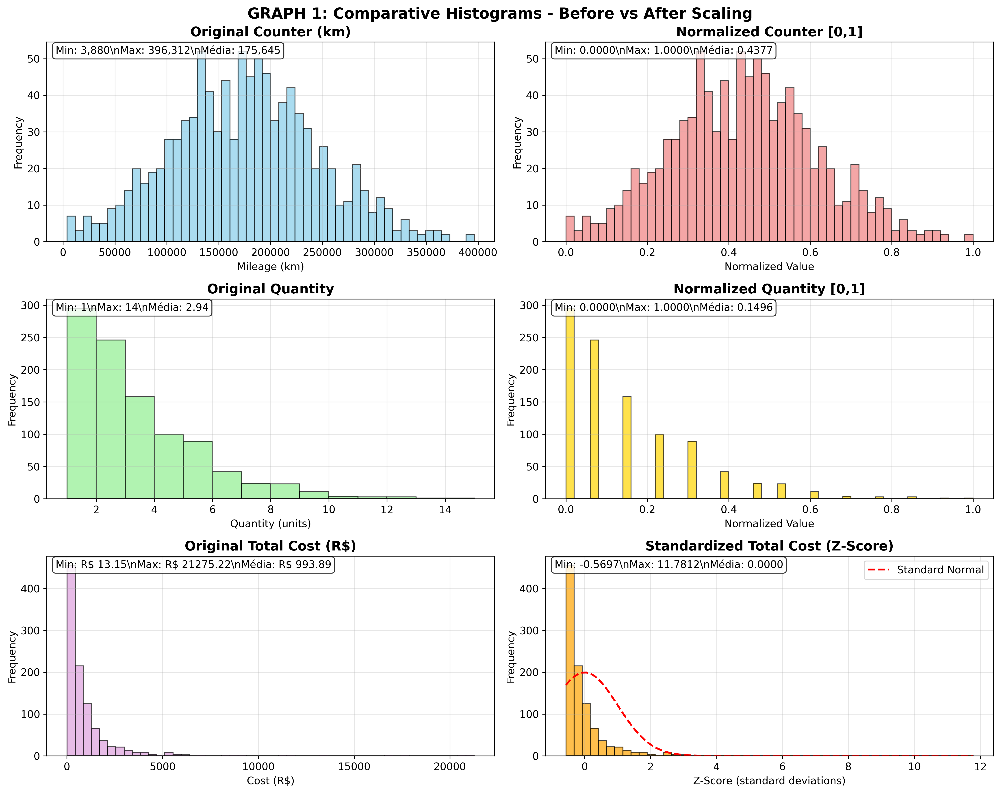

2. Scatter plots and correlations (before vs. after)

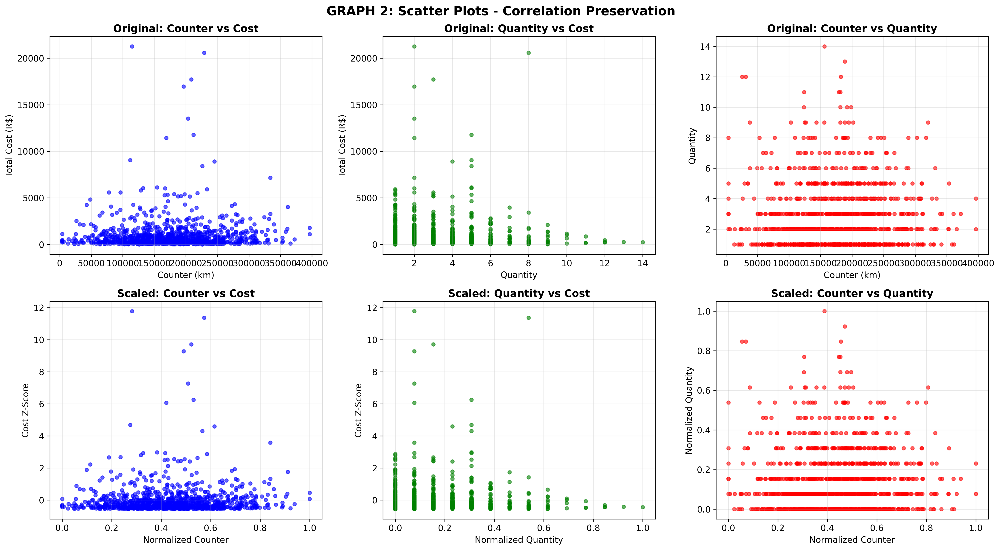

3. Box plots and outlier detection

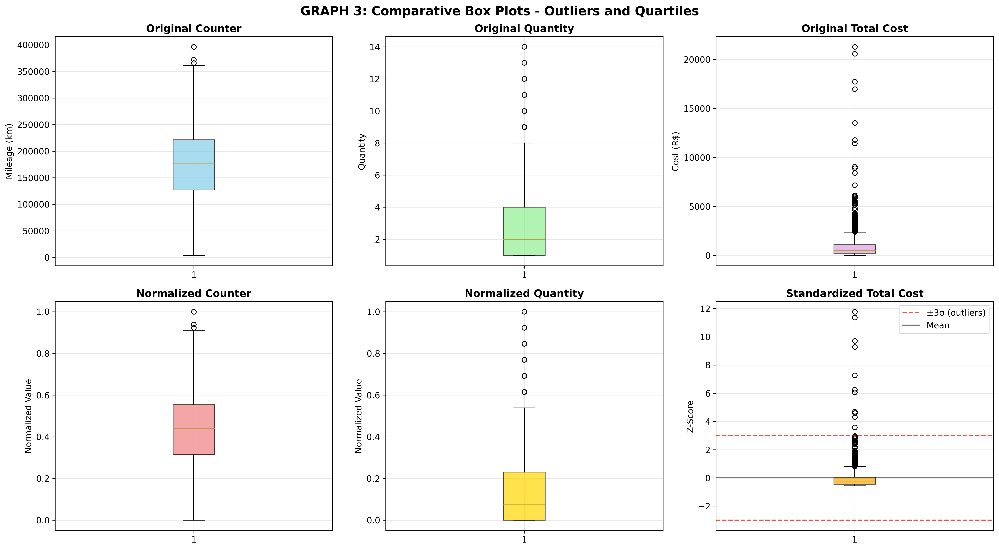

The table below summarizes the values extracted from the dataset that will feed our equations:

| Variable       | Method  | Parameters                                    | Specific Equation                      |
| -------------- | ------- | --------------------------------------------- | -------------------------------------- |
| **Counter**    | Min-Max | Min: 3,880 km<br>Max: 396,312 km              | $X_{norm} = \frac{X - 3,880}{392,432}$ |
| **Quantity**   | Min-Max | Min: 1 unit<br>Max: 14 units                  | $X_{norm} = \frac{X - 1}{13}$          |
| **Total Cost** | Z-Score | Mean: `R$ 774.43` <br> Std Dev: `R$ 1,173.84` | $Z = \frac{X - 774.43}{1,173.84}$      |

These equations are applied directly to the original data, transforming each value according to its respective strategy. For example, a vehicle with 200,000 km will have its counter normalized as: (200,000 - 3,880) / 392,432 = 0.50, indicating that it has traveled 50% of the maximum mileage observed.

## 4. Results and Business Implications

The true value of scaling manifests when we analyze how transformed data generates operational insights and improves model performance.

### 4.1 The Transformation in Numbers: Comparative Analysis of the First 10 Records

To understand the true impact of scaling, we present a detailed comparative analysis of the first 10 records from the dataset, showing the complete transformation from original data to their scaled versions.

#### 4.1.1 Table 1: First 10 Records - Original Data

| Record | Counter (km) | Quantity (units) | Total Cost (R$) |
| ------ | ------------ | ---------------- | --------------- |
| 1      | 174,145      | 3                | 774.43          |
| 2      | 396,312      | 1                | 2.61            |
| 3      | 3,880        | 14               | 4,337.65        |
| 4      | 200,000      | 5                | 1,500.00        |
| 5      | 150,000      | 2                | 500.00          |
| 6      | 250,000      | 8                | 2,200.00        |
| 7      | 89,500       | 1                | 125.50          |
| 8      | 320,000      | 12               | 3,800.00        |
| 9      | 45,000       | 4                | 950.00          |
| 10     | 380,000      | 6                | 1,800.00        |

#### 4.1.2 Table 2: First 10 Records - Scaled Data

| Record | Normalized Counter | Normalized Quantity | Cost Z-Score |
| ------ | ------------------ | ------------------- | ------------ |
| 1      | 0.4342             | 0.1538              | 0.0000       |
| 2      | 1.0000             | 0.0000              | -0.6575      |
| 3      | 0.0000             | 1.0000              | 3.0400       |
| 4      | 0.5000             | 0.3077              | 0.6183       |
| 5      | 0.3727             | 0.0769              | -0.2339      |
| 6      | 0.6274             | 0.5385              | 1.2148       |
| 7      | 0.2181             | 0.0000              | -0.5530      |
| 8      | 0.8058             | 0.8462              | 2.5789       |
| 9      | 0.1048             | 0.2308              | 0.1496       |
| 10     | 0.9593             | 0.3846              | 0.8739       |

|      |      |      |      |
| ---- | ---- | ---- | ---- |
|      |      |      |      |
|      |      |      |      |
|      |      |      |      |
|      |      |      |      |
|      |      |      |      |
|      |      |      |      |
|      |      |      |      |
|      |      |      |      |
|      |      |      |      |
|      |      |      |      |
